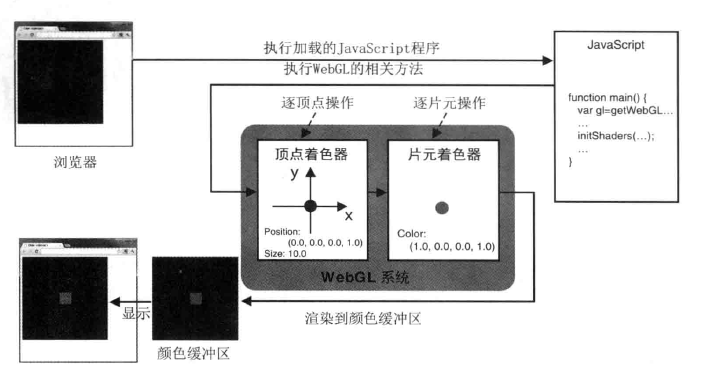

> WebGL入门指南读书笔记- 附录

<!-- more -->

## 附录

### 附录 A WebGL 中无需交换缓冲区

WebGL 中从来不进行"交换缓冲区"的操作, 这一步操作在大多数 OpenGL 实现中都是必要的.

我们知道 OpenGL 使用两个颜色缓冲区: "前台" 颜色缓冲区和 "后台" 颜色缓冲区, 前台颜色缓冲区中的内容将直接显示在屏幕上. 通常, 具体绘图操作的对象实际上是后台颜色缓冲区, 在绘图操作完成后, 需要将其中的内容复制到前台颜色缓冲区中区, 使之显示在屏幕上. 如果直接在前台颜色缓冲区中绘制, 屏幕上就会出现一些视觉假象(如闪烁), 因为在你完成一帧绘制之前, 前台颜色缓冲区中的内容就会被更新到屏幕上.

为了支持双缓冲区方法, OpenGL 提供了切换前台与后台缓冲区的机制. 在某些系统中, 切换缓冲区是自动的. 而在另一些系统中, 需要后要缓冲区中会指望一帧后, 显示的调用切换缓冲区的方法.

<!-- more -->

相比之下, WebGL 是运行在浏览器中的, 能够自动地将绘制好的内容完美的更新到屏幕上, 不需要显示交换缓冲区, 如下图:

单缓冲区之所以可行, 是因为由 JS 编写的 WebGL 程序对于浏览器来说, 只是一次更底层方法的调用.

由于 WebGL 程序不是独立运行而是依赖于浏览器的. 所以当 JS 执行结束并退出后, 浏览器就能够对于颜色缓冲区进行检查. 如果其中的内容被修改过了, 浏览器就会负责将其显示到屏幕上
