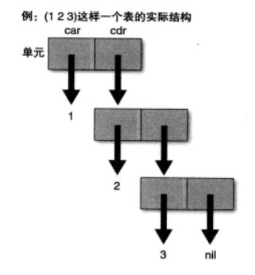
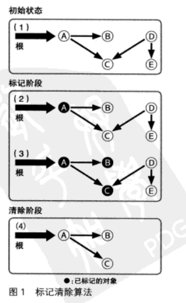
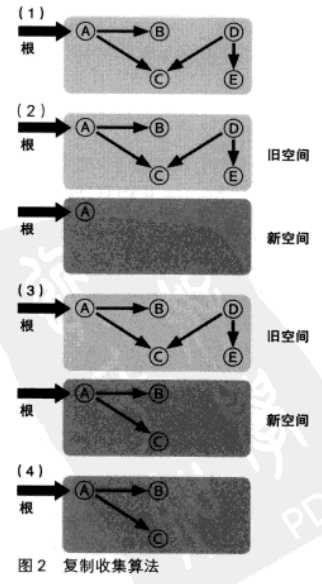
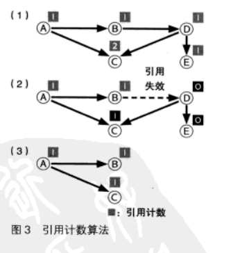
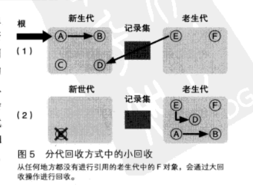
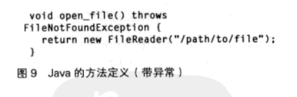
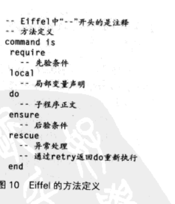

# 一. 编程语言的历史

## 1.1 编程的本质

编程的本质在于思考

## 1.2 编程历史的历史

### FORTRAN 

实质上的第一种编程语言, 应用于数值计算领域. 

- 重视兼容性, 保留了一些现在已经几乎不再使用的编码风格. 如:`在程序中空格没有意义`


### COLBOL

COLBOL(Common Business Orientd Language, 面向商业的通用语言). 

- 面向商业计算, 不需要太多的算式
- 对于从事商业活动的一般大众, 采用了更接近日常表达方式的语法. 类似于英语

### Lisp

原始是基于一种数学计算模型来设计的. 约翰麦卡锡设计了一种以`Lambda`演算为基础的"图灵完全"的计算模型, Lisp的起源就是为了描述这一模型而设计出来的. 

- Lisp擅长与表结构这样的非数值型处理. 因此被广泛应用于AI这样的领域. 
- 垃圾回收和异常处理等机制最初就是有Lisp发明的

与 `FORTRAN`, `COLBOL` 并称上古编程语言三大巨头.

### SNOBOL

SNOBOL(StriNg Oriented symBOlic Language, 面向字符串的符号化语言), 专门用于字符串处理的语言. 

- 革新性在于它是以`模板(Pattern)`为中心来进行字符串处理的, 可以说是`Ruby`, `Perl`, `AWK`等语言的先祖.

### 其他的数学性语言

Prolog就是一个以一阶谓词逻辑为基础的编程语言. 

以数学为基础的语言中, 还有另外一个派系, 被称为函数型编程语言. 例如`ML`,`Haskell`. 这一类的数学性语言, 比起机器的处理方式, 更倾向于直接表达要表达的概念. 

也就是说相对于`How(如何实现)`, 更倾向于`What(想要什么)`来表达问题. 这样可以不被机器的处理方式所左右, 而将问题抽象的表达出来. 这是一种非常先进的特性. 

### 主流语言

C, C++, Java, Ruby, Perl, Python, PHP等等.


## 1.3 编程语言的进化方向

进化的脉络中, 有几个关键词. 其中一个就是`抽象化`, 也被称为`黑箱化`. 近代的编程语言中, 都可以为一系列过程赋予相应的名称. 

将过程抽象化是不够的, 我们需要一定的输入输出操作. 因此, 在下一个阶段中, 对数据进行黑箱化就闲的非常重要. CLU就是数据抽象化出现早期的一种语言. 

在抽象化的延长线上, 就自然而然的产生了面向对象编程的概念. 所谓对象, 就是抽象化的数据本身.

几乎所有的语言都或多或少的提供了面向对象的能力, 也有一些故意不提供面向对象支持的. 

- 大部分人一次只能驾驭`7±2`种概念
- 无论使用什么编程语言, 生产一条基本语句所需要的工数几乎是一定的. (人月神话)

换句话说, 要描述同样的算法, A语言需要1000行, B只需要10行, 只要采用B语言, 生产效率就可以提高100倍. 


## 1.4 未来的编程语言

1. 情况一: 变化不大
2. 情况二: 不需要编程语言了
3. 情况三: 更抽象的编程语言


## 1.5 DSL: 特定领域语言

DSL, 指的是利用为特定领域所专门设计的词汇和语法, 简化程序设计过程, 提高生产效率的技术. 

特点在于集中描述"想要做到什么(What)", 而不必对"如何做到(How)"进行描述.

例如, 有一个叫做`rake`的编译工具, 它是用`Ruby`编写的. 这个工具功能和`make`差不多, 会分析文件的依赖关系, 并自动执行程序的编译, 连接等操作. 其中描述依赖关系的`Rakefile`就是使用就是使用了`Ruby`语法的一种DSL:

```
task :default => [:test]
task :test do
    ruby "test/unittest.rb"
end
```

意思是:

1. 默认任务是`test`
2. `test`的内容是执行`test/unittest.rb`

启动`rake`命令的格式为:

```js
rake 任务
```

DSL是对页顶目的的小规模语言的称呼, 是最近才出现的比较新的叫法. 但这种语言本省是比较常见的东西. 

其中, `awk`算是比较有名的. 还有比如描述依赖关系的`Makefile`的`make`, `sed`, `pic`等等. 

这些mini语言, 都是专用于页顶用途的, 大多数情况下无法完成复杂的工作. 但是本质上和DSL是一样的. 

### 外部DSL

以这些mini语言为代表的, 由专门的语言引擎来实现的DSL, 称为外部DSL. 

比如Java中, 有XML编写的配置文件. 这些也是外部DSL的一种形式. 此外, 数据库所使用的SQL也是一种典型的外部DSL.

外部DSL的优点, 在于它是独立于程序开发语言所使用的语言之外的. 对于某个领域进行操作的程序, 不一定是用同一种语言来编写的. 

正则表达式就是如此, 可以在不同的语言中使用. 

外部DSL实际上是全形设计的语言和语言引擎, 因此可以根据它的目的进行自由的设计. 不必被特定的执行模块和现有语言的语法所左右. 

###  内部DSL

外部DSL是从UNIX中脱胎发展而来的, 而内部DSL则是发源于Lisp和Smalltalk的文化之中

内部DSL并不是创造一种新语言, 而是在现有语言中实现DSL, 而作为DSL基础的这种现有语言, 称为宿主语言. 

宿主语言可以是任何编程语言. Lisp, Smalltalk, Ruby则比较适合作为DSL的宿主语言. 

内部DSL的优点: 

- 借助宿主语言的语法, 因此无需学习一种新的语言.
- 内部DSL具备宿主语言具备的全部功能. 
- 实现简单, 基于宿主语言, 只需要增加一些功能

缺点:

- 自由度低

### DSL的本质

- DSL的本质是抽象化, 是否具备仅用于特定用途的功能可以作为判断DSL的依据(参考)
- 贝尔实验室: 库设计就是语言设计

也就是说: API也是构成编程语言的一个重要要素. 向一种语言添加库, 也就是相当于在设计一种"新增了一些词汇的规模更大的语言".

大卫.托马斯曾说:

编程就是为自己的应用程序设计DSL的过程.

因此, DSL并不仅仅是一种技术, 而是应用程序开发的重要设计原理和原则之一, 可以说适用于任何软件的开发. 在设计API时, 如果能像"设计一种新的DSL"一样进行设计的话, 有些想法应该会变得不同吧. 

### DSL的构成要素

构成一种优秀内部DSL的要素包括下列5种:

- 上下文(Context)
- 语句(Sentence)
- 单位(Unit)
- 词汇(Vocabulary)
- 层次结构(Hierarchy)

其中上下文, 指的是对于DSL中每个单独的语句, 规定其所拥有的含义. 也许有人认为: "用参数的方式进行显示指定就好了". DSL的宗旨在于简洁的描述.

语句, 值得是上下文中每条独立的代码.

单位, 类似于把"现在时间的20小时之前"写成"20.hours.ago".

词汇, 为目的领域定义了多少适用的方法.

层次结构, 嵌套的上下文. 


##  1.6 元编程

元, 意为对本身的描述. 比如描述数据本身的数据, 就是元数据. 

像C语言这样的编程语言, 语言层面上会有数组和结构体的概念, 但经过编译之后, 这些信息就丢失了.

不过现代的编程语言, 在运行中还会保留这样一些信息. 比如在C++中, 一个对象是知道自己的数据类型的, 通过这个信息, 可以在调用虚拟成员函数时, 选择与自己的类型相匹配的函数.

像这样获取和变更程序本身信息的功能, 被称为反射. 


### Lisp

- `Lisp`是通过括号来体现语句和表达式的
- `Lisp`中没有通常的运算符, 而是全部采用由括号括起来的函数调用形式
- `1-`是用来将参数减1的函数

在Lisp中, 最重要的数据类型是表, 甚至Lisp这个名字本身就是用`List Processor`来的. 一个表是被称为单元(Cell)的数据连接起来所构成的. 一个单元包含两个值, 一个叫做`car`, 另一个叫做`cdr`. 他们的值可以是对其他单元的引用, 或者是被称为原子的非单元值, 例如, 数值, 字符串, 符号等等. 



单元是用点对来描述的, 比如car和cdr都是1, 则:

```lisp
(1 . 1)
```

如果cdr部分是一个表, 则省略点和括号, 也就是说:

```lisp
(1 . (2 . 3))

;; => 
(1 2 . 3)
```

然后如果cdr部分为`nil`, 则省略cdr部分, 于是:

```lisp
(1 2 3 . nil)

;; => 
(1 2 3)
```

S表达式的基本规则就是这样, 只要理解了这个规则, 就可以通过括号的罗列来想象出实际的表结构. 掌握了规则时候再看这段代码, 才能理解的更清楚:

```lisp
;;; 通过归纳法定义的阶乘计算
(defun fact(n)
    (if (= 1 n)
        1
        (* n (fact (1- n)))))
```

Lisp是通过S表达式来进行表达的, 换句话说, Lisp是通过Lisp本身最频繁操作的表的方式来表达的. 这意味着程序和数据是完全等同的. 本质上, 元编程已经成为了Lisp语言的一部分. 

#### Lisp 程序

Lisp程序时有Form排列起来构成的, 形式就是S表达式, 他通过下面的规则进行求值.

- 符号会被解释被为变量, 求出该变量所绑定的值
- 除符号以外的原子, 则求出自身的值. 即: 整数的话就是整数本身, 字符串的话就是该字符串本身
- 如果形式为表, 则头一个符号为"函数名", 表中的剩余元素为参数

在形式中, 表示函数名的部分, 实际上还分为函数, 特殊形式和宏三类. 

函数就是函数, 特殊形式就是控制结构, 比如用于赋值的:

```Lisp
(setq a 128)
```

假定`setq`是一个函数, 那么a作为参数就会被求值, 而不会对变量a进行赋值. `setq`并不会对`a`进行求值, 而是将其作为变量名来对待, 这是Lisp语言中直接设定好的规则, 像这样拥有特殊待遇的形式, 就是特殊形式. 除了`setq`以外, 还有用于条件分支的`if`, 定义局部变量的`let`等

#### 宏

```Lisp
(defmacro square2 (x)
    (list '* x x))

(defun square (x)
    (* x x))
```

Lisp中的宏, 可以对表达式求值时, 通过对构成程序的表进行操作, 从而改变程序本省. 

与函数的区别:

除了关键字的区别, 宏返回的不是求值的结果, 而是以表的形式返回要在宏被调用的地方嵌入的表达式.

比如 `(square2 2)`, 进行求值的话, Lisp会找到`square2`, 发现这是一个宏, 首选会用2作为参数, 对`square2`进行救治. list是将作为参数传递的值以表的形式返回的函数. 

```lisp
(lisp '* x x) ;; => (* 2 2)
```

然后将这个结果嵌入到调用`square2`的地方, 在进行实际的求值. 

就`square`和`square2`来说, 两种方法没有什么区别, 但是通过使用获取参数, 加工, 然后再嵌入的技术, 只要是遵循S表达式的语法, 其可能性就几乎是无限的. 无论是创建新的控制结构, 还是在Lisp中创建内部DSL.

#### 宏的优点和缺点

Lisp中的S表达式, 是实现Lisp实现复杂宏的关键, 例如C/C++中的宏是通过Preprocessor, 这种方式只能做简单的字符串替换, 无法编写复杂的宏. 

采用了宏, 程序的解读就会变得困难. 

### 元编程的可能性与危险性

在Lisp和Ruby程序中, 程序本身的信息是可以被访问的, 因此在程序中也可以对程序本身进行操作. 这就是元编程. 

元编程对无法预先确定的操作进行了应对, 体现了语言的灵活性. 

另外如果用得太多, 就降低了代码的可读性. 


## 1.7 内存管理

无限内存的主要技术:

- GC: 内存的垃圾回收机制
- 虚拟内存

### GC的三种基本方式

- C/C++: 手动内存管理, 需要手动释放
- Java: GC

#### 术语定义

- Garbage(垃圾): 需要回收的对象, 没有引用的对象作为垃圾. 将这些对象回收, 就是GC
- Root(根): 半盘对象是否可被引用的起始点. 对于哪里是根, 不同的变化才能原因和编译器有不同的规定, 基本上是将变量和运行栈空间作为根. 


#### 标记清除方式

标记清除(Mark and Sweep)是最早开发出的GC算法(1960), 他的原理非常简单, 首先从根开始将所有可能被引用的对象用递归的方式进行标记, 然后将没有标记到的对象作为垃圾进行回收. 



标记清除算法的处理事件, 是和存货对象数与对象总数总和相关的. 

作为标记清除的变性, 还有一种标记压缩(Mark and Compact)算法. 它不是将标记的对象清除, 而是将他们不断压缩. 

#### 复制收集方式

标记清除算法的一个缺点是, 在分配了大量对象, 其中只有一小部分存活的情况下, 所消耗的时间会大大超过必要的值, 这是因为在清除阶段需要对大量死亡对象进行扫描.

复制收集(Copy and Collection), 则试图克服这一缺点. 在这种算法中, 会从根开始被引用的对象复制到另外的空间中, 然后, 再将复制的对象所能够引用的对象用递归的方式不断复制下去.



复制完成后, "死亡"对象就被留在旧空间中. 然后将旧空间废弃, 就可以一口气将所有空间都释放出来了. 

复制收集方式, 标记阶段的开销是一样的, 销毁节点的开销被大大节省了. 

另一个好处在于它具有局部性. 在复制收集的过程中, 会按照对象被引用的顺序将对象复制到新空间. 于是, 关系较近的对象被放在距离较近的内存空间的可能性会被提高. 这被称为局部性. 局部性高的情况下, 内存缓存会更容易有效运作, 程序的运行性能能够提高. 

#### 引用计数方式

引用计数(reference_count)是GC算法中最简单也最容易实现的一种, 和标记清除方式是差不多同一时间的. 

基本原理是: 在每个对象中保存改对象的引用计数, 当引用发生增减时对计数进行更新. 

引用计数的增减, 一般发生在变量赋值, 对象内容更新, 函数结束等时间点. 当一个对象的引用计数变为0, 这说明它将来不会被引用, 因此可以释放相应的内存空间. 



容易实现是引用计数算法的最大优点. 标记清除和复制收集这些GC机制在实现上都有一定难度. 

除此之外, 当对象不再被引用的瞬间就会被释放, 这也是一个优点. 其他的GC机制中, 要预测一个对象何时会被释放是困难的. 并且由GC而产生的中断时间也比较短. 

缺点是:

- 无法释放循环引用的对象
- 必须在发生增减的时候正确处理, 否则就会造成bug

### GC改良

基于这三种基础的基本GC, 衍生了一些高级GC技术. 

#### 分代会收(Generational GC)

分代会收的目的是在程序运行期间, 将GC的消耗时间尽量缩短. 

基本思路, 是利用了一般程序所具备的性质, 即大部分对象都会在短时间内成为垃圾, 而经过一定时间依然存活的对象往往比较拥有较长的寿命. 长寿的对象更容易存活下来, 短命对象则会很快被废弃. 

因此, 对分配不就, 诞生时间较短的年轻对象进行重点扫描, 应该就可以更有效的回收大部分垃圾. 

在分代回收中, 对象按照生成时间进行分代, 刚刚生成不就的奶年轻对象为新生代, 而存活了较长时间的对象划为老对象. 根据具体实现方式不同, 可能还可以划分为更多的代. 

如果对于对象寿命的假说成立的话, 那么只要扫描新生代对象, 就可以收掉废弃对象中的很大一部分. 

像这种只扫描新生代对象的会后操作, 就叫小回收(Minor GC)

- 从根开始常规扫描, 找到存活对象
- 采用标记清除或者复制搜集算法(大部分)标记对象
- 遇到老生代则停止递归
- 残留对象划分到老生代



这里有个问题, 如果有老生代对新生代的引用, 在扫描过程中, 会被误认为死亡. 为此, 在分代回收中, 会对对象的更新进行监视, 将这类记录单独记录在一个记录集中, 在执行小回收的过程中, 把这个记录集也作为一个根来对待. 

分代的正常工作需要保持记录集的内容更新. 为此, 在老生代到新生代的引用产生的瞬间, 就必须对改应用进行记录, 而负责执行这个操作的子程序, 需要嵌入到所有涉及对象更新操作的地方.

工作原理:

有两对象A/B, 当对A的内容进行改写, 并加入对B的引用是, 如果A属于老生代, B属于新生代,则将引用添加到记录集. 

这样涉及所有修改对象内容的地方进行保护, 因此被称为 "写屏障(Write barrier)". 写屏障不经在分代回收中, 同时也用于很多其他GC算法. 

老生代对象也会被释放, 因此需要偶尔进行一次包含老生代区域的全面回收, 像这样的GC就是完全回收(Full GC), 或者大回收(Major GC)

分代回收通过减少GC中扫描的对象数量, 达到缩短GC带来的平均中断时间的效果. 

#### 增量回收

在对实时性要求更高程序中, 比起缩短GC的平均中断时间, 往往更重视缩短GC的最大中断时间. 比如机器人的姿态控制, 车辆制动程序等. 

为了保持这样的实时性, 需要不等到GC全部完成, 而是将GC操作细分为多个部分逐一执行. 这种方式被称为增量回收. 

但这个过程中, 由于GC过程是渐进的, 在回收过程中程序会继续执行, 引用关系会发生变化. 为了避免, 需要采用写屏障. 因此当被标记的对象的引用关系发生变化时, 需要通过写屏障. 当已经被标记的对象的引用关系发生变化时, 通过写屏障对讲新引用的对象作为扫描的起始点记录下. 

由于增量回收是分步的, 所以可以将中断时间控制在一定时间只能, 但是总时间就会相应的增加. 

#### 并行回收

多线程GC, 在原有的程序运行的同时运行GC. 

这很像增量回收, 不过并行回收可以多CPU的性能, 尽可能让这些GC并行. 写屏障虽然可以保持信息状态的更新, 但是让GC完全不影响原有程序的运行是不可能的. 在特定阶段也需要暂停原有的程序. 

#### GC 大统一论

像标记清除和复制收集, 被称为耿总回收. 相对的, 引用计数算法则是对象之间的引用关系发生变化时, 通过引用计数进行更新来判断对象生死的. 


这两者相互队里, 对其中一方进行改善的技术之中, 必然存在另一种进行改善的技术. 


## 1.8 异常处理

"正常化偏见": 对于一些偶然发生的情况, 一旦发生了就会不自觉的忽略其危害. 

### 用特殊返回值表示错误

比如`fopen`. 

缺点: 

- 对于错误的检测不是强制进行的, 可能会没注意到导致崩溃
- 原本的程序容易被错误处理埋没

### 异常机制

在比较新的语言中, 有`exception`机制, 来减轻错误处理的负担.

可以在可能产生异常的地方使用`try...out`捕获异常

### 产生异常

抛出异常对象

对不同的异常指定不同的异常对象. 

以及后续处理`finally`之类的

### Java的检查型异常

Java的异常处理具有其他不具备的特性. 即每个方法都需要显式的声明自己可能会产生什么样类型的异常. 在数据类型, 方法名, 参数之后, 有一段形如`throws`异常的代码, 用于声明可能会产生的异常.



并且在java中调用某个方式时, 对于该方法定义中所声明的异常, 如果没有异常处理来进行捕获, 且没有用throws继续抛给上层的话, 就会产生一个变异错误. 因为异常已经成为方法的数据类型一部分了. 这样的异常就叫做检查型异常. 在广泛的语言中, java是第一个. 

### ICON的异常

Icon这种语言, 它的异常是通过"假"来表示的. 也就是说, 当对表达式求值时, 如果没有产生异常, 结果为真, 反之为假. 

```
比如 a < b
```

并不是a小于b时为真, 否则为假. 在Icon中: 将a, b进行比较, 两者相等或b小时产生异常, 否则返回b的值. 因此, 在Icon中, 

```
a < b < c
```

这样的表达式是合理的. 

在Icon中, 逐行读取文件并输出的程序可以写成这样:

```icon
while write(read())
```

执行循环知道条件判断表达式失败, 因此这个操作会被循环执行直到失败

Icon中还有一种叫every的语句, 可以对所有组合进行尝试, 直到失败

```icon
every write((1 to 3) + (2 to 3))
```

普通的语言中这样的操作需要两层循环来完成. 

### Eiffel 的 Design By Contract

Eiffel这种语言中强调一种称为Design By Contract(契约式设计, DbC)的概念. 及所有的方法都必须规定执行前需要满足的条件和执行后需要满足的条件, 当条件不能满足时, 就会产生异常. 

这样的思路, 就是讲对子程序的调用, 看做是一种"需要兑现满足先验条件的约定, 后验条件就必定得到满"的契约. 



### 异常与错误值

大部分情况下都应该使用异常, 不过有一些情况下使用错误值更好. 

如果错误情况是超出预计的, 错误就应该作为异常处理, 如果是在预期之内的, 就应该返回错误值. 
