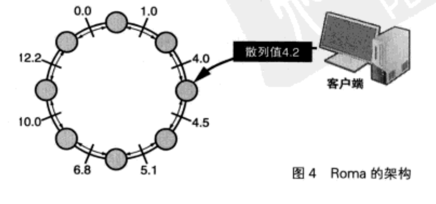
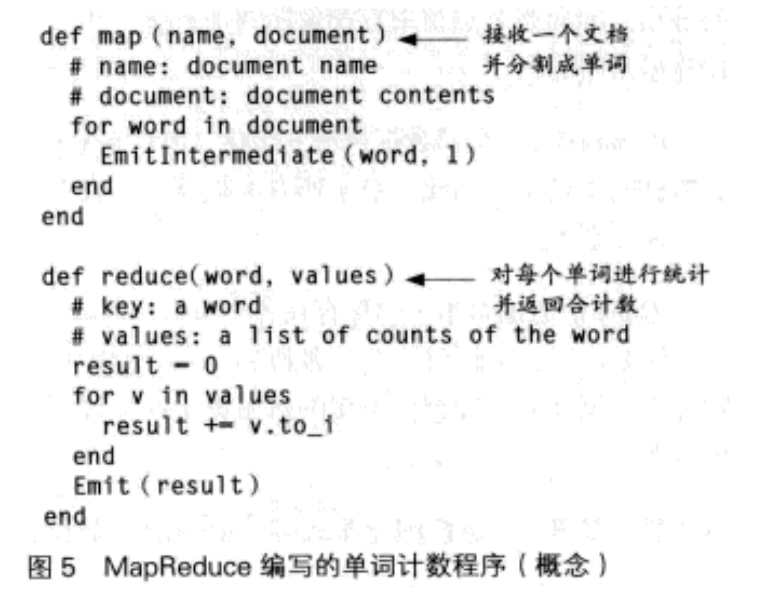

# 三. 云计算时代的编程

## 3.1 可扩展性

在量子力学的世界中, 会发生一些超乎常理的现象. 

这些现象也影响了计算机世界. 不如从小尺度上, 电路越来越精细导致量子力学开始影响, 从大尺度上, 则产生了信息爆照导致的海量数据问题

### 大数据的查找

#### 线性查找

逐一查找数据, 计算量与查找对象的数据量成正比

#### 二分查找

对已经排好序的数据进行中间值查找

#### 散列表

hash查找, 需要有一个满足以下条件的散列函数, 本质上进行的是映射:

- 从数据到整数值(0~n-1)的映射
- 足够分散
- 不易冲突

应对冲突的方法:

- 链地址法: 将拥有相同散列值的元素存放在链表中, 因此随着元素个数的增加, 散列冲突和查询链表的时间也会跟着增加. 有点事比较简单, 性能较高(Ruby Hash)
- 开放地址法: 遇到冲突, 寻早一个新的数据存放空间, 按序遍历知道找到空闲槽.(Python 字典)

开放地址法可以通过以下算法来寻找目标槽:

1. 计算数据的散列值
2. 从散列值找到相应的槽
3. 如果槽与数据一致, 则使用该槽->查找结束
4. 如果槽为空闲, 则散列表中不存在该数据->查找结束
5. 计算下一个槽的地址
6. 返回第三步

开放地址法优点在于用不同数组的方法存放数据, 和链表相比空间更少, 性能更好. 但是惠然冲突发生更加平凡. 并且数据的删除也很麻烦, 不能静静删除对象的数据所在的槽. 否则可能导致后续的数据无法被查到

#### 布隆过滤器

布隆过滤器是一种可以判断某个数据是否存在的数据结构, 或者也可以说是判断集合中是否包含某个成员的数据结构. 特点如下:

- 判断时间与数据个数无关
- 空间效率非常好
- 无法删除元素
- 偶尔会出错

在面对大量数据时, 我们的目标是缩小查找的范围, 因此大多数情况下, 少数误判不会产生什么问题. 

此外布隆过滤器的误判都是假阳性, 也就是说只会讲不属于该集合的元素判断为该集合, 而不会产生假阴性的误判. 想布隆过滤器这样偶尔会出错的算法, 称为概率算法(probabilistic algorithm)

布隆过滤器拥有极高的时间效率, 以及极高的空间效率. 理论上说(假定误判率为1%), 平均每个数据只需要9.6bit的空间. 

原理:

布隆过滤器使用k个散列函数和m比特的比特数组. 作为比特数组的初始值, 所有比特位都被置为0. 向布隆过滤器插入数据时, 会对该数据求得k个散列值(`0 < k < m`), 并以每个散列值为索引, 将对应的比特数组中的比特位全部置1.

要判断是否包含某个数据, 则需要求得数据的k个散列值, 然后器对应比特位中任意一个为0, 就可以判断集合中不存在该数据.

即便所有k为1, 也可能是散列冲突导致的偶然现象. 这种偶然现象和集合中数据的个数n, 散列函数种类k, 以及比特数组的大小m有关. 

m相对于n过小, 就会发生比特数组中所有位都为1, 从而判断所有数据都在数组内. 此外, 当k过大, 每个数据所消耗的比特会增加, 比特数组的填充速度加快, 也会发生误判. k过小, 填充较慢, 但又会由于散列冲突的增多而导致误判的增加.

### 计算机的极限

单台计算机是有极限的

#### DHT(分布式散列表)

在分布式环境下工作的散列表, 就是DHT. 他并非指一种特定的算法, 而是指将散列表在分布式环境中进行实现的技术的统称. 包含了CAN, Chord, Pastry, Tapestry等.

分布式的困难:

- 不稳定的节点, 随时消失, 复原
- 伴随这些问题产生的数据查找困难问题

所以基本上数据都会保存多分副本, 对了应对节点的增减, 又需要重新计算数据位置.

KV数据库就是分布式环境下实现的. 比如: CouchDB, ToKyoTyrant, Kai, Roma等

简单说, 这些数据库通过网络访问Hash, 其数据分别存放在多台计算机中. 都有各自针对的数据规模, 网络架构和实现语言等方面的特点

除了分布式数据存储, 还有想GFS(Google File System)这样的分布式文件系统技术.

### Roma

Roma就是一种KV数据库, 特点如下:

- 所有数据都存放在内存中的内存是数据库(IMDB)
- 采用环装的分布式架构
- 数据冗余化: 每个数据拥有两个副本
- 运行中可以自由增减节点
- 开源

### MapReduce

分布式环境中的数据, 一定程度上能通过K-V存储和分布式文件系统解决, 但是对于编程来说, 依然十分困难. 在分布式散列表中, 我们需要解决多进程启动, 相互同步, 并发控制, 节点变动等等问题. 程序会变的非常复杂. 

Google通过MapReduce这一技术, 实现了对分布式处理描述的高效化. 

MapReduce是将数据的处理通过Map(映射), Reduce(简化)的组合进行描述的.

MapReduce大概就是这样处理的:

- 将文档传递给map函数
- 对每个单词进行统计并将结果传递给reduce函数

MapReduce是高度抽象化的. 它也是没有开源的, 但是基于论文信息, 也出现了Hadoop这样的开源软件. 

## 3.2 C10K 问题

上面曾讲到正常化偏见, 在编程中, 就是"这个数据不会超过16比特的范围吧","这个程序不会用到公元2000年以后吧". 这种想法就是导致了10年前的千年虫问题的根源. 

C10K问题, 就Client 10,000 Problem, 即"在同时连接到服务器的客户端数量超过10,000个的环境中, 即便硬件性能足够, 也无法正常的提供服务"的问题. 

主要背景在于`keep-alive`技术:

在socket网络连接中, 一次连接的建立需要一定的开销, 对于反复建立连接就会消耗一笔不小的开销, 为了解决这个问题, 从http1.1开始, 对同一台服务器产生的多个请求, 都可以通过相同的socket连接来完成, 这就是`keep-alive`.

此外, 我们还可以利用`keep-alive`由服务端向和客户端主动推送. 这样的技术造成了我们需要很多的并发连接. 

虽然实时性高了, 但是并发服务造成了更多的服务器载荷

### 关于正常化偏见

在安全领域有一个"最弱连接"(Weaklist link)的说法, 就是说往两端用力拉一个拉环, 其中最脆弱的一个环会崩解.

C10K的问题就类似于此. 历史上的许多`想当然`, 造成了这个问题 

1. "同时工作的进程不会有那么多吧"

UNIX的进程ID是一个带符号的16位整数, 也就是说, 一台计算机上同时存在的进程无法超过32767个. 不过现在实际上基本都是32/64位了

而Linux的进程数上限为48353.

现代操作系统的进程数上限都是在内核参数中设置的. 如果进程数量随着并发连接数等比例增加的话, 是无法处理大量的并发连接的, 所以就需要事件驱动模型这样的技术在软件架构层面进行优化了. 

此外, Linux系统的进程数上线, 实际上也就是整个系统中运行的线程数的线上, 因为为此每个并发连接启动一个线程的程序也存在同样的上限.

2. 内存的容量租后用来处理创建的进程和线程的数量吧

进程和线程的创建都需要消耗内run. 如果一个程序为每一个连接都创建一个进程或者线程, 对于状态的管理可以相对简化, 程序也会比较易懂, 但问题则在于内存的开销. 

程序空间可以通过操作系统进行共享, 但变量空间和栈空间是无法共享的. 因此这部分的内存开销是无法避免的. 此外, 每次创建一个线程, 一般也会产生一定的内存开销. 

大量的进程开销超过物理内存容量的时候, 就会使用磁盘来进行数据交换. 导致速度骤降

3. 同时打开的文件描述符的数量不会有那么多吧

4. 要对多个文件描述符进行监视, 用select系统调用就足够了吧

### epoll

Linux中对文件描述符的监控方式

### libev

epoll/kqueue更加先进, 但是只能在特定的平台上使用. 于是libev和EventMachine就出现了. 

libev是一个提供高性能时间循环功能的库. 

libev是通过loop结构体中设定一个回调函数, 当发生事件的时候, 回调函数就会被调用. 

libev可以根据不同的平台自动使用epoll, kqueue./dev/poll等事件监听API. 如果这些都不可用, 则调用select系统调用. 

注意在使用这样的事件驱动库时, 必须要注意回调函数不能发生阻塞. 由于事件循环是在单线程下工作的, 因此在回调函数执行过程中, 不能对其他事件进行处理. 所有的事件驱动架构的程序都必须要尽快结束回调的处理. 

### EventMachine

面向Ruby的事件驱动框架. 支持服务端, 客户端的网络连接, 输入输出, SSL加密

对于这些事件驱动框架来说, 如何尽量缩短回调的执行时间非常重要, 如果发生阻塞, 在大量并发连接的情况下是致命的. 于是非阻塞I/O就非常重要了.

## 3.3 HashFold

HashFold 是 MapReduce 的一种辩题. MapReduce 通过分解, 提取数据流的Map函数和花间, 计算数据的Reduce函数, 对处理进行分割, 实现对大数据的高效分布处理. 

相对的, HashFold是以散列表的方式接受Map后的数据, 然后通过FLod的过程来对散列表元素的去重. 这种模型将MapReduce中一些没有细化的部分, 如Map后的数据如何排序再进行Reduce, 通过散列表的性质做了清晰的描述. 

是一种对于大规模数据处理中分布式处理的实现. 

HashFold的Map过程在接收原始数据之后, 将数据生成k-v对, 然后flod过程接收两个value, 并返回一个新的value. 

### 多核与多进程

启用多个进程的时候, 操作系统会自动进行调配, 使得各个进程分配到适当的CPU资源. 

当进程数量过多, 就是产生抖动现象.(内存消耗完)

为了避免抖动, 操作系统实际也进行了一些优化. 不如写时复制--在创建子进程的时候, 对于所有的内存空间先进行共享, 只有当实际发生对数据的改写时才进行赋值. 

Linux中还有一个OOM Killer(Out of Memory Killer), 当发生抖动时, 就会选择适当的进程强制结束它. 

### 进程池

线程和进程的创建伴随着一定的开销, 因此可以先创建好再重复利用这些进程. 这个技术就是进程池. 

## 3.4 进程间通行

在有限的时间内处理大量的信息, 基本手段就是分割统治. 也就是说, 关键是如何分割大量的数据并进行并行处理. 

### 同计算机的进程间通信

- 管道
- 消息
- 信号量
- 共享内存
- TCP套接字
- UDP套接字
- UNIX域套接字

### TCP/IP

网络通信协议

## 3.5 Rack / Unicorn

Rack 是为了使用Ruby开发web应用的微型web框架

Unicorn: 面向UNIX的Rack HTTP服务器, 可以做反向代理

