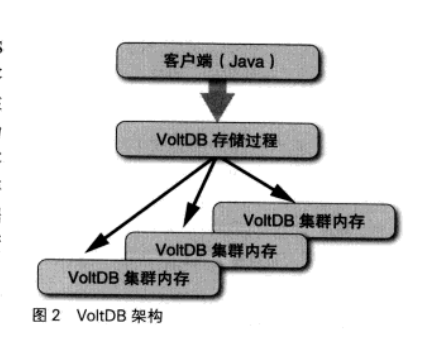

# 四. 支撑大数据的数据存储技术

## 4.1 键-值 存储

Key-Value存储是数据库的一种. 以关系型数据为代表的现有数据库系统正在接近极限, 而KV数据库在可以超越这个极限. 

KV存储是有键对象到值对象的映射来保存数据的. 类似于一个永久保存的hash数据关系

### hash类

就是hash类喽

### DBM

Hash类中的数据只能存在于内存, 运行结束就消失了, DBM负责包这些数据持久化.

DBM的特点:

- key/value 只能使用字符串
- 创建DBM对象需要制定存放数据的文件路径
- 数据会被保存在文件中

### ACID

RDBMS数据库, 具备ACID:

- Atomicity: 原子性
- Consistency: 一致性
- Isolation: 隔离性
- Durability: 持久性

近来随着数据的增加, 想要保持ACID变得越来越困难, RDNMS的极限即在于此, 也是我们希望通过KV数据库来解决的问题

### CAP

随着信息的增加, 大量数据无法保存在单独的硬盘上, 也无法通过单一计算机进行处理, 而在多台计算机进行处理的过程中, 就会发生延迟, 故障等等问题. 

当计算机数量达到一定程度, 几乎一定会有计算机发生故障. 此时ACID的特性就很难满足, 所以ACID被视为不可扩展的. 

因此有人提出了CAP, 即在大规模环境中:

- Consistency: 一致性
- Availability: 可用性
- Partition Tolerance: 分裂容忍性

这三个性质中, 只能同时满足两个.

大规模系统中, 分裂 延迟, 故障几乎是家常便饭. 

据说, CAP原理已经通过数学方法得到了证明. C是满足ACID的关键因素. 所以, 在大规模环境下, RDBMS可能无法达到预期值. 

### CAP解决方案--BASE

依据CAP原理, 我们必须在三者中舍弃一个. 

舍弃P(分裂容忍性)的话, 需要在发生分裂的时候令一方失效. 

在分布式系统中, 像这样"局部故障导致整体故障"的要害, 称为单一故障点, 需要极力避免

不可能舍弃A(可用性). 舍弃可用性意味着等待, 即发生分裂的时候, 服务需要停止并等待分裂恢复. 另外, 为了保持一致性, 也必须等待所有的数据完成记录. 

然而用户是不可能等待的. 

那么现在就只剩下一致性了. 实际上, 一致性是可以舍弃的. 应为显示生活其实不存在严密一致性. 

除了银行汇款这样的场景外, 其实大多数处理都不需要严格遵循ACID. 

在这样的环境中, BASE也许更加合适:

- Basically Availabel: 基础可用性
- Soft-state: 非严密状态
- Eventuallu Consistent: 最终一致性

BASE更重视可用性, 而不追求状态的严密性. 且只要求数据的最终一致性. 是一种乐观模式. 

ACID(酸) BASE(碱)是相对的. ACID是悲观的.

### 大规模环境的键-值存储

键值才能出可以通过给定键返回对应的值这一简单的模式, 来支撑大规模的数据. 键-值存储适合大规模数据也正是因为它使用散列值和结构简单这两点. 

基本架构就是讲多台计算机组成虚拟圆环, 每个节点负责某些返回的散列值所对应的数据. 

访问数据的时候, 首先通过键计算出散列值, 然后找到负责改散列值的节点, 取出或者存放数据. 

当然这只是其中一种存储模式.

#### 访问

- 初始化
- 访问
  - 应用程序按顺序访问指定的节点, 并想第一个应答的节点传达访问请求
  - 建立连接的节点向客户端发送路由表
  - 计算出散列值, 通过路由表查询负责改散列值的节点, 并发送请求
  - 获取或者保存数据

每次进行数据访问, 需要与各个节点建立连接并通行. 这个通信过程是通过socket来进行的. 这需要很大的开销. 不过, 一般对kv的访问都具有局部性. 这样的情况下, 可以使用池的高年, 保持一定的socket来重复利用. 

因为存在延迟, 故障, 分裂等情况, 就需要定期更新路由表来保持路由表的状态. 以及设定超时时间. 

#### 节点处理

节点的工作内容:

- 应对访问
- 信息保存
- 维护节点构成信息
- 更新节点构成信息
- 加入处理
- 终止处理

#### 存储器

- RH存储器: 将信息保存在Ruby的Hash对象中的存储器
- DBM存储器: 将信息保存在DBM
- File存储器: 将信息保存在文件中
- SQLite3: 将信息保存在SQLLite3中
- TC存储器: 将信息保存在TokyoCabinet

#### 写入和读取

当应用程序发起写入请求, 确认散列值属于本节点, 该节点会通过存储器对数据进行保存.

如果数据只保存在一个节点上, 是不可靠的. 因此写入必须有多个节点共同完成. 

需要重视响应速度的话, 可以在本节点完成写入后立即响应, 然后继续剩下的写入操作. 

读取和写入差不多, 但是不需要冗余操作, 所以更简单

#### 节点追加

分布式键值存储系统优点就是灵活. 数据变多, 访问速度下降时, 只要通过追加新的节点就可以了. 

追加新节点, 只需要指定一个现有节点作为入口, 然后启动新的节点. 新节点申请加入环, 然后全体节点进行数据分配.

#### 故障应对

单节点丢失, 将会进行组织结构的更新, 进行数据复制, 然后给你更新新的节点结构信息, 并定期的发送给应用程序. 而对于整体来说, 就像什么也没发生. 

如果节点又复活了, 就会作为一个新节点重新加入. 

如果多个节点同时消失, 就可能会导致数据丢失, 系统就会报错. 

如果发生分裂, 就只能手动停止其中一个系统了. 

### 终止处理

- 首先向任意节点发送终止请求, 然后该节点自动称为负责终止的主节点
- 向全体节点发送即将终止的声明. 收到声明之后, 各节点停止接受新的节点, 并在当前动作完成之后, 进行写入操作
- 回复主节点, 然后结束进程. 

## 4.2 NoSQL

NoSQL是相遇与关系型数据库的. 

### RDB的极限

一般认为关系型数据库在性能上存在极限, 是应为必须遵循ACID特性. 

当数据量增大时, 就需要对访问进行并发控制, 这样必然会导致并发数量的下降. 如果将数据库分布到多台服务器, 为了保持一致性, 也会导致性能下降. 

当然, 可以通过一些方法应对这个问题:

- 水平分割: 将一张表中的各行数据直接分割到多个表中, 比如奇偶ID分离等.
- 垂直分割: 将一张表的字段分割到其他表. 

### NoSQL数据库的解决方案

- 键值访问
- 放宽一致性原则, 遵循BASE原则

NoSQL类型:

- 键值存储数据库: 查询方式基本上只能通过键来进行, 有memecached, ROMA, Redis, TokyoTyrant等
- 面向文档数据库: 键值存储的值不是单纯的数字或者字符串, 而是一个文档结构, 可以是XML或者JSON, 有CouchDB, MongoDB以及各种XML数据库等
- 面向对象数据库: 直接将面向对象语言中的对象进行持久化, 看起来就像是一个永久保存对象的系统而已. 有Db4o, ZopeDB. ObjectStore等

### MongoDB

- JSON数据格式
- 不定义结构
- 支持分布式
- 乐观事务机制(同一个文档基本上不会被同时修改)

#### 原子操作

MongoDB不支持事务机制, 所以对于同一个文档的更新无法保护. 但是其update方法是互斥的. 其操作结果要么更新成功, 要么报错. 这就是一个原子操作. 

## 4.3 SQL数据库的反击

SQL在云时代的思路就是分割. 

目的是通过将数据库中大量的记录分别存放到多台服务器中, 从而避免数据库服务器的瓶颈. 比如奇偶分离. 然后在代码里面对奇偶编号访问不同的数据库. 

但是这样的做法显然比较脏. 

### Spider

所以, 有了一些其他的做法. 比如吧查询和存储分离. 逻辑与数据分离. 这样可维护性就变高了. 

比如Spider, 还有例如像MySQL, Cluster, SpockProxy等其他方案

SQL之父在一篇文章中这样写道:

- NoSQL的优势在于性能和灵活性
- NoSQL的性能也不是多有情况下都由于SQL
- NoSQL的性能是通过牺牲SQL和ACID的特性来实现的, 而性能问题与SQL和ACID无关

而SQL性能主要瓶颈在于:

1. 日志(Logging)
2. 事务锁(Locking)
3. 内存锁(Latching)
4. 缓存管理(Buffer Management)

### VoltDB

然后这个大佬就开发了VlotDB这个开源数据库来验证他的观点

该数据库是面向大规模事务处理应用程序的SQL数据库系统, 特征如下:

- 比传统SQL高出几十倍的性能
- 线性可扩展性
- 以SQL作为DBMS接口
- ACID特性
- 全天候工作

VlotDB是一个内存数据库, 所以不需要日志, 也不需要缓存管理了. 他的持久性是通过复制维持的. 多台服务器拷贝同一份数据, 也提供了定期将数据写入文件的功能.

此外, 数据库是分割成多个区域来管理的, 对于每个分区都分配了一个独立的管理线程. 也就是说, 对分区的操作时单线程的. 因此也就不需要排他处理和事务所和内存锁机制了. 

由于是内存数据库, 所以性能非常好, 并且会随着节点的增加使得性能呈线性提升. 

此外, VlotDB是以内存型集群作为前提的架构. 传统数据库中, 对于需要重复进行的操作, 可以通过某种手段调用服务器上实现写好的存储过程来实现的, 从而一定程度上减少通信量. VlotDB把所有的事务都通过存储过程来实现, 所以在该数据库中, 你只能通过事先写好的存储过程来查询. 所以对VlotDB就不能通过主流的ODBC和JDBC. 而是要用java来编写程序. 

一个VlotDB程序有几个部分:

1. 数据库结构定义文件
2. 存储过程: java编写的, 可以执行比较复杂的逻辑
3. 工程定义, 一个叫project.xml的文件, 定义了文件名, 存储过程名, 数据库分割基准字段等信息
4. 客户端代码.

1到3都会被提交给`VlotCompiler`的程序. 会生成一个`catalogg.jar`的文件提交给服务端. 此外, 还需要指定:

- 构成集群的节点数量
- 每个节点的分区数量
- 集群首领的主机名

但是这些信息都是在编译时指定的, 这意味着不能动态扩展. 所以, 改变节点需要:

1. 将数据库输出到文件(持久化)
2. 修改节点数量重新生成目录
3. 重新启动数据库
4. 载入数据

按官方文档的说法, 10节点就可以实现100万个QPS.  

## 4.4 memecached

缓存数据库比磁盘数据库快很多. 因此, 一般右右一下特征:

- 以字符串为对象的键-值存储
- 数据只保存在内存中
- 可以对数据设置有效期
- 达到一定容量后清除最少被访问的数据
- 键长上限250B, 值长上限1MB

### Redis

- 基于内存
- 支持持久化
- 支持分布
- 支持除了字符串之外的数据结构
- 高速
- 原子性
- 不兼容memcached协议

