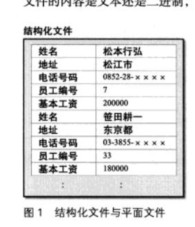
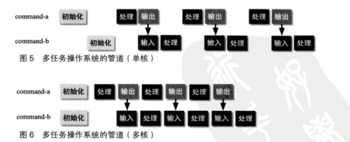
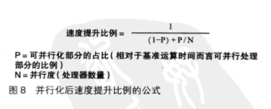
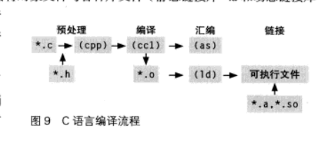
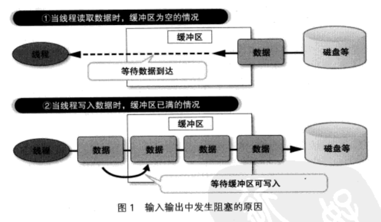
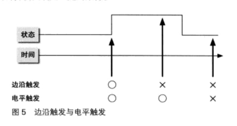

# 五. 多核时代的编程

## 5.1 摩尔定律

基础描述: "集成电路中的晶体管数量大约每两年翻一倍"

半导体的知道使用的是一种类似印刷的技术. 简单来说, 是被称为"晶圆"的原型单晶硅薄片上涂一层感光树脂(光刻胶), 然后将电路的影像照射到晶圆上. 其中被光照社并感光的部分树脂就会保留下来, 其余的部分就会露出硅层. 

然后对露出的硅进行加工, 就可以制作成晶体管等原件. 摩尔定律的本质, 就是如何才能在晶圆上蚀刻出更细微的电路. 

电路的制程缩小一半, 就意味着同样的电路占用的面积可以缩小到原来的1/4. 在电路设计不变的情况下, 用相同面积的硅晶圆就可以制造出4倍数量的集成电路, 或者吧材料成本所见到原来的四分之一. 

此外, 对于构建CPU的MOS(Metal-Oside Semiconductor)晶体管, 当制程缩减一半, 就可以实现2倍的开关速度和只消耗1/4的电量. 这是IDM发现的一种性质, 被称为`Dennard Scaling`.

### 后果

价格下降, 性能提升. 

现代CPU都配备了专用的高速缓存, 通过高速缓存可以在访问内存是缩短等待时间. 从CPU的运行速度来看, 通过外部总线连接的主内存访问非常缓慢. 仅仅是等待数据从内存传输过来的这段时间, CPU就可以执行数百条指令. 

内部缓存就是用于CPU快速运算的, 还有CPU配置了第二梯队的而计算村,以及第三梯队的三级缓存.

### 提高性能

CPU在运行软件的时候,看起来是注意执行指令的, 但实际构成CPU的电路是能够同时执行多个操作的. 将指令执行的操作进行分割, 通过流水做的方式缩短每一个单独步骤的处理事件. 从而提升指令在后仍提的执行速度. 这种流水线处理就是一种提高性能的基本技术. 

典型的处理步骤包括:

- 取出指令(fetch)
- 指令解码(decode)
- 取出运算数据(data fetch)
- 运算
- 输出运算结果

等

将操作划分的月息, 每一级的梳理时间也会相应缩短, 从而提升指令执行的团兔粮. 处于这样的考虑, 现代的CPU中流水线都被进一步划分. 

对于CPU来说, 访问寄存器和访问内存所需要的时间是天壤之别的. 如果需要对内存进行访问, 则在执行去除数据这一步的时间内, 整个流水线就需要等待几百个始终周期. 这样一来流水线化对指令执行速度带来的那一点提升就被抵消了

像这样流水线发生停顿的问题被称为气泡. 需要对产生气泡的原因不同, 采用不同的对策.

上述这样由于内存访问速度缓慢导致的流水线停顿问题, 被称为数据冒险. 针对这种问题的策略, 教师高度缓存. 实际上是消耗一定数量的晶体管作为CPU内部高速存储空间, 从而提升速度. 

### 极限和超越极限

摩尔定律到极限了, 继续这样下去, 总有一天, 一个晶体管会变得比一个原子还小. 

导线宽度终究有极限. 所以需要其他解决方案, 比如远紫外线和X涉嫌. 

但是又会带来其他问题, 比如渗漏电流以及伴随的发热问题.

而随着极限的到来, 软件不能在吃性能提升的红利了. 这就需要软件开发者付出更多的努力. 我们需要新的计算模型. 

## 5.2 UNXI管道

UNIX之前, 大多数操作系统的文件是结构化文件. 结构化文件就是拥有结构的记录的罗列. 

但是在UNIX中, 文件被定义为了单纯的字节流. 对于这些字节流如何解释, 则交给每个应用程序自己解决. 其内容是文本还是二进制, 本质上没有任何区别. 



UNIX的另一个独到之处, 就是Shell. 

Shell不仅是和用户进行交互的界面, 也是将命令批处理化的一种语言. 

UNIX之前, 也有类似的命令管理语言, 如JCL. 但是Shell功能更加丰富, 可以对多个命令进行灵活的组合. 如果要执行重复的命令, 只需要把操作过程记录到文件中, 就能作为程序运行. 这就是脚本语言这个名称的词源.

UNIX现在还有script这个命令, 可以吧shell中的输入内容记录到文件中, 编写出脚程序. 

script的本意是剧本. 

最后一点就是串流管道`stream pipeline`. UNIX进程都具有标准输入输出, 这样就可以将某个命令的输出作为另一个命令的输入. 实现命令的串联. 

这就是管道编程. 

### 多核管道



### xargs

`xargs`是用于将标准输入转换成命令行参数的命令. 

例如:

```sh
find . -name '8~' | xargs rm
```

意思是将所有`~`结尾的文件删除

但是命令行参数的数量是有限的, xargs也考虑到了. 当参数过多是会分为几条命令分别执行. 

此外, 它提供了一个多核命令行参数"-P". 就可以指定启动指定数量的今后才能. 

```sh
find . -name '8~' | xargs -P 4 rm
```

### 瓶颈

共享设备是无法改善性能的, 比如内存, 磁盘, 网络设备等.

### 阿姆达尔定律

"系统性能提升效果, 会随着无法并行的部分而产生饱和"

这是一个估算通过多核并行能够获得多少性能提升的经验法则. 



### 多核编译



```sh
make -j4 # 使用4个线程并行编译
```

`-j`的设置应该略大于实际的核心数量为佳

## 5.3 非阻塞I/O

在需要大量链接的服务器上, 使用线程会使内存负荷和线程切换的开销变得巨大. 因此, 单线程的事件驱动模型更合适. 

但是事件驱动模型也有缺点. 比如在处理回调的时候需要等待. 这样处理发生停止的情况称为阻塞. 阻塞多半在输入输出. 

### 啥?

大部分的输入输出免不了阻塞, 应为输入输出的操作速度并不快, 因此需要进行缓冲. 当数据叨叨缓冲区时, 读取操作只需要从缓冲区中将数据复制出来就可以了.

缓冲机制下, 有两种情况会产生等待. 一种当缓冲区为空, 需要等待数据到达缓冲区. 另一种是缓冲区满了, 需要等待缓冲区腾出空间. 

尤其是在输入(读取)时, 读取操作会一直等待数据的到达.

这样就会发生阻塞. 

输出也可能会发生阻塞, 但是发生的概率不会更高, 并且等待时间较短. 

非阻塞读取有几种方法:

- read(2)
- read(2)+select
- read(2)+O_NONBLOCK
- aio_read
- 信号驱动I/O



边沿触发和电平触发:



## 6.4 Node.js

提高效率的三个方法

- 减负
- 拖延
- 委派

### 减负

提高处理速度的最有效方法, 就是换一台新的电脑. 可惜人不能这样处理. 

不能更换硬件的前提下, 还有以下方法:

- 采用更好的算法
- 减少无谓的开销
- 用空间换时间

相当于:

- 思考更高效的工作方式
- 减少低级重复劳动
- 将复杂的步骤和判断实现总结成文档

### 拖延

减少不必要的不紧急的工作, 就可以更快的完成必要的工作. 怎么判断必要或者不必要的工作呢. 我们可以吧工作拖到不能拖位置. 这样工期就跟不上了, 这时候我们就可以看看那些工作是必须的, 剩下的就砍掉吧. 

但是这个方法的副作用就是一旦时间算不好, 连必要的工作也完成了.

还有一种方法, 将小任务掺杂在碎片时间完成, 类似于CPU中的乱序执行. 

### 委派

委派, 即借用他人的力量完成工作, 也就是团队合作, 协作, 协调的意思. 类似多核, 困难如下:

- 任务分割
- 通信开销
- 可靠性

对于任务分割, 我们可以吧任务分为两种, 出在后续处理, 在任务完成是需要获得通知的同步任务, 执行开始后不必惯性其完成情况的异步任务. 同步任务意味着存在依赖关系, 委派的效果就不明显. 如何将工作分割成异步任务就成了提高效率的关键. 

通信开销是必不可少

可靠性和分布式编程中的故障率也有相似之处

### 非阻塞编程

node.js 事件驱动模型

### 事件循环的利弊

要实现事件循环相同的功能, 除了回调函数之外, 还可以采用启动线程的方式. 不过回调是一种普通的函数调用, 相比之下, 线程启动所需要的开销就要大得多. 并且每个线程都需要占用一定的栈空间.

当然, 线程池技术可以优化内存的使用, 但是还是单线程更有优势.

单线程的问题在于无法利用多核以及阻塞会停滞整体. 

## 6.5 ZeroMQ

所谓的拖延, 就是把工作分解成细小的任务, 将无法马上着手的工作拖到后面再做, 从而减少等待和无用的时间. 

而委派, 就是用多个CPU来共同分组. 

### 多CPU

提升性能

### 阿姆达尔

多CPU性能也不是无限的

活用多CPU的处理, 基本如下步骤:

1. 数据分割, 分配
2. 对预分配的数据进行并行处理
3. 将已胡处理的数据进行集约

并行的部分只有2而已

### 多CPU的方法

线程和进程

用线程实现多核, 则只能在同一台电脑上

用进程则无法共享内存空间, 需要复制数据进行操作. 

注意, 永远没有银弹

### 进程间通行

- 管道
- SysV IPC
- TCP Socket
- UDP Socket
- UNIX Socket

### 管道

shell

### SysV IPC

- 消息队列
- 信号量
- 共享内存

### 套接字

- 通信对象不限于同一台计算机
- 文件描述符
- 自动释放
- 可移植性强

利用IP通行

### UNIX 套接字

套接字的异类. 基于UNXI文件系统上一个特殊文件的路径识别的, 只能用于同一台计算机

### ZeroMQ

分布式进程通信库

