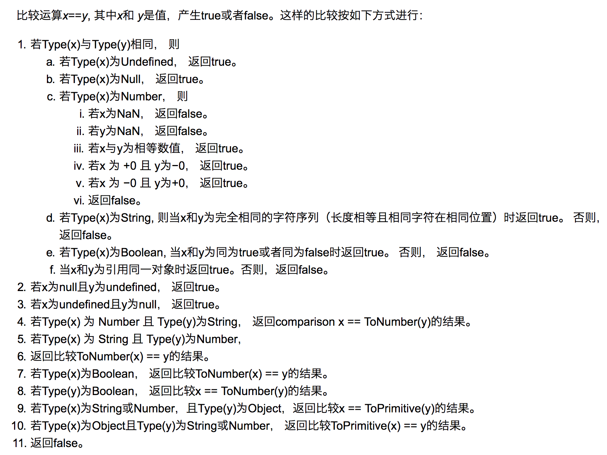

# 前端面试之道(JavaScript)

> [原文链接](https://yuchengkai.cn/docs/frontend/)

## 内置类型

七大内置类型分类

-   基本类型
    -   null
    -   undefined
    -   boolean
    -   number(浮点类型, 没有整型, 基于 IEEE754)
        -   NaN 属于 number, 且 NaN!==NaN
    -   string
    -   symbol
-   对象类型

typeof 可以判断基本类型的类型, 除了 null

> 在 js 最初的 32 位系统中, 出于性能考虑使用低位存储变量的类型信息, 000 表示对象, null 表示为全 0, 因此被错误的判断为 object

判断类型更好的方法是:

```js
Object.prototype.call(); //=>[object Type]
```

## 类型转换

### 转 boolean

除了 undefined, null,false, NaN, '',0,-0,其他所有值都转为 true

### 对象转基本类型

对象在转基本类型时, 首先调用 valueof, 然后调用 toString, 并且这两个方法是可以重写的;

```js
let a = {
    valueOf() {
        return 0;
    }
     toString() {
        return '1';
    },
    [Symbol.toPrimitive]() {
        return 2;
    }
};

1 + a // => 3
'1' + a // => '12'
```

`Symbol.toProtimitive`也是可以被重写的, 该方法在转基本类型的时候调用优先级最高

### 四则运算中的类型转换

-   在加法运算中, 其中一方是字符串, 则另一方也会被转为字符串
-   在其他运算中, 其中一方是数组, 则另一方也会被转换为数字
-   加法运算会触发三种类型转换: 值=>原始值=>数字=>字符串

```js
1 + '1'; // '11'
2 * '2'; // 4
[1, 2] + [2, 1]; // '1,22,1'

'a' + +'b'; // -> "aNaN"
//_+b 是NaN
```

### '=='中的类型转换:



这里是一道例题:

```js
// [] 转成 true，然后取反变成 false
[] == false
// 根据第 8 条得出
[] == ToNumber(false)
[] == 0
// 根据第 10 条得出
ToPrimitive([]) == 0
// [].toString() -> ''
'' == 0
// 根据第 6 条得出
0 == 0 // -> true
```

### 比较运算符

1. 如果是对象, 就通过`toPrimitive`转换对象
2. 如果是字符串, 就通过`unicode`字符索引来比较

## 原型


1. 每个**函数**都有`prototype`属性, 除了`Function.prototype.bind()`, 该属性指向原型.
2. 每个**对象**都有`__proto__`属性, 指向了创建该对象的构造函数的原型, 其实这个属性指向了`[[prototype]]`. 但是`[[prototype]]`是内部属性, 我们并不能访问, 所以使用`__proto__`来访问
3. 对象可以通过`__proto__`来寻找不属于该对象的属性, `__proto__`将对象链接起来组成了原型链.

[深度解析](https://github.com/KieSun/Dream/issues/2)

## new

1. 新生成了一个对象
2. 链接到原型
3. 绑定 this
4. 返回新对象

手动实现一个 new:

```js
function create() {
    //创建一个空的对象
    let obj = new Object();
    //获得构造函数
    let Con = [].shift.call(arguments);
    //链接到原型
    obj.__proto__ = Con.prototype;
    //绑定this, 执行构造函数
    let result = Con.apply(obj, arguments);
    //确保 new 出来的是个对象
    return typeof result === 'object' ? result : obj;
}
```

对于一个实例对象来说, 都是通过`new`产生的, 无论是`function Foo()`还是`let a=[b:1]`.

对于创建一个对象来说, 字面量方式不论是性能还是可读性, 都是推荐的方式, 因为在使用`new Object()`的方式创建对象时需要通过作用链域来一层层找到`Object`, 但是使用字面量的方式就没有这个问题.

```js
function Foo() {}
//function 内部等于new Function()
let a = { b: 1 };
//这个字面量内部实际上就是使用了new Object()
```

对于 new, 还需要注意运算符优先级:

```js
function Foo() {
    return this;
}
Foo.getName = function() {
    console.log('1');
};
Foo.prototype.getName = function() {
    console.log('2');
};

new Foo.getName(); //=>1
new Foo().getName(); //=>2
```

`new Foo()`的优先级高于`new Foo`, 所以上述代码可以这样划分:

```js
new (Foo.getName())();
new Foo().getName();
```

## instanceof

`instanceof`可以通过原型链来判断对象的类型, 手动实现如下:

```js
function instanceof(left,right){
    //获得类型的原型
    let prototype=right.prototype;
    //获得对象的原型
    left=left.__proto__;
    //判断对象的类型是否等于类型的原型
    while(true){
        if(left===null)
            return false;
        if(prototype===left)
            return true;
        left=left.__proto__;
    }
}
```

## this

```js
function foo() {
    console.log(this.a);
}

var a = 1;
foo();

var obj = {
    a: 2,
    foo: foo
};

obj.foo();
```

这两种情况, `this`只依赖与调用函数前端的对象, 优先级是第二个情况大于第一个情况。

```js
var c = new foo();
c.a = 3;
console.log(c.a);
```

`new`的优先级是最高的， `this`只会绑定在`c`上， 不会被任何方式修改`this`的绑定. 除此之外, 就是利用 call,apply,bind 手动的改变 this, 这个优先级仅次于 new.

搞清楚这个, 就剩下一个箭头函数了. 箭头函数本身没有`this`, 函数的`this`只取决于其外部代码的上下文:

```js
function a() {
    return () => {
        return () => {
            console.log(this);
        };
    };
}

consoel.log(a()()());
```

像在这个例子中, this 指向的就是 window.

## 执行上下文

当执行 JS 代码的时候, 会产生三种执行上下文:

-   全局执行上下文
-   函数执行上下文
-   eval 执行上下文

每个执行上下文都有三个重要的属性:

-   变量对象(VO), 包含变量, 函数声明和函数的形参, 该属性只能在全局上下文中访问到
-   作用域链(JS 采用词法作用域, 也就是说变量的作用域在定义的时候就决定了)
-   this

```js
var a = 10;
function foo(i) {
    var v = 20;
}
foo();
```

对于这段代码, 执行栈中有两个上下文: 全局上下文和函数`foo`上下文.

```js
stack = [globalContext.fooContext];
```

对于上下文来说, VO 大概是这样的:

```js
globalContext.VO=globe;
globalContext.VO={
    a:undefined,
    foo: <Function>
}
```

对于函数`foo`来说, VO 不能访问, 只能访问到活动对象(AO):

```js
fooContext.VO=foo.AO;
fooContext.AO {
    i:undefined,
    b:undefined,
    arguments: '<>'
}
//arguments 是函数独有的对象(箭头函数没有)
//该对象是一个伪数组, 有'length`属性并且可以通过下标访问元素
//该对象中`callee`表示函数本身
//`caller`属性代表函数的调用者
```

作用域链可以理解为包含自身变量对象和上级变量对象的列表, 通过`[[Scope]]`属性查找上级变量:

```js
fooContext.[[Scope]]=[
    globaleContext.VO
]

fooContext.Scope=fooContext.[[Scope]]+fooContext.VO
fooContext.Scope=[
    fooCOntext.VO,
    globalContext.VO
]
```

现在我们来重新认识`var`:

```js
b(); //call b
console.log(a); //undefined

var a = 'Hello world';

function b() {
    console.log('call b');
}
```

通常我们解释声明提升说将声明的代码移动到了顶部, 更准确的解释是, 在生成执行上下文的过程中, 会分成两个阶段, 第一个阶段是创建的阶段, JS 解释器会找出需要提升的变量和函数, 并在提前在内存中开辟弓箭, 函数会把整个函数体放入内存中, 变量只声明并且赋值为 undefined, 所以在第二个阶段, 也就是代码执行阶段, 我们可以直接提前使用.

在提升的过程中, 相同的函数会覆盖上一个函数, 并且函数优先于变量提升.

```js
b(); //call b second

function b() {
    console.log('call b first');
}

function b() {
    console.log('call b second');
}

var b = 'Hello world';
```

`let`是在 ES6 中被引入的, `let`不能在声明前使用, 但这不是说`let`不会提升, 而是因为临时死区导致了不能再声明前使用.

对于非匿名的立即执行函数, 需要注意:

```js
var foo = 1;
(function foo() {
    foo = 10;
    console.log(foo);
})(); // => f foo() {foo = 10; console.log(foo)}
```

js 在遇到非匿名的立即执行函数时, 会创建一个辅助的特定对象, 然后将函数名称作为这个对象, 然后将函数名作为这个对象的属性, 因此函数内部才可以访问到`foo`, 但是这个值是只读的, 所以对它的赋值并不会生效, 所以打印的结果还是这个函数, 并且外部的值也没有发生改变.

```js
specialObject={};

Scope=specialObject+Scope;

foo=new FunctionExpression;
foo.[[Scope]]=Scope;
specialObject.foo=foo;//{DontDelete},{ReadOnly}

delete Scope[0];// remove specialObject from the froint of scope chain
```

## 闭包

```js
function A() {
    let a = 1;
    function B() {
        console.log(a);
    }

    return B;
}
```

在函数 A 已经弹出调用栈之后, B 还能应用到函数 A 的变量, 这就是闭包. 因为此时 A 中的边哦那个是存储在堆上的, 现在 JS 引擎可以通过逃逸分析辨别出那些变量需要存储在堆上, 那些需要存储在栈上.

经典循环输出问题:

```js
for (var i = 1; i <= 5; i++) {
    setTimeout(function timer() {
        console.log(i);
    }, i * 1000);
}
```

解决办法三种:

```js
//使用闭包
for (var i = 1; i <= 5; i++) {
    (function(j) {
        setTimeout(function timer() {
            console.log(j);
        }, j * 1000);
    })(i);
}

//使用setTimeout的第三个参数
for (var i = 1; i <= 5; i++) {
    setTimeout(
        function timer(j) {
            console.log(j);
        },
        i * 1000,
        i
    );
}

//使用let
for (let i = 1; i <= 5; i++) {
    setTimeout(function timer() {
        console.log(i);
    }, i * 1000);
}
```

对于第三种来说, 它会创建一个块级作用域, 相当于:

```js
{
    //形成块级作用域
    let i = 0;
    {
        let ii = i;
        setTimeout(function timer() {
            console.log(ii);
        }, i * 1000);
    }
    i++;
    {
        let ii = i;
    }
    i++;
    {
        let ii = i;
    }
    ...
}
```

## 深拷贝和浅拷贝

### 浅拷贝

1. 通过`Object.assign`来进行浅拷贝:

```js
let a = {
    age: 1
};
let b = Object.assign({}, a);
a.age = 2;
console.log(b.age); //1
```

2. 通过`...`扩展运算符来浅拷贝:

```js
let a = {
    age: 1
};
let b = { ...a };
a.age = 2;
console.log(b.age); //1
```

浅拷贝只解决了第一层的引用问题, 深拷贝就是对每一层都递归的进行浅拷贝.

### 深拷贝

1. 通过`JSON.parse(JSON,stringify(object))`来进行深拷贝

```js
let a = {
    age: 1,
    jobs: {
        first: 'FE'
    }
};

let b = JSON.parse(JSON.stringify(a));
a.jobs.first = 'native';
console.log(b.jobs.first);
```

但是这个方法存在局限性:

-   会忽略`undefined`
-   会忽略`Symbol`
-   不能序列化函数
-   不能解决循环引用的对象

基本上,临时简单的用可以. 并且它是内置函数中处理深拷贝性能最快的

但如果数据中含有循环引用, 或者有 undefined 或者 symbol 的数据, 可以考虑使用 lodash 的深拷贝函数.

如果所需要拷贝的对象含有内置类型并且不包含函数, 可以使用`messageChannel`:

```js
function structuralClone(obj) {
    return new Promise(resolve => {
        const { port1, port2 } = new MessageChannel();
        port2.onmessage = ev => resolve(ev.data);
        port1.postMessage(obj);
    });
}

var obj = {
    a: 1,
    b: {
        c: b
    }
};

//注意该方法是异步的, 可以处理undefined和U循环引用对象
async () => {
    const clone = await structuralClone(obj);
};
```

## 模块化

### ES6 Module

```js
//file a.ja
export function a() {}
export function b() {}

//file b.js
export default function() {}

import { a, b } from 'a.js';
import XXX from 'b.js';
```

### CommonJS

`CommonJs`是 Node 独有的规范, 浏览器中使用就需要用到`Browserify`解析了.

```js
//a.js
module.exports = {
    a: 1
};
//or
exports.a = 1;
//b.js
var module = require('./a.js');
modul.a; //=>log 1
```

两种赋值方式类似, 但是 exports 不能直接赋值. 区别于 ES6 的 module:

-   CommonJS 支持动态导入, 后者虽有提案, 目前不支持
-   前者是同步导入, 因为用于服务端, 文件都在本地, 同步导入卡主也影响不大, 后者是异步导入, 用于浏览器, 需要下载文件, 采用同步导入会导致渲染卡顿.
-   CommonJS 在到处是都是值拷贝, 就算导出的值变了, 导入的值也不会改变, 所以如果更新值, 必须重新导入, 后者采用实时绑定的方式, 导入导出的值都指向同一个内存地址, 导入值会跟随导出值变化
-   后者回编译成`require/exports`来执行

### AMD

AMD 主要用在`requirejs`中, 提出比较早, 国内现在用的不算太多.

```js
//导入形式1
define(['./a', './b'], function(a, b) {
    a.do();
    b.do();
});

//导入形式2
define(function(require, exports, module) {
    var a = require('./a');
    a.doSomething();
    var b = require('./b');
    b.doSomething();
});
```

## 防抖

将多次请求合并为一次, 或者某段时间内只能触发某个事件一次, 可以用于页面滚动监听, reszie 监听等.

先来实现一个简单的防抖:

```js
//func是用户传入需要防抖的函数
//wait是等待时间
const debounce = (func, wait = 50) => {
    //缓存一个定时器id
    let timer = 0;
    /**
     * 这里返回的函数式每次用户实际调用的防抖函数
     * 如果已经设定过定时器就清空上一次的定时器
     * 开始一个新的定时器, 延迟执行用户传入的方法
     */
    return function(...args) {
        if (timer) clearTime(timer);
        timer = setTimeout(() => {
            func.apply(this, args);
        }, wait);
    };
};
```

可以看出, 如果用户一直触发这个函数, 并且每次触发的间隔小于 wait, 这个函数最终只会触发一次. 节流于此不同, 它会每个一定时间调用函数.

上面的代码中, 只能在最后调用, 一般的防抖会有一个`immediate`选项, 表示是否立即调用. 两者的区别在于:

-   假设在搜索的时候, 我们希望用户数万最后一个字才调用查询接口, 这时候适合`延迟执行`, 它总是在一连串函数触发之后调用
-   例如用户在上传代码的时候, 就需要立即触发上传接口, 然后改变上传按钮的样式, 在间隔一段时间以后才能再次触发.

下面是一种简单的实现:

```js
//获取当前时间戳
function now() {
    return +new Date();
}

/**
 *  防抖函数
 *  @param  {function}  func    回调函数
 *  @param  {number}    wait    调用间隔
 *  @param  {boolean}   immediate   设置为true时, 立即调用函数
 *  @return  {function}  返回及客户调用函数
 */
function debounce(func, wait = 50, immediate = true) {
    let timer, context, args;
    //延迟执行函数
    const later = () =>
        setTimeout(() => {
            //延迟函数执行完毕, 清空缓存的定时器序号
            timer = null;
            //延迟执行的情况下, 函数会在延迟函数中执行
            if (!immediate) {
                func.apply(context, args);
                context = null;
                args = null;
            }
        }, wait);

    //这里返回实际调用的函数
    return function(...params) {
        if (!timer) {
            timer = later();
            //如果是立即执行, 调用函数
            //否则缓存参数和调用上下文
            if (immediate) {
                func.apply(this.params);
            } else {
                context = this;
                args = params;
            }
        } else {
            //如果已有延迟执行函数, 调用的时候清除原来的并重新设定一个
            //这样延迟函数重新计时
            clearTimeout(timer);
            timer = later();
        }
    };
}
```

## 节流

防抖和节流的本质是不一样的, 防抖是将多次执行合并为最后一次执行, 节流是将多次执行转变为每隔一段时间只执行一次.

```js
/**
 *  underscore, 节流函数
 * @param  {function}   func      回调函数
 * @param  {number}     wait      表示时间窗口的间隔
 * @param  {object}     options   如果想忽略开始函数的的调用，传入{leading: false}。
 *                                如果想忽略结尾函数的调用，传入{trailing: false}
 *                                两者不能共存，否则函数不能执行
 * @return {function}             返回客户调用函数
 */

_.throttle = function(func, wait, options) {
    var context, args, result;
    var timeout = null;
    //之前的时间戳
    var previous = 0;
    //如果options没传则设为空对象
    if (!options) options = {};
    //定时器回调函数
    var later = function() {
        //如果设置了leading, 就将previous设为0
        //用于下面函数的第一个if判断
        previous = options.leading === false ? 0 : _.now();
        //置空一可以防止内存泄漏, 二可以为下面的定时器判断
        timout = null;
        result = func.apply(context, args);
        if (!timeout) context = args = null;
    };
    return function() {
        //获得当前时间戳
        var now = _.now();
        //首次进入前者必为true
        //如果需要第一次不执行函数
        //就将上次时间戳设为当前的
        //这样在接下来计算remaining的值会大于0
        if (!previous && options.leading === false) previous = now;
        //计算剩余时间
        var remaining = wait - (now - previous);
        context = this;
        args = arguments;
        // 如果当前调用已经大于上次调用时间 + wait
        // 或者用户手动调了时间
        // 如果设置了 trailing，只会进入这个条件
        // 如果没有设置 leading，那么第一次会进入这个条件
        // 还有一点，你可能会觉得开启了定时器那么应该不会进入这个 if 条件了
        // 其实还是会进入的，因为定时器的延时
        // 并不是准确的时间，很可能你设置了2秒
        // 但是他需要2.2秒才触发，这时候就会进入这个条件
        if (remaining <= 0 || remaining > wait) {
            //如果存在定时器清理, 否则会调用二次回调
            if (timeout) {
                clearTimeout(timeout);
                timeout = null;
            }
            previous = now;
            result = func.apply(context, args);
            if (!timeout) context = args = null;
        } else if (!timeout && options.trailing !== false) {
            //判断是否设置了定时器和trailing
            //没有的话就开启一个定时器
            //并且不能同时设置leading和trailing
            timeout = setTimeout(later, remaining);
        }
        return result;
    };
};
```

## 继承

ES5 的继承写法, 大致像这样:

```js
function Super() {}
Super.prototype.getNumber = function() {
    return 1;
};

function Sub() {}
let s = new Sub();
Sub.prototype = Object.create(Super.prototype, {
    constructor: {
        value: Sub,
        enumerable: false,
        writable: true,
        configurable: true
    }
});
```

思路就是将子类的原型设置为父类的原型.

在 ES6 中, 我们可以通过 class 语法来简单的实现继承:

```js
class MyDate extends Date {
    test() {
        return this.getTime();
    }
}

let myDate = new MyDate();
myDate.test();
```

但是这里会产生一个报错:

```js
Uncaught TypeError: this is not a Date object
```

因为在 JS 底层, 如果不是由 Date 构造出来的实例是不能调用 Date 中的函数的. ES6 中的 class 与 es5 中继承的写法是不同的.

可以这样是解决这个问题:

```js
function MyDate() {}
MyDate.prototype.test = function() {
    return this.getTime();
};
let d = new Date();
Object.setPrototypeOf(d, MyDate.prototype);
Object.setPrototypeOf(MyDate.prototype, Date.prototype);
```

思路就是创建父类实例时候改变实例的原型链, 通过父类连接到 Date 链上.

## call,apply,bind

`call`和`apply`都是为了解决改变`this`的指向, 作用都是相同的, 只是传参的方式不同.

除了第一个参数外, call 可以接受一个参数列表, apply 只接受一个参数数组.

```js
let a = {
    value: 1
};
function getValue(name, age) {
    console.log(name);
    console.log(age);
    console.log(this.value);
}

getValue.call(a, 'cxk', '24');
getValue.apply(a, ['cxk', '24']);
```

### 模拟实现 call/apply

-   不传入第一个参数, 那么默认为 window
-   改变了 this 指向, 让新的对象可以执行该函数, 那么就是给新对象提供一个函数, 执行完成后删除

```js
Function.prototype.myCall = function(context) {
    var context = context || window;
    //给context添加一个属性
    context.fn = this;
    //将context后面的参数提取出来
    var args = [...arguments].slice(1);
    var result = context.fn(...args);
    //删除fn
    delete context.fn;
    return result;
};
```

这是 call 的实现思路, 实现 apply 的类似的:

```js
Function.prototype.myApply = function(context) {
    var context = context || window;
    context.fn = this;

    var result;
    //需要判断是否存储第二个参数
    //如果存在, 就将第二个参数展开
    if (argumnets[1]) {
        result = context.fn(...arguments[1]);
    } else {
        result = context.fn();
    }

    delete context.fn;
    return result;
};
```

bing 与其他两个的方法作用是一直的, 只是该方法会返回一个函数, 并且我们可以通过 bind 实现柯里化, 同样的模拟实现一个`bind`:

```js
Function.prototype.myBind = function(context) {
    if (typeof this !== 'function') {
        throw new TypeError('Error');
    }
    var _this = this;
    var args = [...arguments].slice(1);
    //返回一个函数
    return function F() {
        //因为返回了一个函数, 我们可以new F(), 所以需要判断
        if (this instanceof F) {
            return new _this(...args, ...arguments);
        }
        return _this.apply(context, args.concat(...arguments));
    };
};
```

## Promise 实现

Promise 可以看成一个状态机, 初始为`pending`, 通过函数`resolve`和`reject`, 将状态转化为`resolved`或者`rejected`, 并且状态一旦改变就不能再次变化.

`then`函数会返回一个`promise`实例, 并且该返回值是一个新的实例而不是之前的实例, 如果返回同一个实例, 多个`then`调用就失去意义了.

```js
// 手动实现一个Promise

//三种状态

const PENDING = 'pending';
const RESOLVED = 'resolved';
const REJECTED = 'rejected';

//promise 接受一个函数参数, 该函数会立即执行
function MyPromise(fn) {
    let _this = this;
    _this.currentState = PENDING;
    _this.value = undefined;
    //用于保存then中的回调, 只有当promise状态为pending时才会缓存, 并且每个实例至多缓存一个
    _this.resolvedCallbacks = [];
    _this.rejectedCallbacks = [];

    _this.resolve = function(value) {
        if (value instanceof MyPromise) {
            //如果value是个Promise, 递归执行
            return value.then(_this.resolve, _this.reject);
        }
        setTimeout(() => {
            //异步执行, 保证执行顺序
            if (_this.currentState === PENDING) {
                _this.currentState = RESOLVED;
                _this.value = value;
                _this.resolvedCallbacks.forEach(cb => cb());
            }
        });
    };

    _this.reject = function(reason) {
        setTimeout(() => {
            //异步执行, 保证执行顺序
            if (_this.currentState === PENDING) {
                _this.currentState = REJECTED;
                _this.value = reason;
                _this.rejectedCallbacks.forEach(cb => cb());
            }
        });
    };
    //用于解决: new Promise(()=> throw Error(error))
    try {
        fn(_this.resolve, _this.reject);
    } catch (e) {
        _this.reject(e);
    }
}

MyPromise.prototype.then = function(onResolved, onRejeted) {
    var self = this;
    //规范2.2.7, then必须返回一个新的promise
    var promise2;
    //规范2.2 onResolved 和 onRejected 都为可选参数
    //如果类型不是函数需要忽略, 同时也实现了透传
    //Promise.resolve(4).then().then((value)=>console.log(value))
    onResolved = typeof onResolved === 'function' ? onResolved : v => v;
    onRejeted =
        typeof onRejeted === 'function'
            ? onRejeted
            : r => {
                  throw r;
              };

    if (self.currentState === RESOLVED) {
        return (promise2 = new MyPromise(function(resolve, reject) {
            //规范2.2.4 保证onFulfilled, onRejected 异步执行
            //所以使用setTimeout包裹
            setTimeout(function() {
                try {
                    var x = onResolved(self.value);
                    resolutionProcedure(promise2, x, resolve, reject);
                } catch (reason) {
                    reject(reason);
                }
            });
        }));
    }

    if (self.currentState === REJECTED) {
        return (promise2 = new MyPromise(function(resolve, reject) {
            setTimeout(function() {
                //异步执行onRejected
                try {
                    var x = onRejeted(self.value);
                    resolutionProcedure(promise2, x, resolve, reject);
                } catch (reason) {
                    reject(reason);
                }
            });
        }));
    }

    if (self.currentState === PENDING) {
        return (promise2 = new MyPromise(function(resolve, reject) {
            self.resolutionProcedure.push(function() {
                //考虑到报错, 使用trycatch包裹
                try {
                    var x = onResolved(self.value);
                    resolutionProcedure(promise2, x, resolve, reject);
                } catch (r) {
                    reject(r);
                }
            });

            self.rejectedCallbacks.push(function() {
                try {
                    var x = onRejeted(self.value);
                    resolutionProcedure(promise2, x, resolve, reject);
                } catch (r) {
                    reject(r);
                }
            });
        }));
    }
};

//规范2.3
function resolutionProcedure(promise2, x, resolve, reject) {
    //规范2.3.1, x不能和promise2相同, 避免循环引用
    if (promise2 === x) {
        return reject(new TypeError('Error'));
    }

    //规范2.3.2
    //如果x为Promise , 状态为pending需要继续等待否则执行
    if (x instanceof MyPromise) {
        if (x.currentState === PENDING) {
            x.then(function(value) {
                //再次调用该函数式为了确认x resolve 的参数是什么类型, 如果是基本类型就再次resolve
                //把值传给下一个then
                resolutionProcedure(promise2, value, resolve, reject);
            }, reject);
        } else {
            x.then(resolve, reject);
        }
        return;
    }

    //规范2.3.3.3.3
    //reject 或者 resolve 其中一个执行过, 忽略其他
    let called = false;
    if (x !== null && (typeof x === 'object' || typeof x === 'function')) {
        //规范2.3.3.2, 如果不能去除then, 就reject
        try {
            //规范 2.3.3.1
            let then = x.then;
            //如果then是函数, 调用x.then
            if (typeof then === 'function') {
                //规范2.3.3.3
                then.call(
                    x,
                    y => {
                        if (called) return;
                        // 规范 2.3.3.3.1
                        resolutionProcedure(promise2, y, resolve, reject);
                    },
                    e => {
                        if (called) return;
                        called = true;
                        reject(e);
                    }
                );
            } else {
                //规范2.3.3.4
                resolve(x);
            }
        } catch (e) {
            if (called) return;
            called = true;
            reject(e);
        }
    } else {
        //规范2.3.4, x为基本类型
        resolve(x);
    }
}
```

## Generator 实现

Genenrator 是 ES6 中新增的语法, 和 Promise 一样, 都可以用来异步编程

```js
//使用*表示一个Generator函数
//内部可以通过yield暂停代码
//通过diaoyongnext恢复执行
function* test() {
    let a = 1 + 2;
    yield 2;
    yield 3;
}

let v = test();
console.log(b.next()); //> {value:2,done:false}
console.log(b.next()); //> {value:3,done:false}
console.log(b.next()); //> {value: undefined,done:true}
```

下面是一个 Generator 函数的简单实现:

```js
//手动实现一个Generator函数

function generator(cb) {
    return function() {
        var object = {
            next: 0,
            stop: function() {}
        };

        return {
            next: function() {
                var ret = cb(object);
                if (ret === undefined) return { value: undefined, done: true };
                return {
                    value: ret,
                    done: false
                };
            }
        };
    };
}

// 如果你使用 babel 编译后可以发现 test 函数变成了这样
function test() {
    var a;
    return generator(function(_context) {
        while (1) {
            switch ((_context.prev = _context.next)) {
                // 可以发现通过 yield 将代码分割成几块
                // 每次执行 next 函数就执行一块代码
                // 并且表明下次需要执行哪块代码
                case 0:
                    a = 1 + 2;
                    _context.next = 4;
                    return 2;
                case 4:
                    _context.next = 6;
                    return 3;
                // 执行完毕
                case 6:
                case 'end':
                    return _context.stop();
            }
        }
    });
}
```

## Map/FlatMap/Reduce

map 的作用是生成一个新数组, 遍历原数组, 将每个元素拿出来后做一些变换然后 append 到新的数组:

```js
[1, 2, 3].map(v => v + 1);
// -> [2, 3, 4]
```

map 有三个参数:索引元素, 索引, 原数组:

```js
['1', '2', '3'].map(parseInt);
//  parseInt('1', 0) -> 1
//  parseInt('2', 1) -> NaN
//  parseInt('3', 2) -> NaN
```

`FlatMap`和`map`的作用几乎是相同的, 但是对于多维数组来说, 会将原数组降维, 可以将 FlatMap 看做 map+flatten, 目前在浏览器中还不支持.

```js
[1, [2], 3].flatMap(v => v + 1);
// -> [2, 3, 4]
```

讲一个数组彻底降维, 可以这样实现:

```js
const flattenDeep = arr => (Array.isArray(arr) ? arr.reduce((a, b) => [...a, ...flattenDeep(b)], []) : [arr]);
flattenDeep([1, [[2], [3], [4], 5]]);
```

其中 reduce 的作用是将数组中的值组合起来, 最终得到一个值:

```js
function a() {
    console.log(1);
}

function b() {
    console.log(2);
}

[a, b].reduce((a, b) => a(b())); //=>2 1
```

## async/await

一个函数如果加上 async, 那么该函数就会返回一个 Promise:

```js
async function test() {
    return '1';
}
console.log(test()); // -> Promise {<resolved>: "1"}
```

可以把`async`看成将函数返回值使用`Promise.resolve()`包裹了下

await 只能在 async 函数中使用:

```js
function sleep() {
    return new Promise(resolve => {
        setTimeout(() => {
            console.log('finish');
            resolve('sleep');
        }, 2000);
    });
}
async function test() {
    let value = await sleep();
    console.log('object');
}

test();

//finish
//object
```

async/await 相比起 Promise 来说, 处理 then 的调用链上能够更清晰的写出代码, 缺点在于滥用 await 可能会导致性能问题, 因为 await 会阻塞代码, 也许之后的异步代码并不依赖于前者, 但仍然需要等待前者完成, 导致代码失去了并发性.

下面是一题代码题:

```js
var a = 0;
var b = async () => {
    a = a + (await 10);
    console.log('2', a); // -> '2' 10
    a = (await 10) + a;
    console.log('3', a); // -> '3' 20
};
b();
a++;
console.log('1', a); // -> '1' 1
```

-   首先函数 b 执行, 在执行 await 之前, 变量 a=0, 因为在 await 内部实现了 generators, 它会在保留堆栈中的数据, 所以此时 a=0 被保存下来
-   await 为异步操作, 返回 promise 对象并且返回执行代码的控制权, 使得代码继续执行,所以输出 console.log('1',a);
-   同步代码执行完毕, 开始执行异步代码, 将保存下来的值拿出来使用, 此时 a=10;
-   继续执行常规代码

## Proxy

```js
let p = new Proxy(target, handler);
// `target` 代表需要添加代理的对象
// `handler` 用来自定义对象中的操作

let onWatch = (obj, setBind, getLogger) => {
    let handler = {
        get(target, property, receiver) {
            getLogger(target, property);
            return Reflect.get(target, property, receiver);
        },
        set(target, property, value, receiver) {
            setBind(value);
            return Reflect.set(target, property, value);
        }
    };
    return new Proxy(obj, handler);
};

let obj = { a: 1 };
let value;
let p = onWatch(
    obj,
    v => {
        value = v;
    },
    (target, property) => {
        console.log(`Get '${property}' = ${target[property]}`);
    }
);
p.a = 2; // bind `value` to `2`
p.a; // -> Get 'a' = 2
```

## V8 下的垃圾回收机制

V8 实现了准确是 GC, GC 算法采用了分代式垃圾回收机制, 因此, V8 将内存(堆)分为新生代和老生代两部分.

### 新生代算法

新生代中的对象一般存活时间较短, 使用 Scavenge GC 算法

在新生代空间中, 内存空间分为两部分, 分别为 Form 空间和 To 空间, 在这两个空间中, 必定有一个空间是实用的, 另一个空间是空闲的. 新分配的对象会被放入 From 空间中, 当 From 空间被占满时, 新生代 GC 就启动了.

算法会检查 From 空间中存活的对象并复制到 To 空间中, 如果有失活的对象就销毁, 当复制完成后将 From 空间和 To 空间互换, GC 结束.

### 老生代算法

老生代中的对象一般存活时间较长且数量也多, 使用了两个算法, 分别是标记清除算法和标记压缩算法.

一般来说, 这样一些对象才会出现在老生代空间中:

-   新生代中的对象是否已经经历过一次 Scavenge 算法, 如果经历过的话, 会将对象从新生代空间移动到老生代空间中
-   To 空间的对象占比大小超过 25%, 在这种情况下, 为了不影响到内存分配, 会将对象从新生代空间移动到老生代空间中.

老生代中的空间比较复杂:

```c++
enum AllocationSpace {
  // (v8:7464): Actually map this space's memory as read-only.
  RO_SPACE,    // 不变的对象空间
  NEW_SPACE,   // 新生代用于 GC 复制算法的空间
  OLD_SPACE,   // 老生代常驻对象空间
  CODE_SPACE,  // 老生代代码对象空间
  MAP_SPACE,   // 老生代 map 对象
  LO_SPACE,    // 老生代大空间对象
  NEW_LO_SPACE,  // 新生代大空间对象

  FIRST_SPACE = RO_SPACE,
  LAST_SPACE = NEW_LO_SPACE,
  FIRST_GROWABLE_PAGED_SPACE = OLD_SPACE,
  LAST_GROWABLE_PAGED_SPACE = MAP_SPACE
};
```

如下情况下会先启动标记清除算法:

-   某一个空间没有分块的时候
-   空间中被对象超过一定限制
-   空间不能保证新生代中的对象移动到老生代中

在这个阶段中, 会比那里堆中所有的对象, 然后标记活的对象, 在标记完成后, 销毁所有没有被标记的对象. 在标记大型对内存时, 可能需要上百毫秒才能完成一次标记, 从 2011 年开始, V8 从 stop-the-world 标记切换到增量标记. 在增量标记期间, GC 将标记工作分解为更小的模块, 可以让 JS 应用逻辑在模块间隙执行一会, 从而不至于让应用出现停顿. 在 2018 年, GC 又提出了一种并发标记的技术, 可以让 GC 扫描和标记对象时, 同时允许 JS 运行. ([详细链接](https://v8project.blogspot.com/2018/06/concurrent-marking.html))

清除对象后会造成对内存出现碎片, 当碎片超过一定限制后会启动压缩算法, 在压缩过程中, 将或的对象向一端移动, 知道所有对象都移动完成然后清理掉不需要的内存.
