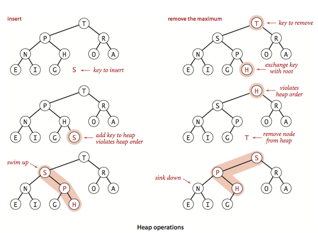

# 前端面试之道(数据结构)

> [原文链接](https://yuchengkai.cn/docs/cs/dataStruct.html)

## 栈

栈只能在某一段添加或者删除数据, 遵循先进后出.

在 js 中可以用数组来实现这一结构

```js
class Stack {
    contructor() {
        this.stack = [];
    }
    push(item) {
        this.stack.push(item);
    }
    pop() {
        this.stack.pop();
    }
    peek() {
        return this.stack[this.getCount() - 1];
    }
    getCount() {
        return this.stack.length;
    }
    isEmpty() {
        return this.getCount() === 0;
    }
}
```

## 队列

队列只能在一端添加数据, 在另一端删除数据, 遵循先进先出.

这里有两种单链队列和循环队列.

单链队列实现如下:

```js
class Queue {
    constructor() {
        this.queue = [];
    }
    enQueue(item) {
        this.queue.push(item);
    }
    deQueue() {
        return this.queue.shift();
    }
    getHeader() {
        return this.queue[0];
    }
    getLength() {
        return this.queue.length;
    }
    isEmpty() {
        return this.getLength() === 0;
    }
}
```

因为单链队列在出队操作的时候需要 O(n)的时间复杂度, 所以引入了循环队列, 循环队列出队操作平均是 O(1)的时间复杂度.

循环队列实现如下:

```js
//循环队列

class SqQueue {
    constructor(length) {
        this.queue = new Array(length + 1);
        //队头
        this.first = 0;
        //队尾
        this.last = 0;
        //当前队列大小
        this.size = 0;
    }
    enQueue(item) {
        //判断队尾+1是否为队头
        //如果是就代表需要扩容数组
        //%this.queue.length是为了防止数组越界
        if (this.first === (this.last + 1) % this.queue.length) {
            this.resize(this.getLength() * 2 + 1);
        }
        this.queue[this.last] = item;
        this.size++;
        this.last = (this.last + 1) % this.queue.length;
    }
    deQueue() {
        if (this.isEmpty()) {
            throw Error('Queue is empty');
        }
        let r = this.queue[this.first];
        this.queue[this.first] = null;
        this.first = t(this.first) + (1 % this.queue.length);
        this.size--;
        //判断当前队列大小是否过小
        //为了保证不浪费空间, 在队列空间等于总长度的1/4时且不为1/2时缩小总长度为当前的一半
        if (this.size === this.getLength() / 4 && this.getLength() / 2 !== 0) {
            this.resize(this.getLength() / 2);
        }
        return r;
    }
    getHeader() {
        if (this.isEmpty()) {
            throw Error('Queue is empty');
        }
        return this.queue[this.first];
    }
    getLength() {
        return this.queue.length - 1;
    }
    isEmpty() {
        return this.first === this.last;
    }
    resize(length) {
        let q = new Array(length);
        for (let i = 0; i < length; i++) {
            q[i] = this.queue[(i + this.first) % this.queue.length];
        }
        this.queue = q;
        this.first = 0;
        this.last = this.size;
    }
}
```

## 链表

链表是一个天然的递归结构, 可以充分利用计算机的内存空间, 实现灵活的内存动态管理, 但是链表失去了数组随机读取的有点, 同时增加了节点的指针域, 空间开销比较大.

单向链表

```js
class Node {
    constructor(v, next) {
        this.value = v;
        this.next = next;
    }
}

class LinkList {
    constructor() {
        //链表长度
        this.size = 0;
        //虚拟头部
        this.dummyNode = new Node(null, null);
    }
    find(header, index, currentIndex) {
        if (index === currentIndex) return header;
        return this.find(header.next, index, currentIndex + 1);
    }
    addNode(v, index) {
        this.checkIndex(index);
        //当往链表末尾插入时, prev.next为空
        //其他情况时, 因为要插入节点, 所以插入节点的next应该是prev.next, 然后设置prev.next为插入的节点
        let prev = this.find(this.dummyNode, index, index, 0);
        prev.next = new Node(v, prev.next);
        this.size++;
        return prev.next;
    }
    insertNode(v, index) {
        return this.addNode(v, index);
    }
    addToFirst(v) {
        return this.addNode(v, 0);
    }
    addToLast(v) {
        return this.addNode(v, this.size);
    }
    removeNode(index, isLast) {
        this.checkIndex(index);
        index = isLast ? index - 1 : index;
        let prev = this.find(this.dummyNode, index, 0);
        let node = prev.next;
        prev.next = node.next;
        node.next = null;
        this.size--;
        return node;
    }
    removeFirstNode() {
        return this.removeNode(0);
    }
    removeLastNode() {
        return this.removeNode(this.size, true);
    }
    checkIndex(index) {
        if (index < 0 || index > this.size) throw Error('index error');
    }
    getNode(index) {
        this.checkIndex(index);
        if (this.isEmpty()) return;
        return this.find(this.dummyNode, index, 0).next;
    }
    isEmpty() {
        return this.size === 0;
    }
    getSize() {
        return this.size;
    }
}
```

## 树

### 二叉树

树拥有很多种结构, 二叉树是树中最常见的结构, 也是一个天然的递归结构

**二分搜索树**是二叉树的一种, 拥有二叉树的特性, 区别在于二分搜索树的每个节点的值逗比他的左子树的值大, 比右子树的值小.

适合用于二分搜索

```js
//二分搜索树

class Node {
    constructor(value) {
        this.value = value;
        this.left = null;
        this.right = null;
    }
}
class BST {
    constructor() {
        this.root = null;
        this.size = 0;
    }
    getSize() {
        return this.size;
    }
    isEmpty() {
        return this.size === 0;
    }
    addNode(v) {
        this.root = this._addChild(this.root, v);
    }
    // 添加节点时，需要比较添加的节点值和当前
    // 节点值的大小
    _addChild(node, v) {
        if (!node) {
            this.size++;
            return new Node(v);
        }
        if (node.value > v) {
            node.left = this._addChild(node.left, v);
        } else if (node.value < v) {
            node.right = this._addChild(node.right, v);
        }
        return node;
    }

    //深度优先遍历

    // 先序遍历可用于打印树的结构
    // 先序遍历先访问根节点，然后访问左节点，最后访问右节点。
    preTraversal() {
        this._pre(this.root);
    }
    _pre(node) {
        if (node) {
            console.log(node.value);
            this._pre(node.left);
            this._pre(node.right);
        }
    }
    // 中序遍历可用于排序
    // 对于 BST 来说，中序遍历可以实现一次遍历就
    // 得到有序的值
    // 中序遍历表示先访问左节点，然后访问根节点，最后访问右节点。
    midTraversal() {
        this._mid(this.root);
    }
    _mid(node) {
        if (node) {
            this._mid(node.left);
            console.log(node.value);
            this._mid(node.right);
        }
    }
    // 后序遍历可用于先操作子节点
    // 再操作父节点的场景
    // 后序遍历表示先访问左节点，然后访问右节点，最后访问根节点。
    backTraversal() {
        this._back(this.root);
    }
    _back(node) {
        if (node) {
            this._back(node.left);
            this._back(node.right);
            console.log(node.value);
        }
    }

    //广度优先遍历
    breadthTraversal() {
        if (!this.root) return null;
        let q = new Queue();
        // 将根节点入队
        q.enQueue(this.root);
        // 循环判断队列是否为空，为空
        // 代表树遍历完毕
        while (!q.isEmpty()) {
            // 将队首出队，判断是否有左右子树
            // 有的话，就先左后右入队
            let n = q.deQueue();
            console.log(n.value);
            if (n.left) q.enQueue(n.left);
            if (n.right) q.enQueue(n.right);
        }
    }

    //寻找最小值
    getMin() {
        return this._getMin(this.root).value;
    }
    _getMin(node) {
        if (!node.left) return node;
        return this._getMin(node.left);
    }

    //寻找最大值
    getMax() {
        return this._getMax(this.root).value;
    }
    _getMax(node) {
        if (!node.right) return node;
        return this._getMin(node.right);
    }

    /**
     * 向上取整和向下取整，这两个操作是相反的，所以代码也是类似的，
     * 这里只介绍如何向下取整。既然是向下取整，那么根据二分搜索树的特性，值一定在根节点的左侧。
     * 只需要一直遍历左子树直到当前节点的值不再大于等于需要的值，然后判断节点是否还拥有右子树。
     * 如果有的话，继续上面的递归判断。
     */
    floor(v) {
        let node = this._floor(this.root, v);
        return node ? node.value : null;
    }
    _floor(node, v) {
        if (!node) return null;
        if (node.value === v) return v;
        // 如果当前节点值还比需要的值大，就继续递归
        if (node.value > v) {
            return this._floor(node.left, v);
        }
        // 判断当前节点是否拥有右子树
        let right = this._floor(node.right, v);
        if (right) return right;
        return node;
    }

    //删除最小节点
    delectMin() {
        this.root = this._delectMin(this.root);
        console.log(this.root);
    }
    _delectMin(node) {
        // 一直递归左子树
        // 如果左子树为空，就判断节点是否拥有右子树
        // 有右子树的话就把需要删除的节点替换为右子树
        if ((node != null) & !node.left) return node.right;
        node.left = this._delectMin(node.left);
        // 最后需要重新维护下节点的 `size`
        node.size = this._getSize(node.left) + this._getSize(node.right) + 1;
        return node;
    }

    //删除任意节点
    delect(v) {
        this.root = this._delect(this.root, v);
    }
    _delect(node, v) {
        if (!node) return null;
        // 寻找的节点比当前节点小，去左子树找
        if (node.value < v) {
            node.right = this._delect(node.right, v);
        } else if (node.value > v) {
            // 寻找的节点比当前节点大，去右子树找
            node.left = this._delect(node.left, v);
        } else {
            // 进入这个条件说明已经找到节点
            // 先判断节点是否拥有拥有左右子树中的一个
            // 是的话，将子树返回出去，这里和 `_delectMin` 的操作一样
            if (!node.left) return node.right;
            if (!node.right) return node.left;
            // 进入这里，代表节点拥有左右子树
            // 先取出当前节点的后继结点，也就是取当前节点右子树的最小值
            let min = this._getMin(node.right);
            // 取出最小值后，删除最小值
            // 然后把删除节点后的子树赋值给最小值节点
            min.right = this._delectMin(node.right);
            // 左子树不动
            min.left = node.left;
            node = min;
        }
        // 维护 size
        node.size = this._getSize(node.left) + this._getSize(node.right) + 1;
        return node;
    }
}
```

### AVL-平衡二叉树

二分搜索树实际在业务中是受到限制的，因为并不是严格的 O(logN)，在极端情况下会退化成链表，比如加入一组升序的数字就会造成这种情况。

AVL 树改进了二分搜索树，在 AVL 树中任意节点的左右子树的高度差都不大于 1，这样保证了时间复杂度是严格的 O(logN)。基于此，对 AVL 树增加或删除节点时可能需要旋转树来达到高度的平衡。

对于 AVL 树来说, 添加节点会有四种情况


```js
class Node {
    constructor(value) {
        this.value = value;
        this.left = null;
        this.right = null;
        this.height = 1;
    }
}

class AVL {
    constructor() {
        this.root = null;
    }
    addNode(v) {
        this.root = this._addChild(this.root, v);
    }
    _addChild(node, v) {
        if (!node) {
            return new Node(v);
        }
        if (node.value > v) {
            node.left = this._addChild(node.left, v);
        } else if (node.value < v) {
            node.right = this._addChild(node.right, v);
        } else {
            node.value = v;
        }
        node.height = 1 + Math.max(this._getHeight(node.left), this._getHeight(node.right));
        let factor = this._getBalanceFactor(node);
        // 当需要右旋时，根节点的左树一定比右树高度高
        if (factor > 1 && this._getBalanceFactor(node.left) >= 0) {
            return this._rightRotate(node);
        }
        // 当需要左旋时，根节点的左树一定比右树高度矮
        if (factor < -1 && this._getBalanceFactor(node.right) <= 0) {
            return this._leftRotate(node);
        }
        // 左右情况
        // 节点的左树比右树高，且节点的左树的右树比节点的左树的左树高
        if (factor > 1 && this._getBalanceFactor(node.left) < 0) {
            node.left = this._leftRotate(node.left);
            return this._rightRotate(node);
        }
        // 右左情况
        // 节点的左树比右树矮，且节点的右树的右树比节点的右树的左树矮
        if (factor < -1 && this._getBalanceFactor(node.right) > 0) {
            node.right = this._rightRotate(node.right);
            return this._leftRotate(node);
        }

        return node;
    }
    _getHeight(node) {
        if (!node) return 0;
        return node.height;
    }
    _getBalanceFactor(node) {
        return this._getHeight(node.left) - this._getHeight(node.right);
    }
    // 节点右旋
    //           5                    2
    //         /   \                /   \
    //        2     6   ==>       1      5
    //       /  \               /       /  \
    //      1    3             new     3    6
    //     /
    //    new
    _rightRotate(node) {
        // 旋转后新根节点
        let newRoot = node.left;
        // 需要移动的节点
        let moveNode = newRoot.right;
        // 节点 2 的右节点改为节点 5
        newRoot.right = node;
        // 节点 5 左节点改为节点 3
        node.left = moveNode;
        // 更新树的高度
        node.height = 1 + Math.max(this._getHeight(node.left), this._getHeight(node.right));
        newRoot.height = 1 + Math.max(this._getHeight(newRoot.left), this._getHeight(newRoot.right));

        return newRoot;
    }
    // 节点左旋
    //           4                    6
    //         /   \                /   \
    //        2     6   ==>       4      7
    //             /  \         /   \      \
    //            5     7      2     5      new
    //                   \
    //                    new
    _leftRotate(node) {
        // 旋转后新根节点
        let newRoot = node.right;
        // 需要移动的节点
        let moveNode = newRoot.left;
        // 节点 6 的左节点改为节点 4
        newRoot.left = node;
        // 节点 4 右节点改为节点 5
        node.right = moveNode;
        // 更新树的高度
        node.height = 1 + Math.max(this._getHeight(node.left), this._getHeight(node.right));
        newRoot.height = 1 + Math.max(this._getHeight(newRoot.left), this._getHeight(newRoot.right));

        return newRoot;
    }
}
```

## 字典树-Trie

一种有序树, 用于保存关联数组, 其中的键通常是字符串.

简单点说, 这个结构的作用大多数为了方便搜索字符串, 该树有以下几个特点:

-   根节点代表空字符串
-   节点不存储字符, 路径存储字符吗每条链路代表一个字符.
-   从根节点开始到任意一个节点, 沿途经过的字符连接起来就是该节点对应的字符串

```js
//字典树

class TrieNode {
    constructor() {
        //代表每个字符经过的节点的次数
        this.path = 0;
        //代表到该节点的字符串有几个
        this.end = 0;
        //链接
        this.next = new Array(26).fill(null);
    }
}

class Trie {
    constructor() {
        //根节点, 表示空字符
        this.root = new TrieNode();
    }

    //插入字符串
    insert(str) {
        if (!str) return;
        let node = this.root;
        for (let i = 0; i < str.length; i++) {
            const index = str[i].charCodeAt() - 'a'.charCodeAt();
            if (!node.next[index]) {
                node.next[index] = new TrieNode();
            }
            node.path += 1;
            node = node.next[index];
        }
        node.end += 1;
    }

    //搜索字符串出现的次数
    search(str) {
        if (!str) return;
        let node = this.root;
        for (let i = 0; i < str.length; i++) {
            let index = str[i].charCodeAt() - 'a'.charCodeAt();
            // 如果索引对应没有值，代表没有需要搜素的字符串
            if (!node.next[index]) {
                return 0;
            }
            node = node.next[index];
        }
        return node.end;
    }

    //删除字符串
    delete(str) {
        if (!this.search(str)) return;
        let node = this.root;
        for (let i = 0; i < str.length; i++) {
            let index = str[i].charCodeAt() - 'a'.charCodeAt();
            // 如果索引对应的节点的 Path 为 0，代表经过该节点的字符串
            // 已经一个，直接删除即可
            if (--node.next[index].path == 0) {
                node.next[index] = null;
                return;
            }
            node = node.next[index];
        }
        node.end -= 1;
    }
}
```

## 并查集

并查集是一种特殊的树结构，用于处理一些不交集的合并及查询问题。该结构中每个节点都有一个父节点，如果只有当前一个节点，那么该节点的父节点指向自己。

这个结构中有两个重要的操作，分别是：

-   Find：确定元素属于哪一个子集。它可以被用来确定两个元素是否属于同一子集。
-   Union：将两个子集合并成同一个集合。

```js
class DisjointSet {
    // 初始化样本
    constructor(count) {
        // 初始化时，每个节点的父节点都是自己
        this.parent = new Array(count);
        // 用于记录树的深度，优化搜索复杂度
        this.rank = new Array(count);
        for (let i = 0; i < count; i++) {
            this.parent[i] = i;
            this.rank[i] = 1;
        }
    }
    find(p) {
        // 寻找当前节点的父节点是否为自己，不是的话表示还没找到
        // 开始进行路径压缩优化
        // 假设当前节点父节点为 A
        // 将当前节点挂载到 A 节点的父节点上，达到压缩深度的目的
        while (p != this.parent[p]) {
            this.parent[p] = this.parent[this.parent[p]];
            p = this.parent[p];
        }
        return p;
    }
    isConnected(p, q) {
        return this.find(p) === this.find(q);
    }
    // 合并
    union(p, q) {
        // 找到两个数字的父节点
        let i = this.find(p);
        let j = this.find(q);
        if (i === j) return;
        // 判断两棵树的深度，深度小的加到深度大的树下面
        // 如果两棵树深度相等，那就无所谓怎么加
        if (this.rank[i] < this.rank[j]) {
            this.parent[i] = j;
        } else if (this.rank[i] > this.rank[j]) {
            this.parent[j] = i;
        } else {
            this.parent[i] = j;
            this.rank[j] += 1;
        }
    }
}
```

## 堆

堆通常是一个可以被看做一棵树的数组对象。

堆的实现通过构造二叉堆，实为二叉树的一种。这种数据结构具有以下性质。

-   任意节点小于（或大于）它的所有子节点
-   堆总是一棵完全树。即除了最底层，其他层的节点都被元素填满，且最底层从左到右填入。

将根节点最大的堆叫做最大堆或大根堆，根节点最小的堆叫做最小堆或小根堆。

优先队列也完全可以用堆来实现，操作是一模一样的。

### 大根堆

堆的每个节点的左边子节点索引是 `i * 2 + 1`，右边是 `i * 2 + 2`，父节点是 `(i - 1) /2`。

堆有两个核心的操作，分别是 `shiftUp` 和 `shiftDown` 。前者用于添加元素，后者用于删除根节点。

`shiftUp` 的核心思路是一路将节点与父节点对比大小，如果比父节点大，就和父节点交换位置。

`shiftDown` 的核心思路是先将根节点和末尾交换位置，然后移除末尾元素。接下来循环判断父节点和两个子节点的大小，如果子节点大，就把最大的子节点和父节点交换。



```js
class MaxHeap {
    constructor() {
        this.heap = [];
    }
    size() {
        return this.heap.length;
    }
    empty() {
        return this.size() == 0;
    }
    add(item) {
        this.heap.push(item);
        this._shiftUp(this.size() - 1);
    }
    removeMax() {
        this._shiftDown(0);
    }
    getParentIndex(k) {
        return parseInt((k - 1) / 2);
    }
    getLeftIndex(k) {
        return k * 2 + 1;
    }
    _shiftUp(k) {
        // 如果当前节点比父节点大，就交换
        while (this.heap[k] > this.heap[this.getParentIndex(k)]) {
            this._swap(k, this.getParentIndex(k));
            // 将索引变成父节点
            k = this.getParentIndex(k);
        }
    }
    _shiftDown(k) {
        // 交换首位并删除末尾
        this._swap(k, this.size() - 1);
        this.heap.splice(this.size() - 1, 1);
        // 判断节点是否有左孩子，因为二叉堆的特性，有右必有左
        while (this.getLeftIndex(k) < this.size()) {
            let j = this.getLeftIndex(k);
            // 判断是否有右孩子，并且右孩子是否大于左孩子
            if (j + 1 < this.size() && this.heap[j + 1] > this.heap[j]) j++;
            // 判断父节点是否已经比子节点都大
            if (this.heap[k] >= this.heap[j]) break;
            this._swap(k, j);
            k = j;
        }
    }
    _swap(left, right) {
        let rightValue = this.heap[right];
        this.heap[right] = this.heap[left];
        this.heap[left] = rightValue;
    }
}
```
