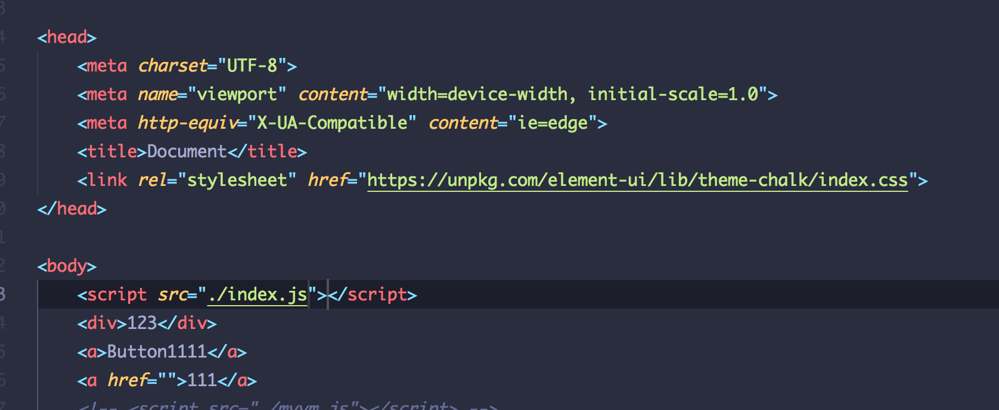

# 前端面试之道(浏览器)

> [原文链接](https://yuchengkai.cn/docs/frontend/browser.html)

## 事件机制

### 事件触发三阶段

事件触发有三个阶段:

-   window 往事件触发处传播, 遇到注册的捕获事件会触发
-   传播到事件触发处是触发注册的事件
-   从事件触发处往 window 传播, 遇到注册的冒泡事件会触发.

事件触发一般会按照上面的顺序(从上而下的捕获, 从下而上的冒泡)进行, 但是也有特例, 如果给一个目标节点同时注册冒泡和捕获事件, 事件触发会按照注册的顺序触发:

```js
// 以下会先打印冒泡然后是捕获
node.addEventListener(
    'click',
    event => {
        console.log('冒泡');
    },
    false
);
node.addEventListener(
    'click',
    event => {
        console.log('捕获 ');
    },
    true
);
```

### 注册事件

通常我们使用`addEventListerner`注册事件, 其第三个参数为 boolean, 默认为 false(冒泡) ,值决定注册捕获事件还是冒泡事件. 也可以传入一个对象:

-   capture: boolean, 决定是捕获事件还是冒泡事件
-   once: boolean, 为 true 时, 该事件在执行一次后会移除监听
-   passive: boolean, 表示永远不会调用`preventDefault`.

一般来说, 可以使用`stopPropagation`来阻止捕获事件和冒泡事件的传递. `stopImmediateProgation`不仅可以阻止事件传播, 还可以阻止事件目标执行别的注册事件.

```js
node.addEventListener(
    'click',
    event => {
        event.stopImmediateProgation();
        console.log('冒泡');
    },
    false
);
// 点击 node 只会执行上面的函数，该函数不会执行
node.addEventListener(
    'click',
    event => {
        console.log('捕获 ');
    },
    true
);
```

### 事件代理

如果一个节点中的子节点是动态生成的, 那么子节点需要注册事件的话应该注册在父节点上:

```html
<ul id="ul">
    <li>1</li>
    <li>2</li>
    <li>3</li>
    <li>4</li>
    <li>5</li>
</ul>
<script>
    let ul = document.querySelector('##ul');
    ul.addEventListener('click', event => {
        console.log(event.target);
    });
</script>
```

事件代理的方式相对于直接给目标注册事件来说:

-   节省内存
-   不需要给子节点注销事件

## 跨域

同源策略: 协议, 域名或者端口有一个不同, 就是跨域, ajax 请求就会失败. 解决跨域有常见的几种方法

### JSONP

原理就是利用`<script>`标签没有跨域限制的漏洞, 通过`<script>`标签指向一个需要访问的地址并提供一个回调函数来接受数据:

```js
<script src="http://domain/api?param1=a&param2=b&callback=jsonp"></script>
<script>
    function jsonp(data) {
    	console.log(data)
	}
</script>
```

JSONP 使用简单且兼容性不错, 但是只能用于 get 请求.

在开发中可能会遇到多个 JSONP 请求的回调函数名师相同的, 这时候就需要自己封装一个 JSONP, 以下是简单的实现:

```js
function jsonp(url, jsonpCallback, success) {
    let script = document.createElement('script');
    script.src = url;
    script.async = true;
    script.type = 'text/javascript';
    window[jsonpCallback] = function(data) {
        success && success(data);
    };
    document.body.appendChild(script);
}
jsonp('http://xxx', 'callback', function(value) {
    console.log(value);
});
```

### CORS

CORS 需要浏览器和后端同时支持. IE8/9 需要通过 XDomainrequest 来实现.

浏览器会自动进行 CORS 通信, 实现 CORS 通信的关键是后端, 只要后端实现了 CORS, 就实现了跨域.

服务端设置`Access-Control-Allow-Origin`, 就可以开启 CORS, 该属性表示那些域名可以访问资源, 如果设置通配符则表示所有网站都可以访问资源.

### document.domain

该方式只能用于二级域名相同的情况下, 比如`a.test.com`和`b.test.com`

只要给页面添加 document.domain='test.com', 表示二级域名都相同就可以实现跨域

### postMessage

这种方式通常用于获取嵌入页面中的第三方页面数据. 一个页面发送消息, 另一个页面判断来源并接受消息.

```js
// 发送消息端
window.parent.postMessage('message', 'http://test.com');
// 接收消息端
var mc = new MessageChannel();
mc.addEventListener('message', event => {
    var origin = event.origin || event.originalEvent.origin;
    if (origin === 'http://test.com') {
        console.log('验证通过');
    }
});
```

## Event Loop

JS 在执行的过程中会产生执行环境, 这些执行环境会被顺序的加入到执行栈中. 如果遇到异步的代码, 会被挂起并加入到 task 队列中. 一旦执行栈为空, Event Loop 就会从 Task 队列中拿出需要执行的额代码并放入执行栈中执行, 所以本质上来说 JS 中的异步还是同步行为.

```js
console.log('script start');

setTimeout(function() {
    console.log('setTimeout');
}, 0);

console.log('script end');
```

虽然延时为 0, 但是实际上还是一步的, 因为 HTML5 标准规定这个函数的第二个参数不得小于 4ms, 不足会自动增加.

不同的任务源会被分配到不同的额 Task 队列中, 任务源可以分为微任务(mincroTask)和宏任务(macroTask),在 ES6 规范中, microtask 被称为 jobs, macrotask 被称为 task

```js
console.log('script start');

setTimeout(function() {
    console.log('setTimeout');
}, 0);

new Promise(resolve => {
    console.log('Promise');
    resolve();
})
    .then(function() {
        console.log('promise1');
    })
    .then(function() {
        console.log('promise2');
    });

console.log('script end');
// script start => Promise => script end => promise1 => promise2 => setTimeout
```

微任务包括:

-   process.nextTick
-   promise
-   Object.observer
-   MutationOberver

宏任务包括:

-   script
-   setTimeout
-   setInterval
-   setImmediate
-   I/O
-   UI rendering

宏任务中包括了 script, 所以浏览器会先执行一个宏任务, 接下来有异步代码的话就先执行微任务

一次正确的 Event Loop 顺序是这样的:

1. 执行同步代码, 属于宏任务
2. 执行栈为空, 查询是否有微任务需要执行
3. 执行所有微任务
4. 必要的话渲染 UI
5. 然后开始下一轮的 EventLoop, 执行宏任务中的异步代码

如果宏任务中的异步代码有大量的计算并且需要操作 DOM 的话, 为了更快的界面响应, 我们可以把操作 DOM 放入微任务中.

### Node 中的 Event loop (\*\*\*)

Node 中的 Event Loop 和浏览器中的不同, 它分为 6 个阶段, 按照顺序反复运行:

```
┌───────────────────────┐
┌─>│        timers         │
│  └──────────┬────────────┘
│  ┌──────────┴────────────┐
│  │     I/O callbacks     │
│  └──────────┬────────────┘
│  ┌──────────┴────────────┐
│  │     idle, prepare     │
│  └──────────┬────────────┘      ┌───────────────┐
│  ┌──────────┴────────────┐      │   incoming:   │
│  │         poll          │<──connections───     │
│  └──────────┬────────────┘      │   data, etc.  │
│  ┌──────────┴────────────┐      └───────────────┘
│  │        check          │
│  └──────────┬────────────┘
│  ┌──────────┴────────────┐
└──┤    close callbacks    │
   └───────────────────────┘
```

#### timer

timers 阶段会执行 setTimeout 和 setInterval

一个 timer 指定的时间并不是准确时间, 而是在达到这个时间后尽快执行会调用,可能会因为系统正在执行别的事务而延迟

下限的时间有一个范围[1,2147483647], 如果设定的时间不在这个范围, 将被设为 1

#### I/O

I/O 阶段会执行除了 close 事件, 定时器和 `setImmediate`的回调

#### idle, prepare

idle, prepare 阶段内部实现

#### poll

poll 阶段很重要, 这一阶段中, 系统会做两件事:

1. 执行到点的定时器
2. 执行 poll 队列中的事件

并且当 poll 中没有定时器的情况下, 会发现以下两件事情:

1. 如果 poll 队列不为空, 会遍历回调队列并同步执行, 直到队列为空或者系统限制
2. 如果 poll 队列为空, 则:
    1. 如果有`setImmediate`需要执行, poll 阶段会停止并且进入到 check 阶段执行 setImmediate
    2. 如果没有`setImmediate`需要执行, 会等待回调被加入到队列中并立即执行回调

如果有别的定时器需要被执行, 会回到 timer 阶段执行回调

#### check

check 阶段执行`setImmediate`

#### close callback

close callbacks 阶段执行 close 事件

在 node 中,有些情况下的定时器执行顺序是随机的:

```js
setTimeout(() => {
    console.log('setTimeout');
}, 0);
setImmediate(() => {
    console.log('setImmediate');
});
// 这里可能会输出 setTimeout，setImmediate
// 可能也会相反的输出，这取决于性能
// 因为可能进入 event loop 用了不到 1 毫秒，这时候会执行 setImmediate
// 否则会执行 setTimeout
```

当然在这种情况下, 执行顺序是相同的:

```js
ar fs = require('fs')

fs.readFile(__filename, () => {
  setTimeout(() => {
    console.log('timeout')
  }, 0)
  setImmediate(() => {
    console.log('immediate')
  })
})
// 因为 readFile 的回调在 poll 中执行
// 发现有 setImmediate ，所以会立即跳到 check 阶段执行回调
// 再去 timer 阶段执行 setTimeout
// 所以以上输出一定是 setImmediate，setTimeout
```

上面介绍的都是 macrotask 的执行情况，microtask 会在以上每个阶段完成后立即执行。

```js
setTimeout(() => {
    console.log('timer1');

    Promise.resolve().then(function() {
        console.log('promise1');
    });
}, 0);

setTimeout(() => {
    console.log('timer2');

    Promise.resolve().then(function() {
        console.log('promise2');
    });
}, 0);

// 以上代码在浏览器和 node 中打印情况是不同的
// 浏览器中一定打印 timer1, promise1, timer2, promise2
// node 中可能打印 timer1, timer2, promise1, promise2
// 也可能打印 timer1, promise1, timer2, promise2
```

Node 中的 process.nextTick 会先于其他 microtask 执行。

```js
setTimeout(() => {
    console.log('timer1');

    Promise.resolve().then(function() {
        console.log('promise1');
    });
}, 0);

process.nextTick(() => {
    console.log('nextTick');
});
// nextTick, timer1, promise1
```

## 存储

| 特性         | cookie                         | localStorage | sessionStorage | indexDB    |
| ------------ | ------------------------------ | ------------ | -------------- | ---------- |
| 数据生命周期 | 由服务器生成, 可以设置过期时间 | 除非被清理   | 页面关闭清理   | 除非被清理 |
| 数据存储大小 | 4k                             | 5M           | 5M             | 无限       |
| 与服务端通信 | 每次都会携带在 header 中       | 不参与       | 不参与         | 不参与     |

cookie 已经不建议用于存储, 如果没有大量数据存储需求, 可以使用后两者

cookie 需要注意安全性:

-   value: 如果用于保存用户登录态, 应该将该值加密, 不能使用明文的用户标识
-   http-only: 不能通过 JS 访问 Cookie, 减少 XSS 攻击
-   secure: 只能在协议为 HTTPS 的请求中携带
-   same-site: 规定浏览器不能再跨域请求中携带 Cookie, 减少 CSRF 攻击

### Service Worker

Service workers 本质上是充当 web 应用程序与浏览器之间的代理服务器, 也可以在网络可用时作为浏览器和网络间的代理, 旨在是的能够创建有效的离线体验, 拦截网络请求并基于网络是否可用以及更新的资源是否驻留在服务器上来采取适当的动作. 还允许访问推送通知和后台同步 API

目前该技术通常用来做缓存文件, 提高首屏速度

```js
// index.js
if (navigator.serviceWorker) {
    navigator.serviceWorker
        .register('sw.js')
        .then(function(registration) {
            console.log('service worker 注册成功');
        })
        .catch(function(err) {
            console.log('servcie worker 注册失败');
        });
}
// sw.js
// 监听 `install` 事件，回调中缓存所需文件
self.addEventListener('install', e => {
    e.waitUntil(
        caches.open('my-cache').then(function(cache) {
            return cache.addAll(['./index.html', './index.js']);
        })
    );
});

// 拦截所有请求事件
// 如果缓存中已经有请求的数据就直接用缓存，否则去请求数据
self.addEventListener('fetch', e => {
    e.respondWith(
        caches.match(e.request).then(function(response) {
            if (response) {
                return response;
            }
            console.log('fetch source');
        })
    );
});
```

## 渲染机制

浏览器的渲染机制一般分为以下几步:

1. 处理 HTML 并构建 DOM 树
2. 处理 CSS 构建 CSSOM 树
3. 将 DOM 和 CSSOM 合并成一个渲染树
4. 根据渲染树来布局, 计算每个节点的位置
5. 调用 GPU 绘制, 合成图层, 显示在屏幕上

在构建 CSSOM 树时，会阻塞渲染，直至 CSSOM 树构建完成。并且构建 CSSOM 树是一个十分消耗性能的过程，所以应该尽量保证层级扁平，减少过度层叠，越是具体的 CSS 选择器，执行速度越慢。

当 HTML 解析到 script 标签时，会暂停构建 DOM，完成后才会从暂停的地方重新开始。也就是说，如果你想首屏渲染的越快，就越不应该在首屏就加载 JS 文件。并且 CSS 也会影响 JS 的执行，只有当解析完样式表才会执行 JS，所以也可以认为这种情况下，CSS 也会暂停构建 DOM。



### load/DOMContentLoaded

Load 事件触发代表页面中的 DOM,CSS,JS,图片已经全部加载完毕

DomContentLoaded 事件触发代表初始的 HTML 被完全加载和解析, 不需要等待 CSS,JS,图片加载

### 图层

一般来说, 可以吧普通文档流看成一个图层, 特定的属性可以生成一个新的图层. 不同的图层渲染互不影响, 所以对于某些频繁需要渲染的建议单独生成一个新图层, 提高性能. 但也不能生成过多的图层, 会引起反作用.

通过以下几个属性可以生成新图层:

-   3D 变换:translate3d,translateZ
-   will-change
-   video,iframe 标签
-   通过动画实现的 opacity 动画转换
-   position:fixed

### 重绘(Repaint)和回流(Reflow)

重绘和回流是渲染步骤中的一小步, 但是这两个步骤对于性能的影响比较大.

-   重绘是当前节点需要更改外观而不会影响布局的, 比如改变 color 就称为重绘
-   回流是布局或者集合属性需要改变就称为回流

回流必定重绘, 重绘不一定引发回流. 回流所需的成本比重绘高得多, 改变深层次的节点更可能导致父节点的一些列回流.

一下几个动作可能会导致性能问题:

-   改变 window 的大小
-   改变字体
-   添加或删除样式
-   文字改变
-   定位或者浮动
-   盒模型

重绘和回流实际上和 Event Loop 有关

1. 当 EventLoop 执行完 MincroTasks 后, 会判断 documeny 是否需要更新, 因为浏览器时 60HZ 刷新率, 所以每 16ms 才会更新一次.
2. 判断是否有 resize/scroll, 有就触发, 所以这两个事件实际上至少 16ms 才会触发一次, 自带节流
3. 判断是否触发了 media query
4. 更新动画并且发送事件
5. 判断是否有全屏操作事件
6. 执行 requestAnimationFrame 回调
7. 执行 IntersectionObserver 回到, 该方法用于判断元素是否可见, 可以用于懒加载, 但是兼容性不太好
8. 更新界面
9. 一帧完成, 如果一帧中有空闲时间, 就会去执行`requestIdleCallback`回调

### 减少重绘和回流

-   使用`translate`替代`top`

```html
<div class="test"></div>
<style>
    .test {
        position: absolute;
        top: 10px;
        width: 100px;
        height: 100px;
        background: red;
    }
</style>
<script>
    setTimeout(() => {
        // 引起回流
        document.querySelector('.test').style.top = '100px';
    }, 1000);
</script>
```

-   使用 visibility 替换 display: none ，因为前者只会引起重绘，后者会引发回流（改变了布局）
-   把 DOM 离线后修改，比如：先把 DOM 给 display:none (有一次 Reflow)，然后你修改 100 次，然后再把它显示出来
-   不要把 DOM 结点的属性值放在一个循环里当成循环里的变量

```js
for (let i = 0; i < 1000; i++) {
    // 获取 offsetTop 会导致回流，因为需要去获取正确的值
    console.log(document.querySelector('.test').style.offsetTop);
}
```

-   不要使用 table 布局，可能很小的一个小改动会造成整个 table 的重新布局
-   动画实现的速度的选择，动画速度越快，回流次数越多，也可以选择使用 requestAnimationFrame
-   CSS 选择符从右往左匹配查找，避免 DOM 深度过深
-   将频繁运行的动画变为图层，图层能够阻止该节点回流影响别的元素。比如对于 video 标签，浏览器会自动将该节点变为图层
