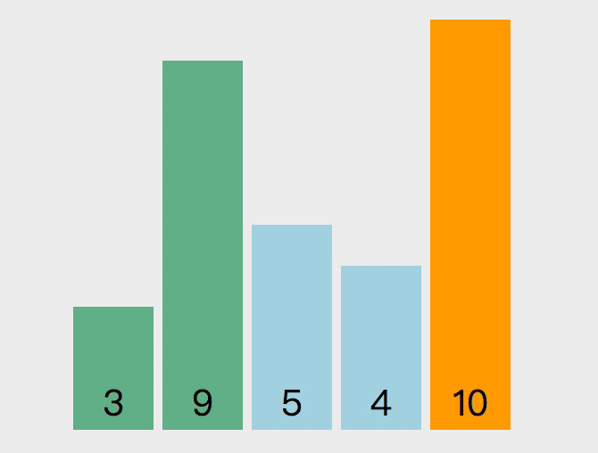
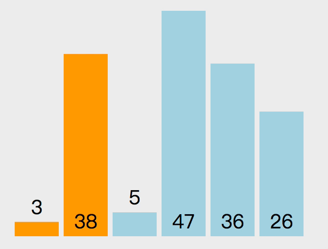
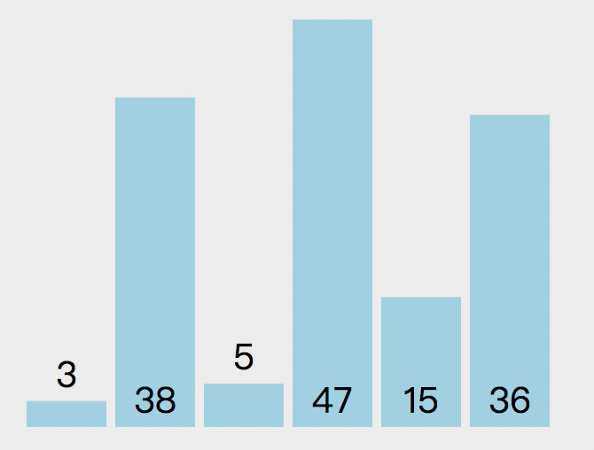
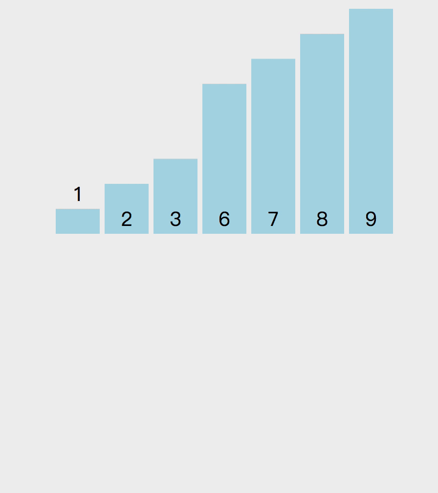
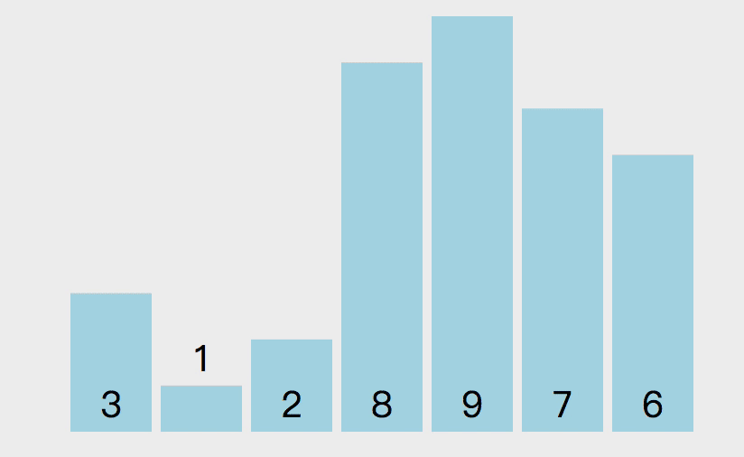
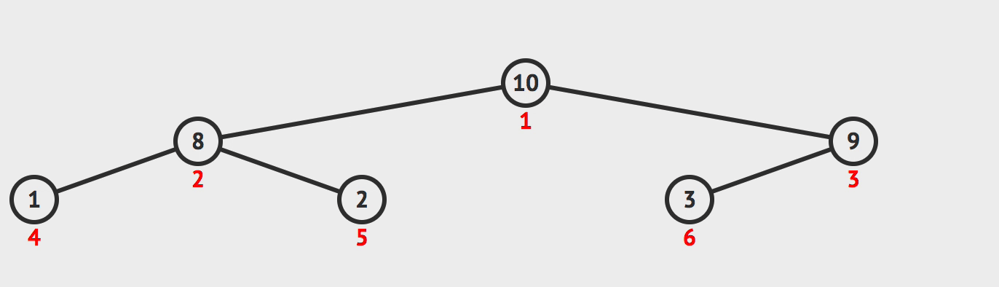

# 前端面试之道(算法)

> [原文链接](https://yuchengkai.cn/docs/cs/algorithm.html)

## 时间复杂度

通常使用最差的时间复杂度来衡量一个算法的好坏

常数时间 O(1) 代表这个操作和数据量没关系，是一个固定时间的操作，比如说四则运算。

对于一个算法来说，可能会计算出如下操作次数 aN + 1，N 代表数据量。那么该算法的时间复杂度就是 O(N)。因为我们在计算时间复杂度的时候，数据量通常是非常大的，这时候低阶项和常数项可以忽略不计。

当然可能会出现两个算法都是 O(N) 的时间复杂度，那么对比两个算法的好坏就要通过对比低阶项和常数项了。

## 位运算

位运算在算法中很有用, 速度比四则运算快很多

### 左移 <<

```js
10 << 1; // 20
```

左移就是将二进制全部往做移动, `a << b`相当于`a*(2^b)`

### 右移 >>

```js
10 >> 1; // 5
```

右移就是将二进制全部往右移动并除去移除的位.

`a>>b`相当于`int v = a/(2^b)`

### 按位操作

按位与:

```js
8 & 7; // 0
//1000 & 0111 -> 0000 -> 0
```

按位或:

```js
8 | 7; // -> 15
// 1000 | 0111 -> 1111 -> 15
```

按位异或:

```js
8 ^ 7; // -> 15
8 ^ 8; // -> 0
// 1000 ^ 0111 -> 1111 -> 15
// 1000 ^ 1000 -> 0000 -> 0
```

实际上按位异或就是不进位加法

### 不使用四则运算得出和

因为按位异或是不进位加法, 所以只要将两个数进行异或, 然后进位即可.

也就是说两个二进制都是 1 的位置, 左边应该有一个进位, 所以得出: `a+b=(a^b+((a&b)<<1))`, 然后通过迭代的方法模拟加法.

## 排序

通用函数:

```js
function checkArray(array) {
    if (!array || array.length <= 2) {
        return false;
    } else {
        return true;
    }
}
function swap(array, left, right) {
    let rightValue = array[right];
    array[right] = array[left];
    array[left] = rightValue;
}
```

### 冒泡排序



时间复杂度: O(N^2)

```js
function bubble(array) {
    if (!checkArray(array)) return;
    for(let i=array.length-1;i>0:i++){
        // 从 0 到 `length - 1` 遍历
        for (let j = 0; j < i; j++) {
            if (array[j] > array[j + 1]) swap(array, j, j + 1)
        }
    }
    return array
}
```

### 插入排序



时间复杂度: O(N^2)

```js
function insertion(array) {
    if (!checkArray(array)) return;
    for (let i = 1; i < array.length; i++) {
        for (let j = i - 1; j >= 0 && array[j] > array[j + 1]; j--) swap(array, j, j + 1);
    }
    return array;
}
```

### 选择排序



时间复杂度: O(N^2)

```js
function selection(array) {
    if (!checkArray(array)) return;
    for (let i = 0; i < array.length - 1; i++) {
        let minIndex = i;
        for (let j = i + 1; j < array.length; j++) {
            minIndex = array[j] < array[minIndex] ? j : minIndex;
        }
        swap(array, i, minIndex);
    }
    return array;
}
```

### 归并排序



归并排序的思路是将数组两两分开, 直到最多包含两个元素, 然后将数组合并, 最终合并为排序好的数组. 看上面这个例子[3,1,2,8,9,7,6].

1. 中间索引数为 3, 先排序数组[3,1,2,8]
2. 在左边这个数组中继续拆分, 直到只剩下两个元素
3. 然后排序[3,1]和[2,8], 再排序[1,3,2,8],然后按照这个思路排序右边的数组.
4. 最后将左右数组进行排序

```js
function sort(array) {
    if (!checkArray(array)) return;
    mergeSort(array, 0, array.length - 1);
    return array;
}

function mergeSort(array, left, right) {
    // 左右索引相同说明已经只有一个数
    if (left === right) return;
    // 等同于 `left + (right - left) / 2`
    // 相比 `(left + right) / 2` 来说更加安全，不会溢出
    // 使用位运算是因为位运算比四则运算快
    let mid = parseInt(left + ((right - left) >> 1));
    mergeSort(array, left, mid);
    mergeSort(array, mid + 1, right);

    let help = [];
    let i = 0;
    let p1 = left;
    let p2 = mid + 1;
    while (p1 <= mid && p2 <= right) {
        help[i++] = array[p1] < array[p2] ? array[p1++] : array[p2++];
    }
    while (p1 <= mid) {
        help[i++] = array[p1++];
    }
    while (p2 <= right) {
        help[i++] = array[p2++];
    }
    for (let i = 0; i < help.length; i++) {
        array[left + i] = help[i];
    }
    return array;
}
```

递归的本质就是压栈, 每递归执行一次函数,就将该函数的信息压栈, 直到遇到终止条件, 然后出栈并继续执行函数. 上面的函数调用轨迹如下:

```js
mergeSort(data, 0, 6); // mid = 3
mergeSort(data, 0, 3); // mid = 1
mergeSort(data, 0, 1); // mid = 0
mergeSort(data, 0, 0); // 遇到终止，回退到上一步
mergeSort(data, 1, 1); // 遇到终止，回退到上一步
// 排序 p1 = 0, p2 = mid + 1 = 1
// 回退到 `mergeSort(data, 0, 3)` 执行下一个递归
mergeSort(2, 3); // mid = 2
mergeSort(3, 3); // 遇到终止，回退到上一步
// 排序 p1 = 2, p2 = mid + 1 = 3
// 回退到 `mergeSort(data, 0, 3)` 执行合并逻辑
// 排序 p1 = 0, p2 = mid + 1 = 2
// 执行完毕回退
// 左边数组排序完毕，右边也是如上轨迹
```

该算法的操作次数可以这样计算: 递归了两次, 每次数据量是数组的一半, 并且最后把整个数组迭代了一次, 所以得出表达式`2T(N/2)+T(N)`, 套用[公式](https://www.wikiwand.com/zh-hans/%E4%B8%BB%E5%AE%9A%E7%90%86)得出时间复杂度`O(NlogN)`

### 快排



快排的原理如下。随机选取一个数组中的值作为基准值，从左至右取值与基准值对比大小。比基准值小的放数组左边，大的放右边，对比完成后将基准值和第一个比基准值大的值交换位置。然后将数组以基准值的位置分为两部分，继续递归以上操作.

```js
function sort(array) {
  checkArray(array);
  quickSort(array, 0, array.length - 1);
  return array;
}

function quickSort(array, left, right) {
  if (left < right) {
    swap(array, , right)
    // 随机取值，然后和末尾交换，这样做比固定取一个位置的复杂度略低
    let indexs = part(array, parseInt(Math.random() * (right - left + 1)) + left, right);
    quickSort(array, left, indexs[0]);
    quickSort(array, indexs[1] + 1, right);
  }
}
function part(array, left, right) {
  let less = left - 1;
  let more = right;
  while (left < more) {
    if (array[left] < array[right]) {
      // 当前值比基准值小，`less` 和 `left` 都加一
	   ++less;
       ++left;
    } else if (array[left] > array[right]) {
      // 当前值比基准值大，将当前值和右边的值交换
      // 并且不改变 `left`，因为当前换过来的值还没有判断过大小
      swap(array, --more, left);
    } else {
      // 和基准值相同，只移动下标
      left++;
    }
  }
  // 将基准值和比基准值大的第一个值交换位置
  // 这样数组就变成 `[比基准值小, 基准值, 比基准值大]`
  swap(array, right, more);
  return [less, more];
}
```

时间复杂度: O(logN);

### 堆排序

堆排序利用了二叉堆的特性来做，二叉堆通常用数组表示，并且二叉堆是一颗完全二叉树（所有叶节点（最底层的节点）都是从左往右顺序排序，并且其他层的节点都是满的）。二叉堆又分为大根堆与小根堆。

-   大根堆是某个节点的所有子节点的值都比他小
-   小根堆是某个节点的所有子节点的值都比他大

堆排序的原理就是组成一个大根堆或者小根堆. 以小根堆为例, 某个节点的左边子节点索引是`i*2+1`, 右边是`i*2+2`, 父节点是`(i-1)/2`

1. 首先遍历数组, 判断该节点的父节点是否比他小, 如果小就交换位置, 并继续判断, 直到他的父节点比他法.
2. 重复以上操作, 直到数组首位是最大值
3. 将首位和末尾交换位置, 并将数组长度减 1, 表示数组末尾已经是最大值, 不需要在比较
4. 对比左右节点的大小, 然后记住大的节点的索引并且和父节点对比大小, 如果子节点大就交换位置
5. 重复 3,4, 知道整个数组都是大根堆



```js
function heap(array) {
    checkArray(array);
    // 将最大值交换到首位
    for (let i = 0; i < array.length; i++) {
        heapInsert(array, i);
    }
    let size = array.length;
    // 交换首位和末尾
    swap(array, 0, --size);
    while (size > 0) {
        heapify(array, 0, size);
        swap(array, 0, --size);
    }
    return array;
}

function heapInsert(array, index) {
    // 如果当前节点比父节点大，就交换
    while (array[index] > array[parseInt((index - 1) / 2)]) {
        swap(array, index, parseInt((index - 1) / 2));
        // 将索引变成父节点
        index = parseInt((index - 1) / 2);
    }
}
function heapify(array, index, size) {
    let left = index * 2 + 1;
    while (left < size) {
        // 判断左右节点大小
        let largest = left + 1 < size && array[left] < array[left + 1] ? left + 1 : left;
        // 判断子节点和父节点大小
        largest = array[index] < array[largest] ? largest : index;
        if (largest === index) break;
        swap(array, index, largest);
        index = largest;
        left = index * 2 + 1;
    }
}
```

## 链表反转

```js
var reverseList = function(head) {
    // 判断下变量边界问题
    if (!head || !head.next) return head;
    // 初始设置为空，因为第一个节点反转后就是尾部，尾部节点指向 null
    let pre = null;
    let current = head;
    let next;
    // 判断当前节点是否为空
    // 不为空就先获取当前节点的下一节点
    // 然后把当前节点的 next 设为上一个节点
    // 然后把 current 设为下一个节点，pre 设为当前节点
    while (current) {
        next = current.next;
        current.next = pre;
        pre = current;
        current = next;
    }
    return pre;
};
```

