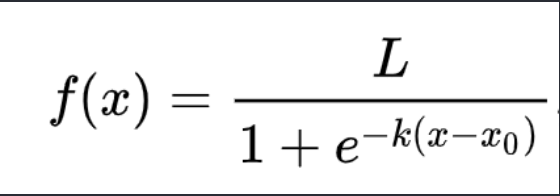

## ML的一般步骤

1. 决定问题
2. 收集和准备数据
3. 选择一种训练方法
4. 训练模型
5. 评估模型
6. 参数调整
7. 预测

## 机器学习中的回归模型

两种类型的回归: 基本线性回归和多项式回归

### 线性回归

线性回归的目标是能够绘制一条直线以便:

- 显示变量关系
- 作出预测

绘制这种类型的线是**最小二乘回归**的典型做法

这条线就叫做最佳拟合线.

#### 多项式回归

另一种线性回归.

多项式是可能由一个或者多个变量和系数组成的数学表达式

多项式回归创建了一条曲线以更好的拟合非线性数据.

### 逻辑回归

经典的基本技术之一. 可以用来发现预测二元分类的模式.

- 仍然是线性的
- 变脸不必对齐(适用于相关性较弱的数据)
- 需要大量干净的数据

#### 二元分类

逻辑回归不提供与线性回归相同的功能. 

前者提供关于二元类别的预测, 而后者能够预测连续值.

#### 其他分类

还有其他类型的逻辑回归, 包括多项和有序:

- 多项: 涉及多个类型 - '橙色, 白色和条纹'
- 有序: 涉及有序类别, 如果想要对结果进行逻辑排序就很有用, 比如(sm, md, lg, xl)

线性回归依赖于使用`sigmoid`函数的最大似然概念, 绘图上的`sigmoid`函数看起来像`S`型. 它接受一个值并将其映射到0和1之间的某个位置. 它的曲线也称为"逻辑曲线"

公式如下:

其中`sinmoid`的重点位于`x`的0点, L是曲线的最大值, k是曲线的陡度. 如果函数的结果大于0.5, 则所讨论的标签将被赋予二进制选择的类"1". 否则将被分类为'0'.

