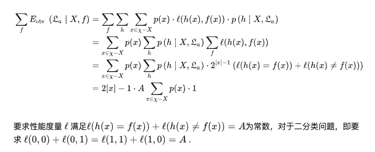

# 西瓜书-01

机器学习: 治理域研究如何通过计算的手段, 利用经验来改善系统自身的性能.

## 术语

- 模型: 泛指从数据学得的结果
- 示例(instance) & 样本(sample): 关于一个事件或者对象的描述
- 数据集(data set): 示例的集合
- 属性(attribute) & 特征 (feature): 反映事件或者对象在某个方面的表现或性质的事项.
- 属性值(attribute): 属性上的值
- 属性空间 & 样本空间: 属性值张成空间.
- 特征向量: 属性空间张成的空间中的坐标点, 一个示例一般可以对应一个点
- 训练 & 学习: 从数据中学得模型的过程
- 训练数据: 训练过程使用的数据, 其中每个数据叫做一个 '训练样本'
- 假设: 模型对应的关于数据的某种潜在规律
- 真相: 这种潜在规律自身. 学习过程就是为了找出或者逼近真相.
- 样例: 拥有标记信息的示例
- 标记: 关于示例结果的信息, 比如: '好瓜'
- 分类: 离散值的预测
- 回归: 连续值的预测
- 二分类任务: 只涉及两个类别的任务, 其中一个通常称为"正类", 另一个称为"反类"
- 多分类任务: 涉及多个类别
- 预测任务: 通过对训练集进行学习, 建立一个从输入空间X到输出空间Y的映射. 对于二分类, 通常令$Y = \{-1, +1\}$ / $\{0, 1\}$, 对于多分类, $|y| > 2$, 对于回归任务, $y = R$, R为实数集
- 测试: 使用模型并用其进行预测
- 测试样本: 预测的时候使用的样本
- 聚类: 将训练集中的样本分成若干的组, 每个组称为一个簇(cluster)
- 监督学习: 训练数据中有标记信息, 分类和回归
- 无监督学习: 训练数据无标记, 聚类
- 泛化: 学得模型用于新样本的能力

### 假设空间

- 归纳: 从特殊到一般的泛化, 从具体事实归结出一般性规律
- 演绎: 从一般到特殊的特化, 从基础原理推演出具体情况

从样例中学习--归纳过程--归纳学习

广义归纳学习: 约等于从样例中学习  
狭义归纳学习: 从训练数据中学得概念--概念学习, 概念形成

最基础的概念学习: 布尔概念学习

学习过程可以看做一个在所有`假设`组成的空间中进行搜索的过程, 搜索的目标是找到与训练集"匹配"的假设, 即能够将训练集中的数据判断正确的假设.

### 归纳偏好

通过学习得到的模型对应假设空间中的一个假设.

机器学习算法在学习过程中对某种类型假设的偏好, 称为: "归纳偏好". 简称偏好

有效的机器学习算法必有偏好, 否则会被等效假设迷惑, 无法产生确定的学习结果.

归纳偏好可以看做学习算法在一个假设空间中对假设进行选择的启发式或者"价值观".

`奥卡姆剃刀`是一种一般性原则可以来引导算法来确立正确的偏好. 即: "有多个假设与观察一致, 则选择最简单的那个". 奥卡姆剃刀不一定是正确的.

`没有免费的午餐定理`(NFL): 总误差与学习算法无关

NFL有个重要的前提: 所有"问题"出现的机会相同, 或者所有问题同等重要. NFL假设了f的均匀分布.

实际来说往往不是这样.

NFL最重要的寓意是: 脱离具体的问题, 空泛的谈论什么学习算法更好毫无意义. 考虑所有潜在的问题, 则所有学习算法一样好. 


### 发展历程

从样例中学习(广义归纳学习)

#### 符号主义学习

符号主义学习, 其代表包括决策树和基于逻辑的学习.

典型的决策树学习已信息论为基础, 以信息熵的最小化为目标, 模拟人类对概念进行判定的树形流程.

推理期和知识期

推理期: 基于符号知识表示, 通过演绎推理技术
知识期: 基于符号知识表示, 通过获取和利用领域知识来建立专家系统

#### 基于神经网络的连接主义学习

连接主义学习.

符号主义能产生明确的概念, 连接主义学习产生的是黑箱模型.

连接主义最大的局限是其试错性. 过程涉及大量参数, 参数的设置缺乏理论指导, 主要靠手工


#### 统计学习

代表性技术: 支持向量机, 核方法

深度学习: 狭义来说就是很多层的神经网络, 降低了机器学习应用者的门槛, 缺乏严格的理论基础.


## 习题

1. 版本空间:

```
好瓜 = (色泽 = *) * (根蒂 = *) * (敲声 = 浊响)

好瓜 = (色泽 = *) * (根蒂 = 蜷缩) * (敲声 = *)

好瓜 = (色泽 = 青绿) * (根蒂 = *) * (敲声 = *)


好瓜 = (色泽 = *) * (根蒂 = 蜷缩) * (敲声 = 浊响)

好瓜 = (色泽 = 青绿) * (根蒂 = *) * (敲声 = 浊响)

好瓜 = (色泽 = 青绿) * (根蒂 = 蜷缩) * (敲声 = *)


好瓜 = (色泽 = 青绿) * (根蒂 = 蜷缩) * (敲声 = 浊响)
```

2. 不会


3. 假设满足数量最多的示例, 即准确率.

准确率 = (符合假设的条件且为好瓜的样例数量)/(符合假设条件的样例)

选择准确率最高的假设.

4. 如下



