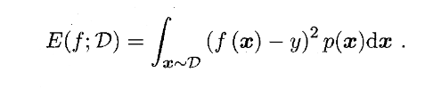
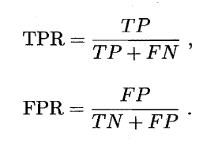
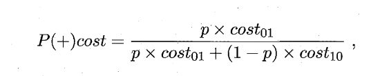

# 西瓜书-02-模型评估与选择

## 经验误差与过拟合

- 错误率: 分类错误的样本数占样本总数的比例
- 错误率: $E = a / m$
- 精度: `精度 = 1 - 错误率` => $A = 1 - a/m$ 
- 误差: 实际预测输出与样本真实输出之间的差异
  - 训练误差: 学习器在训练集上的误差, 又叫经验误差
  - 泛化误差: 在新样本上的误差

- 过拟合: 训练误差太好会导致把训练样本自身的一些特点当做所有潜在样本都会具有的一般性质. 导致泛化性能下降
  - 原因: 最常见的情况是由于学习能力过于强大, 不好处理
  - 过拟合是无法彻底避免的, 只能缓解
- 欠拟合: 相对过拟合, 指对训练样本的一般性质尚未学好.
  - 原因: 学习能力欠缺, 容易克服

模型选择: 理想的解决方案当然是对模型的泛化误差进行评估, 然后选择泛化误差最小的模型. 但是我们无法直接获取泛化误差, 训练误差又因为过拟合而不适合作为标准. 

## 评估方法

实验测试: 使用一个测试集来测试学习器对新样本的判别能力, 然后以测试集上的测试误差, 作为泛化误差的近似. 通常, 假设测试样本也是从样本真实分布中独立同分布采样而得. 

测试集尽可能与训练集互斥, 即测试样本尽量不在训练集中出现, 未在训练过滤中使用过. 

### 留出法

直接将数据集D划分为两个互斥的集合, 其中一个集合作为训练集S, 另一个作为测试集T.

在S上训练出模型, 用T来评估其测试误差, 作为泛化误差的估计. 

训练集合测试集的划分要尽可能保持数据分布的一致性, 避免因数据划分引入的额外误差. 

分层采样: 保留类别比例的采样方式.

一般来说, 单词使用留出法得到的估计结果往往不够稳定可靠. 一般会采用若干次随机划分, 重复进行实验评估后取平均值作为留出法的评估结果.

训练集划分的常见比例: 2/3 ~ 4/5 用于训练, 剩余用于测试.

### 交叉验证法

将数据集D划分为k个大小相似的互斥子集

$$
D = D_1 \cup D_2 \cup  ... \cup D_k, D_i \cap Dj = \varnothing
$$

每个子集都保持数据分布一致性(通过分层采样).

每次用k-1个自己的并集作为训练集, 剩下的自己作为测试集, 进行k次训练&测试, 返回k个测试结果的均值.

交叉验证法评估结果的稳定性和保真性取决于k的取值.

通常把交叉验证法称为`k折交叉验证`(k-fold cross validation)

例如: k最常用的取值位10, 此时称为10折交叉验证.

假定数据集D中包含m个样本, 如果令k=m, 则叫做: 留一法.

留一法不受随机样本划分方式的影响.

留一法的评估结果往往被认为比较准确(未必永远准确, NFL), 缺陷则是: 在数据集大的时候, 计算开销会非常大.

### 自助法

给定包含`m`个样本的数据集`D`, 我们对他进行采样产生数据集`D'`:

- 每次随机从`D`中挑选一个样本拷贝进入`D'`, 然后放回(可能会被再次采样)
- 重复`m`次, 获取`D'`

一部分样本会多次出现, 另一部分不出现, 简单的估计, 样本在m次采样中不被采集的概率是$(1 - 1/m)^m$, 取极限:

$$
\lim_{x\to\infty}(1 - 1/m)^m => 1/e \approx 0.368
$$

通过自助采样, 初始数据集D中大概会有36.8%不会出现在数据集`D'`中, 所以我们可以将D'用作训练集, `D\D'` 用作测试集. 这样, 实际评估的模型与期望评估的模型都使用m个训练样本, 而我们仍然有数据总数约`1/3`的, 没有在训练集中出现的样本用于测试.

这样的测试结果, 也叫作"包外估计"

- 优点: 自助法在数据集较小, 南里有效划分的时候很有用.
- 缺点: 改变了数据集初始的分布, 会引入估计偏差

在初始数据足够的时候, 留出法和交叉验证法更加常用一些

## 调参 & 最终模型

- 调参: 对算法的参数进行设定
  - 学习算法的很多参数是在实数范围内取值, 通常会选择一个范围和步长, 然后选择一个值

- 验证集: 模型评估与选择中用于评估测试的数据集.
  - 例如, 在研究不同算法的泛化性能的时候, 我们用测试集的判别效果来估计模型在实际使用时的泛化能力, 而把训练数据另外划分为训练集合验证集.

## 性能度量

- 性能度量: 衡量模型泛化能力的评价标准

回归任务最常用的性能度量是"均方误差":

一般的, 对于数据分布D和概率密度函数P, 均方误差可以描述为:

### 错误率和精度

即适用于二分类任务, 也适用于多分类任务.

- 错误率: 分类错误的样本数占样本总数的比例
- 精度: 分类正确的样本数占样本总数的比例

错误率定义: 

精度定义:

更一般的, 对于数据分布D和概率密度函数p(.), 错误率和精度可以分别描述为:

### 查准率, 查全率 & F1

衡量维度:
- 错误率: 瓜被误判的比例.
- 查准率: 挑出的西瓜中有多少比例是好瓜
- 查全率: 所有好瓜中有多少比例被挑出来了

二分类问题可以按照真实类别和学习器预测类别的组合划分:

查准率P的定义:

$$
P = \frac{TP}{TP + FP}
$$

查全率的定义:

$$
R = \frac{TP}{TP + FN} 
$$

- 查准率高 => 查全率低
- 查全率高 => 查准率低

根据学习器的预测结果对样例进行排序, 排在前面的是学习器认为最可能是正例的样本, 排在最后的是学习器认为最不可能是正例的样本. 按此顺序, 逐个将样本作为正例进行预测, 则每次可以计算出当前查全率和查准率, 分布到坐标轴上可以得到`P-R曲线`

PR曲线:

- 直观的展示整体的查全率和查准率
- 越往外效果越好

平衡点(Break-Event Point, BEP): 查准率 = 查全率的取值. 用来综合考虑查准率和查全率的性能度量.

BEP有时候过于简单, 更加常用的是F1度量:

在一些应用中, 对查准率和查全率的重视程度不同. F1度量的一般形式$F_\beta$可以用来表达对查准率/查全率的偏好.

当$\beta > 0$表示查全率对查准率的相对重要性, $\beta = 1$时退化为标准的F1

- $\beta > 1$: 查全率影响更大
- $\beta < 1$: 查准率影响更大

在`n`个二分类混淆举证上去综合考察查准率和查全率:

- 后平均法:
  - 先在各个混淆矩阵上分别计算查准率和查全率, 记为$(P_1, R_1), (P_2, R_2), ...$
  - 计算平均值, 得到`宏查准率: macro-P`, `宏查全率: macro-R`, 以及`宏F1: macro-F1`

- 先平均:
  - 将个混淆矩阵的元素进行平均, 再基于这些平均值计算出微查准率, 微查全率, 微F1

### ROC & AUC

ROC: 受试者工作特征(Receiver Operating Characteristic)曲线:
- 与P-R曲线类似, 根据测试结果对样例排序
- 按序逐个将样本作为正例进行预测
- 每次计算出两个重要量的值, 分别作为横/纵坐标, 得到ROC曲线.
- 纵轴是`真正例率, TPR`
- 横轴是`假正例率, FPR`

ROC图绘制如下:

与PR图类似, 如果一个学习器的ROC曲线被另一个包住, 则说明后者的性能更好.

如果两个学习器的ROC曲线交叉, 则比较难判断.

此时要进行比较, 一种比较合理的判断是比较ROC曲线下的面积, 即AUC(Area Under ROC Curve)

从定义知, AUC可通过对ROC曲线下各部分的面积求和而得.

AUC考虑的是样本预测的排序质量, 排序的误差会影响最终的计算. 

假定: 

- 有$m^+$个正例, $m^-$个范例, 并且令$D^+$, $D^-$分别表示正反例的集合
- 则排序损失定义为:

即, 考虑每一对正反例:

- 若正例的预测值小于范例, 则记一个`罚分`
- 若相等: 记0.5个罚分

损失就是ROC曲线上的面积, 即:

### 代价敏感错误率 & 代价曲线

- 非均等代价(unequal cost): 不同的错误其损失和代价是不同的, 即需要权衡不同类型错误所造成的不同损失.

以二分类任务为例, 根据任务的领域设定一个代价矩阵, 从$cost_{ij}$来表示对应的代价:

在非均等代价下, 不再是追求最小化错误次数, 而是希望最小化总体代价. 将表中的第0类作为正类, 将第一类作为反类, 令$D^+$, $D^-$分别代表样例集D的正例子集和反例自己, 则`代价敏感`错误率:

类似的, 可以给出基于分布定义的代价敏感错误率, 以及其他一些性能度量如精度的代价敏感版本.

在非均等代价下, ROC曲线不能直接反映出学习器的期望总体代价, 而代价曲线可以达到这个目的.

代价曲线图的横轴是取值为`[0,1]`的正例概率代价:

类似的, 可以给出基于分布定义的代价敏感错误率, 以及其他一些性能度量, 比如精度的代价敏感版本.

如果令$cost_{ij}$中的`i`, `j`不限于0, 1, 则可以定义出多分类任务的代价敏感性能度量.

- `代价曲线`: 在非均等代价下, ROC曲线不能直接反映出学习器的期望总体代价, 而`代价曲线`则可以达到该目的.

代价曲线的横轴是取值为`[0,1]`的正例概率代价:

其中, `p`是样例为正例的概率

纵轴是取值为`[0,1]`的归一化代价:

其中FPR是之前定义的假正例率, FNR=1-TPR, 是假反例率.

代价曲线的绘制: ROC曲线上每一点对应了代价平面上的一条线段, 设ROC曲线上点的坐标为`(TPR, FPR)`, 则可以相应的计算出FNR, 然后在代价平面上绘制一条从`(0, FPR)`到`(1, FNR)`的线段, 线段下的面积即表示了该条件下期望总体代价, 如此将ROC曲线上每一个点转换为代价平面上的一条线段, 取所有线段的下界, 围成的面积即为在所有条件下学习期的期望总体代价.

## 比较检验

现在我们可以对学习器的性能进行评估和比较了:

- 先试用某种实验评估方法得到学习器某个性能度量的结果
- 然后对这些结果进行`比较`.

在机器学习中, 性能比较是个不简单的事情.

- 首先, 我们希望比较的事泛化性能, 然而通过实验评估方法我们获取的事测试集的性能, 两者未必一致.
- 其次, 测试集上的性能与测试集本身的选择有较大影响
- 第三, 很多机器学习算法本身具有一定随机性

统计假设检验(hypothesis test)是一种性能比较的重要依据:

基于假设检验结果: 若在测试集上观察到学习器A比B好, 那么A的泛化性能在统计意义上优于B.

假定我们默认以错误率为性能度量, 下面来介绍几种机器学习性能比较方法.

### 假设检验

假设检验中的"假设"是对学习器泛化错误率分布的某种判断或者猜想.

- 泛化错误率$\epsilon$: 学习器在一个样本上犯错的概率.
- 测试错误率$\^\epsilon$: 在m个测试样本中, 恰有 $\^\epsilon \times m$个被误分类. 
  
假定测试样本是从总样本中独立采样得到的, 那么泛化错误率为$\epsilon$的学习器被测的测试错误率$\^\epsilon$的概率如下:

给定测试错误率, $P(\^\epsilon; \epsilon)$ 在 $\epsilon = \^\epsilon$时最大, $|\epsilon - \^\epsilon|$增大时, $P(\^\epsilon; \epsilon)$减小, 符合二项分布.

如下图, 若$\epsilon = 0.3$, 则10个样本中测得3个被误分类的概率最大:

我们可以使用二项检验来对泛化错误率是否不大于0.3这样的假设进行检验.

更一般的, 考虑假设$\epsilon \leq \epsilon_0$, 则在$1 - \alpha$的概率内所能观测到的最大错误率如下式的计算:

相应与图中的非阴影部分.

很多时候我们会通过多次重复留出法或者交叉验证法进行多次训练和测试, 这样就会得到多个测试错误率, 此时可以使用`t检验`. 假定我们得到了`k`个测试错误率, 则平均测试错误率`u`和方差为:

考虑这k个测试错误率可以看做泛化错误率$\epsilon_0$的独立采样, 则变量:

服从自由度为`k-1`de `t分布`.

