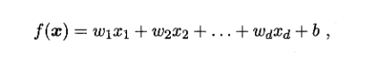
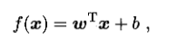
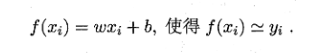
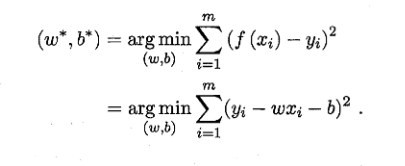
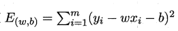
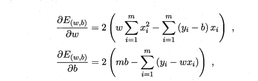
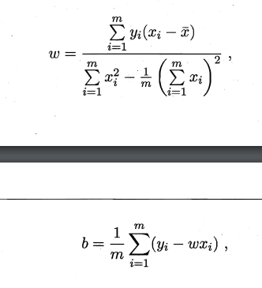
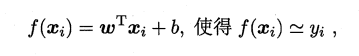
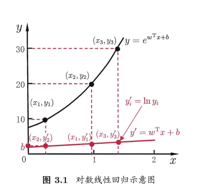
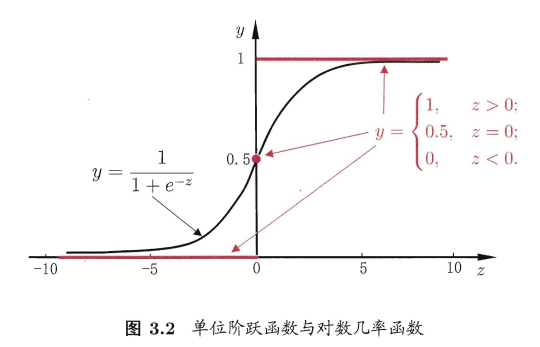

# 西瓜书-03-线性模型

## 基本形式

线性模型试图通过属性的线性组合来进行越策的函数, 比如:

一般用向量形式写成:

其中w和b确定了以后, 模型就确定了.

线性模型简单, 容易建模, 但是蕴含这机器学习中的一些重要思想.

- 很多非线性模型都是基于线性模型的记上引入层级结构或者高维映射得到的.
- w直观的表达了各个属性在预测中的重要性, 所以线性模型有姮好的可解释性

## 线性回归

线性回归(linear regression) 试图准确的预测实值输出标记.

先从一个简单的场景开始:

输入的属性数目只有一个

考虑:

$$
D = \{(x_i, y_i)\}^m_{i=1}, x \in R
$$

对于离散属性, 如果属性值间存在 "序" 关系, 可以通过连续化将其创转为连续值.

比如二值属性"身高"的取值"高", "矮"就可以转换为${1.0, 0.0}$, 三值属性"高","中","矮"则取"中"为`0.5`.

如果属性不存在序关系, 一般会转换为k维的向量. 

比如"瓜类": "西瓜", "南瓜", "黄瓜"一般会转换为`(0,0,1)` ,`(0,1,0)`, `(1,0,0)`.

线性回归**试图**学得:

确定`w`和`b`的关键在于衡量`f(x)`和`y`之间的差别.

- 均方误差是回归任务中常用的性能度量.
- 我们可以试图让均方误差最小化

- 均方误差对应了常用的欧几里得距离(欧氏距离).

基于均方误差最小化进行模型求解称为: **"最小二乘法"**

在线性回归中, 最小二乘法就是试图找到一条直线, 使得所有样本到直线上的欧氏距离之和最小.

线性回归模型的最小二乘"参数估计": 求解w和b, 使得

最小化的过程.

我们将$E_{(w,b)}$分别对w和b求导, 得到:

然后令这两个式子为0 , 就能得到`w`和`b`的最优解的闭式解:

推导到更一般的场景, 样本由d个属性描述, 我们视图建立:

这就是多元线性回归.

我们可以类似的利用最小二乘法来对w和b进行估计.

- 将w和b用向量形式表示: $\hat{w}=(w;b)$
- 相应的, 我们把数据集D标识位一个`m x (d+1)`大小的矩阵X, 其中每行对应于一个示例, 该行前d个元素对应于示例的d个属性, 最后一个元素恒置为1.

$$
\mathbf{x}={\left(\begin{array}{l l l l}{x_{11}}&{x_{12}}&{\cdots}&{x_{1d}}&{1}\\ {x_{21}}&{x_{22}}&{\cdots}&{x_{2d}}&{1}\\ {\vdots}&{\ddots}&{\ddots}&{\vdots}\\ {x_{m1}}&{x_{m2}}&{\cdots}&{x_{m d}}&{1}\end{array}\right)}={\left(\begin{array}{l l}{x_{1}^{\mathrm{T}}}&{1}\\ {x_{2}^{\mathrm{T}}}&{1}\\ {\vdots}&{\vdots}\\ {x_{m}^T}&{1}\end{array}\right)}
$$

再把标记也写成向量形式: $y=(y_{1};y_{2};\cdot\cdot\cdot;y_{m})$ , 则有:

$$
\hat{w}^{*}=\arg\operatorname*{min}_{\tilde{w}}(y-{\bf X}\hat{w})^{\mathrm{T}}(y-{\bf X}\hat{w})\;\;
$$

令$\mathbf{\partial}\cdot E_{{\hat{w}}}=(y-\mathbf{X}{\dot{w}})^{\mathsf{T}}(y-\mathbf{X}{\hat{w}})$, 对w求导, 得到:

$$
\frac{\partial E_{\bar{w}}}{\partial\bar{w}}=2\,\mathbf{X}^{\mathrm{{T}}}(\mathbf{X}\dot{w}-y)
$$

令上式为0, 可以得到最优解的闭式解, 不过这里涉及矩阵逆的计算, 比单变量情形复杂一些.

当$X^TX$是满秩举证或者正定矩阵的时候, 令求导为0可以得到: ${\dot{\omega}}^{*}=\left(\mathbf{X}^{\mathrm{{T}}}\mathbf{X}\right)^{-1}\mathbf{X}^{\mathrm{{T}}}y$

其中$(X^TX)^{-1}$是矩阵$(X^TX)$的逆矩阵, 令$\mathbf{\hat{x}}_{i}=(x_{i},1)$, 最终得到的多元线性回归模型如下:

$$
f({\hat{x}}_{i})={\hat{x}}_{i}^{\mathrm{{T}}}\left(\mathbf{X}^{\mathrm{{T}}}\mathbf{X}\right)^{-1}\mathbf{X}^{\mathrm{{T}}}y
$$

不过限时任务中$X^TX$往往不是满秩矩阵, 会存在多个解都能使得均方误差最小化, 选择哪一个解作为输出将由学习算法的归纳偏好决定.

常见的做法是引入正则化项.

线性模型虽然很简单, 但是有很丰富的变化.

当我们希望线性模型的预测值逼近正式标记的时候, 就得到了线性回归模型.

为了便于观察, 我们把线性回归模型简写为:

$$
y=w^{\mathrm{T}}x+b\;
$$

可否零模型预测值毕竟`y`的衍生物呢?

比如, 假设我们认为示例所对应的输出标记是在指数尺度上变化的, 那就可以将输出标记的对数作为线性模型逼近的目标, 即:

$$
ln y=w^{\mathrm{T}}x+b\;
$$

这就是"对数线性回归". 在形式上是线性回归, 实际上已经是求取输入空间到输出空间的非线性函数映射了.

更加一般的, 我们可以考虑单调可微函数`g(.)`, 令:

$$
y=g^{-1}(w^{\mathrm{T}}x+b)\;
$$

这个模型叫做广义线性模型, 其中:

- `g(.)`叫做联系函数, 比如在对数线性回归中, `g(.) = ln (.)`.

## 3.3 对数几率回归

如何使用线性模型进行分类任务呢?

- 只需要找一个单调可微函数将分裂任务的真实标记`y`和线性回归模型的预测值联系起来就可以.

考虑二分类任务, 其输出标记$y \in \{0, 1\}$

比较理想的函数是阶段跃迁函数:

$$
y=\left\{\begin{array}{c l}{{0,}}&{{z<0\ ;}}\\ {{0.5,}}&{{z=0\ ;}}\\ {{1,}}&{{z>0\ ,}}\end{array}\right.
$$

但是单位跃迁函数不连续, 不能直接作用在$g^-()$.

我们希望知道找到一个一定程度近似单位阶跃函数的替代函数, 并且单调可微.

常用的有**对数几率函数**:

$$
y={\frac{1}{1+e^{-z}}}
$$

对数几率函数是一种`Sigmoid函数`.

它将z值换换位一个接近0或者1的y值, 并且其输出值在`z=0`附近的变化比较陡峭.

代入得到:

$$
y=\frac{1}{1+e^{-(w^{\mathrm{T}}x+b)}}\ .
$$

这个式子实际上是在用线性回归模型的预测结果来逼近真实标记的对数几率.

因此, 这个对应的模型被叫做"对数几率回归"

这是一种分类学习方法. 有很多优点: 
- 比如直接对分类可能性进行建模, 无需实现假设数据分布, 这样就避免了假设分布不准确所带来的的问题
- 不是仅预测出类别, 而是可得到近似概率预测, 这对许多需要利用概率辅助决策的任务很有用
- 此外, 对率函数是任意阶可到的凸函数, 有很好的数学性质, 能够直接用于求取最优解.

求解式子中的w和b, 将其中的y看做类后延概率估计`p(y=1|x)`, 则可以重写为:

$$
\ln{\frac{p(y=1\mid x)}{p(y=0\mid x)}}=w^{\mathrm{T}}x+b
$$

显然的有:

$$
p(y=1\mid x)={\frac{e^{w^{\mathrm{T}}x+b}}{1+e^{w^{\mathrm{T}}x+b}}}\;,
p(y=0\mid x)={\frac{1}{1+e^{w^{\mathrm{T}}x+b}}}
$$

通过极大似然发来估计w和b.

给定数据集$\{(x_{i},y_{i})\}_{i=1}^{m}$, 对率回归模型最大化"对数似然":

$$
\ell(w,b)=\sum_{i=1}^{m}\ln p(y_{i}\mid x_{i};w,b)
$$

即令每个样本属于其真实标记的概率越大越好.

 