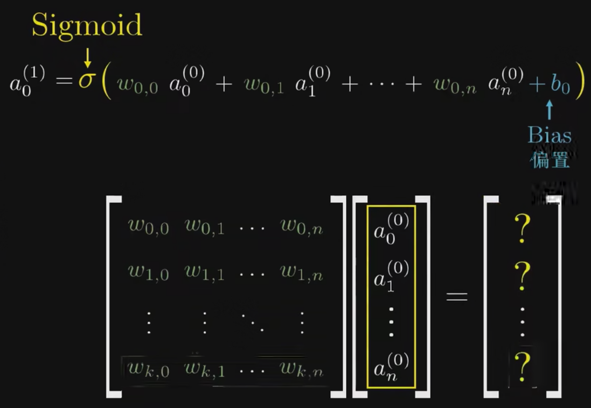
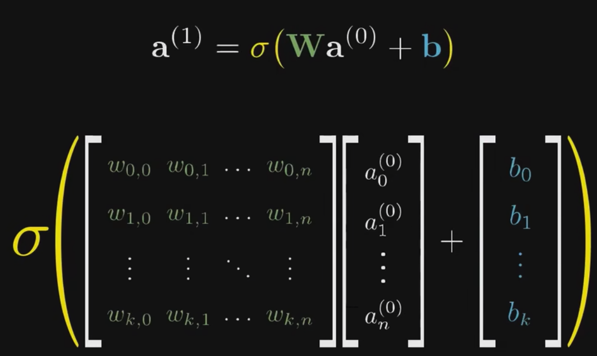

# [笔记]深度学习之神经网络的结构 Part 1

例子: 识别数字

## 概念

- 神经网络: 模仿神经元的一种多层的权重计算方法
  - 最简单的原版: MLP神经网络

- 第一层: 输入层, 神经元: 对于图像识别, 类比一个图像上的像素点
- 中间层: 中间处理数据的层(运算, 模仿生物中的神经网络), 一般不止一层
- 输出层: 我们需要的目标的结果

第一层的权重数量和神经元数量一致, 所以我们会有n个权重值(参数)

> Sigmoid 函数, 用来做信号处理(负无穷接近0, 正无穷接近1)  
> 现在用的比较多的是`RelU(a) = max(0, a)`, 线性整型函数, 这种函数在特别深的神经网络中效果很不错

每个神经元带上权重计算后, 在通过神经网络节点上通过Sigmoid进行压缩

权重计算函数:

再进一步用sigmoid函数进行包裹和简写:

从这个角度来看, 神经网络就是一个函数.

输入是所有的神经元, 输出是我们的结果, 其中的参数就是网络的权重计算.

---

# [笔记]深度学习之梯度下降法 Part 2

