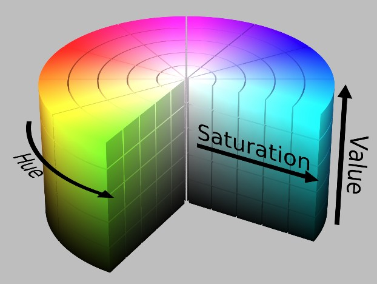

# 颜色模式

## 色立体

- 孟塞尔立体, 以色相(Hue), 明度(Value), 纯度(Chroma)为基础. 色相以红, 黄, 绿, 蓝, 紫心理五原色为基础, 加上其中间相色: 橙, 黄绿, 蓝绿, 蓝紫组成10色相, 顺时针排序. 再10等分组成色共计100色相组成色相环.

## 计算机中的颜色表示方式

- `RGB`色彩模式: RGB是工业界一种颜色标准, 是通过对红(R), 绿(G), 蓝(B)三个颜色通道的变化以及他们相互之间的叠加来得到各种各样的颜色. 这个标准包含了人类示例所能感知到的所有颜色.

- `HSV`色彩模式: HSV由 Hue(色相), Saturation(饱和度), Value(明度)为三种属性表示颜色. 色立体如下图所示:

- `HSL`色彩模式: 与HSV相似, 由Hue(色相), Saturation(饱和度)和Lightness(亮度)组成. 色立体如下图所示:

`HSV`和`HSL`的区别在于其组成元素的概念不同:

- HSV中的S控制春色中混入白色的量, V控制纯色中混入黑色的量
- HSL中的S和黑白没有关系, 饱和度不控制颜色重混入黑白的多少
- HSL中的L控制纯色中混入的黑白两种颜色