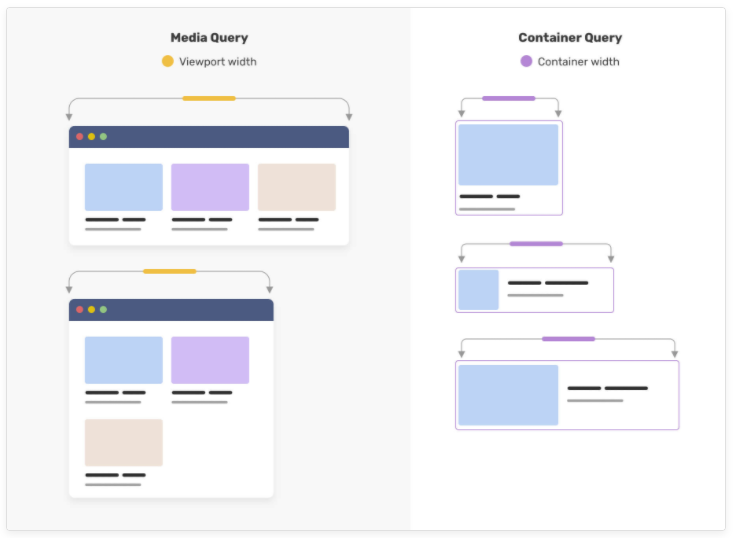

# 基础-@规则

在CSS中存在大量以`@`符号开头的规则, 称之为(at-rule, @规则)


at-rule是一个CSS语句, 以`@`开头:

```
@(U+0040 COMMERCIAL AT) + 标识符 + ... {

}
```

## @charset、@import、@namespace

- `@charset`: 指定样式表中使用的字符编码, 必须是样式表中的第一个元素, 且不得有任何其他字符在前.

```css
@charset "UTF-8";
```

如果CSS文件中有任何非ASCII文本, 例如字体名称, 伪元素的content属性值, 选择器中的非ASCII字符, 都需要确保CSS解析器知道如何将字节正确转换为字符.


- `@import`: 用于从其他样式表导入样式规则, 这些规则比如先于其他类型的规则, `@charset`除外.

`@import`有两种语法:

```css
@import 'custom.css';
@import url('landscape.css');
@import url('landscape.css') screen and (orientation:landscape);
```

并且可以在后面定义媒体查询规则.

合理的使用`@import`可以:

1. 合理的控制CSS文件的大小
2. 更好的模块化&复用

使用它的缺点:

1. 影响浏览器的并行下载
2. 可能导致优先级问题, 样式相互覆盖
3. 导致页面闪烁

当页面加载的时候, link标签引入的CSS会被同时加载, 而`@import`引入的CSS将在页面加载完毕后被夹在.

CSS解析引擎在对一个CSS文件进行解析的时候, 如果在文件顶部遇到`@import`规则, 会替换成导入CSS文件的全部样式, 而加载顺序会在其后, 加载完毕以后会放在样式表顶部, 导致样式冲突.

另一方面, 浏览器渲染的动作一般会执行多次. 最后一次渲染是基于之前加载过的所有样式整合后渲染树进行页面的绘制. 由于`@import`内的规则的加载时机的问题, 会在页面加载完成后再加载, 类似把CSS放在Body的底部, 从而造成了页面的闪烁.


- `@namespace` 是用来定义使用在CSS样式表中的XML命名空间的, 定义的命名空间可以把通配符, 元素和属性选择器限制在指定命名中间中的元素.


## @media, @keyframes, @font-face

- @media: 媒体查询, 满足媒体查询的条件, 则条件规则组中的规则生效
- @keyframes: CSS动画的中间步骤
- @font-face: 下载外部字体

其中`@media`除了最常用的屏幕宽度查询, 还有很其他的能力, 详见上一篇的文章总结.

## @supports 特性检测

`@support`可以通过CSS语法来实现特性检测, 并在内部CSS区块中写入满足特性检测的CSS代码.


比如下面这个例子: 如果支持粘性布局, 则启用

```css
div {
    position: fixed;
}

@supports (position:sticky) {
    div {
        position:sticky;
    }
}
```

配合其他几个关键词: `not`, `and`, `or` 可以书写一些复杂的逻辑: 

`@supports not`: 

```css
.container {
  translate: 50% 10%;
  rotate: 80deg;
  scale: 1.5;
}

/* 如果不支持上述的语法，则 supports 内的语法生效 */
@supports not (scale: 1) {
  .container {
    transform: translate(50%, 10%) rotate(80deg) scale(1.5);
  }
}
```

`@supports and`:

```css
p {
    overflow: hidden;
    text-overflow: ellipsis;
}
@supports (display:-webkit-box) and (-webkit-line-clamp:2) and (-webkit-box-orient:vertical) {
    p {
        display: -webkit-box;
        -webkit-line-clamp: 2;
        -webkit-box-orient: vertical;
    }
}
```

`@supports or`: 

```css
@supports (background:-webkit-linear-gradient(0deg, yellow, red)) or (background:linear-gradient(90deg, yellow, red)){
    div {
        background:-webkit-linear-gradient(0deg, yellow, red);
        background:linear-gradient(90deg, yellow, red)
    }
}
```

## @counter-style CSS计数器

`@counter-style`可以让开发者自定义counter的样式, 一个`@counter-style`规则定义了如何把一个计数器的值转化为字符串的表示. 

下面是一个简单的例子:

```html
<ul>
    <li>Lorem ipsum dolor sit amet, consectetur adipisicing elit. </li>
    <li>Lorem ipsum dolor sit amet, consectetur adipisicing elit. </li>
    <li>Lorem ipsum dolor sit amet, consectetur adipisicing elit. </li>
    <li>Lorem ipsum dolor sit amet, consectetur adipisicing elit. </li>
</ul>
```

```css
@counter-style circled-alpha {
  system: fixed;
  symbols: Ⓐ Ⓑ Ⓒ Ⓓ Ⓔ Ⓕ Ⓖ Ⓗ Ⓘ Ⓙ Ⓚ Ⓛ Ⓜ Ⓝ Ⓞ Ⓟ Ⓠ Ⓡ Ⓢ Ⓣ Ⓤ Ⓥ Ⓦ Ⓧ Ⓨ Ⓩ;
  suffix: " ";
}
li {
   list-style: circled-alpha;
}
```

我们可以得到自定义的计数器前缀.


## @property CSS自定义属性

`@property` 是 `CSS Houdini API` 的一部分, 它允许开发者显式地定义他们的 CSS 自定义属性，允许进行属性类型检查、设定默认值以及定义该自定义属性是否可以被继承。

正常, 我们定义和使用一个CSS自定义属性是这样的:

```css
:root {
    --whiteColor: #fff;
}

p {
    color: var(--whiteColor);
}
```

使用`@property`, 可以这样:

```css
@property --property-name {
  syntax: '<color>';
  inherits: false;
  initial-value: #fff;
}

p {
    color: var(--property-name);
}
```

其中:

- `syntax`: 自定义属性的语法规则, 或者说自定义属性的类型
- `inherits`: 是否允许集成
- `initial-value`: 初始值

还可以在JS内定义:

```js
CSS.registerProperty({
  name: "--property-name",
  syntax: "<color>",
  inherits: false,
  initialValue: "#c0ffee"
});
```

举个例子, 在不使用`@property`的时候, 我们只能针对已有的属性设置渐变:

```css
:root {
    --colorA: #fff;
    --colorB: #000;
}
div {
    background: linear-gradient(45deg, var(--colorA), var(--colorB));
    transition: 1s background;
    
    &:hover {
        --colorA: yellowgreen;
        --colorB: deeppink;
    }
}
```

这个时候, `background`是不支持两个渐变色之间的变化的, 但是使用`@property`就可以:

```css
@property --houdini-colorA {
  syntax: '<color>';
  inherits: false;
  initial-value: #fff;
}
@property --houdini-colorB {
  syntax: '<color>';
  inherits: false;
  initial-value: #000;
}
.property {
    background: linear-gradient(45deg, var(--houdini-colorA), var(--houdini-colorB));
    transition: 1s --houdini-colorA, 1s --houdini-colorB;
    
    &:hover {
        --houdini-colorA: yellowgreen;
        --houdini-colorB: deeppink;
    }
}
```

这就意味着以往很多无法使用CSS实现的效果, 现在借助它都可以实现了.

## @layout

`@layer`声明了一个`级联层`， 同一层内的规则将级联在一起， 这给予了开发者对层叠机制的更多控制。

我们可以通过`@layer`控制不同样式的优先级, 比如:

```css
div {
    width: 200px;
    height: 200px;
}
@layer A {
    div {
        background: blue;
    }
}
@layer B {
    div {
        background: green;
    }
}
```

此时`@layout B`的顺序在`@layout A`的后面, 所以`@layout B`内部的所有样式优先级都会被`@layout A`要高.

也可以同时命名多个`@layout`层, 其后再补充其中的样式规则.

```css
/* 按照这里的优先级顺序 A > C > B */
@layer B, C, A;
div {
    width: 200px;
    height: 200px;
}
@layer A {
    div {
        background: blue;
    }
}
@layer B {
    div {
        background: green;
    }
}
@layer C {
    div {
        background: orange;
    }
}
```

我们可以将CSS不同的模块划分到不同的`@layout`中, 利用先后顺序, 控制全局的样式优先级.

## @container 容器查询

`@container`可以基于容器的可用宽度来改变改变布局.

例如:

```html
<div class="wrap">
    <div class="g-container">
        <div class="child">Title</div>
        <p>Lorem ipsum dolor sit amet consectetur adipisicing elit. Necessitatibus vel eligendi, esse illum similique sint!!</p>
    </div>
</div>
```

```css
.wrap {
    width: 500px;
    resize: horizontal;
    overflow: auto;
}
.g-container {
    display: flex;
    flex-wrap: nowrap;
}
.wrap {
    /* CSS CONTAINER */
    container-name: wrap;
    container-type: inline-size;
}
@container wrap (max-width: 400px) {
    .g-container {
        flex-wrap: wrap;
        flex-direction: column;
    }
}
```

这样我们就可以查询到在不同宽度下, 改变容器内部的布局.

它和媒体查询的区别如下: 



# 参考链接

- [现代 CSS 指南 -- at-rule 规则必知必会](https://mp.weixin.qq.com/s/LkM_Y-9OfgXatocVsM6m6g)