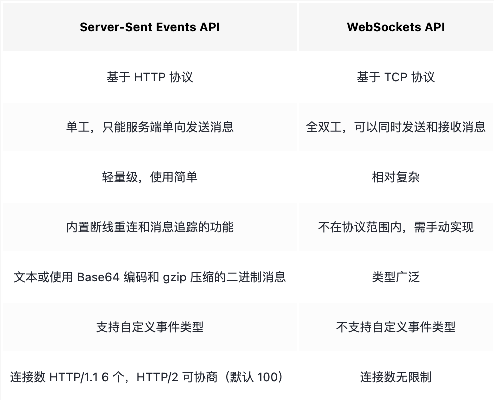

# Server-Sent Events 服务端推送

简称SSE, 是一种服务端试试主动向浏览器推送消息的技术

SSE是HTML5中一个与通信相关的API, 主要由两部分组成:

- 服务端与浏览器端的通信协议(HTTP协议)
- 浏览器端可以供JS使用的`EventSource`对象

它和WebSockets API的异同如下:



## 服务端实现

### 协议

SSE协议比较简单, 本质是浏览器发起http请求, 服务端在收到请求后, 返回状态和数据, 并且加上如下的response:

```
Content-Type: text/event-stream
Cache-Control: no-cache
Connection: keep-alive
```

- SSE API 规定推送事件流的MIME必须是`text/event-stream`
- 必须制定浏览器不缓存服务端发送的数据
- 是一个一直开启的TCP链接, 所以需要`keep-alive`

### 消息格式

EventStream是UTF-8格式编码的文本或者用Base64编码, gzip压缩的二进制消息.

- 每条消息由一行或者多行字段组成, 每个字段是`k:v`格式, 字段以行为单位, 以`\n`结尾, 冒号开头的行使注释.
- 每次推送可以由多个消息组成, 每个消息之间空行分隔(`\n\n`)
- 除了event, id, retry, data以外的字段都会被胡烈
- 注释行可以用来保活,比如隔一段时间给浏览器发送一个注释行

```
event: 事件类型, 浏览器收到这个消息的时候, 会在当前EventSource对象上触发一个事件, 事件类型就是这个字段值, 可以监听
id: 事件ID, 如果断连了, 浏览器会把收到的最后一个事件id放在header中的`last-event-id`, 来进行重连, 可以实现一个简单的同步机制
retry: 重连次数, 单位md
data: 消息数据, 必须是字符串
```

一个例子:

```
: this is first message\n\n

data: this is second message\n\n

data: this is third message part one\n
data this is third message part two\n\n

event: server-time\n
id: 1
retry: 30000\n
data: {"text": "this is fourth message", "time": "xxx"}\n\n
```

这里发送了四条消息:

1. 注释
2. 包含一个data
3. 包含两个data, 会被解析成:`this is third message part one\ndata this is third message part two`
4. 包含完整字段, 指定事件类型为server-time, 时间id为1, 重连时间为30000ms, 消息数据是json字符串

## 浏览器API

在浏览器上可以用`EventSource API`来实现监听.

### 建立连接

```js
const eventSource = new EventSource('http_api_url', { withCredentials: true })
```

- URL: http事件来源, 一旦对象被创建, 浏览器立即开始对该URL地址的事件进行监听
- OPTIONS: 
  - `withCredentials`: 表示是否发送凭证

和XML对象类似, EventSource有一个readyState属性, 含义如下:
- 0: 浏览器与服务端尚未建立连接或者连接被关闭
- 1: 建立连接成功, 浏览器正在助理接收到的事件和数据
- 2: 浏览器与服务端建立连接失败, 客户端不能继续建立与服务端之间的连接

可以使用close方法关闭连接

```
eventSource.close();
```

### 监听事件

EventSource对象本身继承自EventTarget接口, 可以使用以下事件:

- `open`事件, 当成功连接到服务端时触发
- `message`: 当接收到服务端发送的消息时触发. 该事件对象的data属性包含了服务器发送的消息内容
- `error`: 意外的错误事件, 包含错误信息

```js
// 初始化 eventSource 等省略

eventSource.addEventListener('open', function(event) {
  console.log('Connection opened')
})

eventSource.addEventListener('message', function(event) {
  console.log('Received message: ' + event.data);
})

// 监听自定义事件
eventSource.addEventListener('xxx', function(event) {
  console.log('Received message: ' + event.data);
})

eventSource.addEventListener('error', function(event) {
  console.log('Error occurred: ' + event.event);
})
```

或者使用属性监听:

```js
/ 初始化 eventSource 等省略

eventSource.onopen = function(event) {
  console.log('Connection opened')
}

eventSource.onmessage = function(event) {
  console.log('Received message: ' + event.data);
}

eventSource.onerror = function(event) {
  console.log('Error occurred: ' + event.event);
})
```
