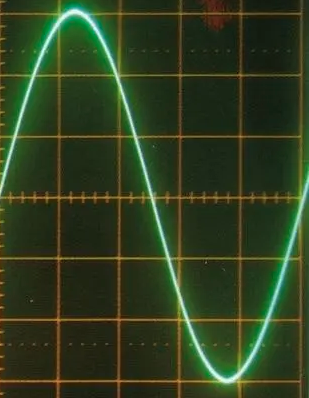

# 傅里叶分析

> 简单来说, 傅里叶变换就是把一个输入信号分解成一堆正弦波的叠加.

利用傅里叶变化, 我们可以把音频中最重要的成分表达出来, 并且得到和原始声音非常接近的波形. 在计算机中, 用一系列数据点的形式来存储.

举个例子:

一段音乐是什么? --一个随着时间变化的整栋

时域:

频域:

傅里叶告诉我们: 任何周期函数都可以看做是不同振幅, 不同相位正弦波的叠加.

而贯穿时域和频域的方法之一, 就是传说中的傅里叶分析.

傅里叶分析可以分为:

- 傅里叶级数
- 傅里叶变换

## 傅里叶级数(Fourier Series)

## 参考

- [傅里叶分析之掐死教程（完整版）更新于2014.06.06](https://zhuanlan.zhihu.com/p/19763358)