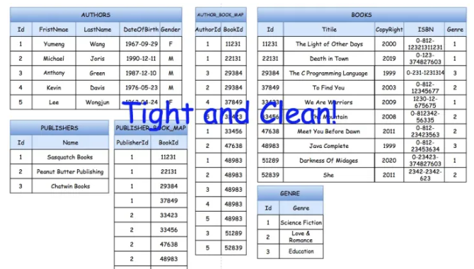
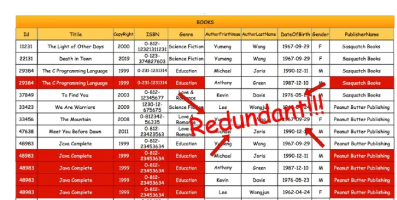
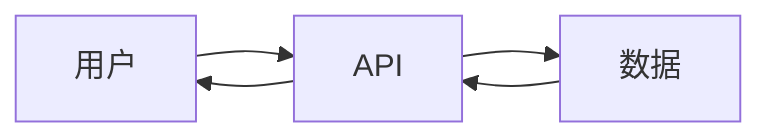
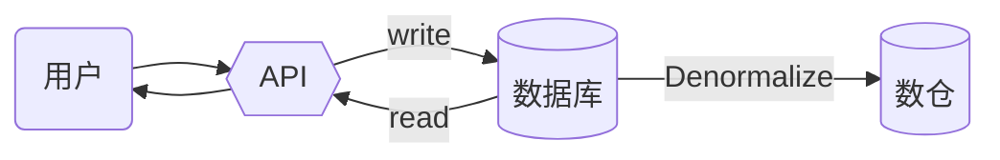

# 数据基础

> 概念解析: 数仓 & 数据湖 & 湖仓一体

## 数据仓库

数据仓库(Data Warehouse)是一种数据集合, 用于支持管理角色和信息的全局共享

- 面向主题(Subject Oriented)
- 集成(Integrated)
- 相对稳定(Non-Volatile)
- 反映历史变化(Time Variant)

业务累计的大量资料, 通过数仓理论所特有的资料存储架构, 系统化的进行分析整理, 比如: 联机分析处理(OLAP), 数据挖掘(Data Mining), 进而支持决策支持系统, 构建商业智能(BI)

**主题**: 指用户使用数仓进行决策时关心的重点方面,比如: 收入, 客户, 销售渠道. 面相主题, 就是值数仓内的信息是按主题进行组织的, 而不是按照业务功能进行组织的.

**集成**: 指数据仓库中的信息不是从各个业务系统重简单抽象出来的, 而是经过一系列加工, 整理和汇总的过程, 因此数仓中的信息是关于整个企业的一致的全局信息.

**随时间变化**: 仓库内的数据并不只是反映当前的状态, 而是记录了从过去某个时间到当前各个阶段的信息.

### 特点

- 高执行效率: 处理的数据量巨大, 分析周期一般以天为单位, 时效性要求较高
- 高数据质量: 进入数仓的数据一般需要清洗, 从而保证数仓提供的数据是准确的
- 高扩展: 提前考虑3~5年的业务发展需求
- 面向主题: 按一定的主题域进行组织

## 数据湖

数据湖(Data Lake)是一个存储企业的各种各样原始数据的大型仓库, 其中的数据可供存取, 处理, 分析以及传输.

数据湖是以其自然格式存储的数据的系统或者存储库, 通常是对象blob或者文件.

数据湖通常是企业所有数据的单一存储, 包括源系统数据的原始副本, 以及用于报告, 可视化分析, 机器学习等任务的转换数据.

数据湖可以包括来自关系型数据库的结构化数据, 半结构化数据(csv, 日志, XML, JSON), 非结构化数据(邮件, 文档, PDF)和二进制数据(图像, 视音频)

Hadoop是比较常见的数据湖技术.

### 特点

- 高保真: 原始数据完整
- 灵活性: 根据需求对原始数据进行加工
- 可管理: 管理数据源, 数据连接, 数据格式, 数据模式, 数据权限等
- 可追溯: 需要对数据的全生命周期进行管理, 包括数据的定义, 接入, 存储, 分析, 应用的全过程. 对其中任一数据可追溯, 能清楚的重现数据完整的产生过程和流动过程

### 湖仓一体

湖仓一体(Data Lakehouse), 旨在为企业提供一个统一的,可共享的数据底座, 避免传统的数据湖, 数据仓库之间的数据移动, 将原始数据, 加工清洗数据, 模型化数据一起存储在湖仓中.

- 即面向业务实现高并发, 精准化, 高性能的历史数据, 实时数据的查询服务, 又能承载分析报表, 批处理, 数据挖掘等分析业务.

#### 特点

1. 统一的数据管理: 保存两类数据: 原始数据 & 处理后的数据. 数据湖中的数据会不断的积累, 演化, 所以要具备数据&权限管理的能力
2. 多模态的存储引擎: 湖仓一体本身内置多模态的存储引擎, 支持可插拔的存储框架
3. 丰富的计算引擎: 提供批处理, 流式处理, 交互式分析到机器学习的各种计算引擎.
4. 数据全生命周期的管理: 同上

## 不同技术的对比

### 数据湖与数据仓库

数据仓库和数据湖是大数据架构的两种设计趋向. 根本分析是在对包括存储系统, 权限, 建模要求等方面的把控.

数据湖是通过开放底层文件的存储能力, 给数据入湖带来最大的灵活性. 进入数据湖的数据可以是结构化的, 也可以是半结构化的.

数据仓库则更加关注数据的使用效率, 大规模下的数据管理, 安全, 合规这样的企业级需求. 数据通过统一的服务接口入仓, 数据通常预先定义schema. 用户通过数据服务接口或者计算引擎访问分布式存储系统中的文件. 

### 数据库与数据仓库

数据库的特点是:

- 相对复杂的表格结构, 存储结构紧致, 冗余数据少
- 读写都有优化
- 相对简单的读写查询, 单次作用于相对的少量数据

数据仓库的特点是: 

- 相对简单的表格结构, 存储结构松散, 冗余数据多
- 一般只有读优化
- 相对复杂的read query, 单次作用域相对大量的数据

#### 存储空间的对比

数据库的表格在转换到数仓表格一般是将多张表格数据整合到一张宽表中, 这个过程即`denormalization`(反规范化).

所以从存储空间角度来说, 相较于数据库紧密的存储结构, 数仓会存在大量冗余和重复的数据.

#### 读写优化对比

- 基本读操作

这里有两个查询:

1. 查询一本书的所有信息
2. 查询某个作者的所有作品信息

在数据库中, 我们需要利用表之间的关联才能找到所有的数据, 在效率上会更低一些.

在数仓中, 因为这些关联关系转化成重复素具聚合在同一张表中, 查询效率就会相对较高.

- 大数据读操作

当数据量非常大的时候, 特定条件下数据仓库的读优化就会开始碾压数据库.

大部分的数据库都是单实例的, 而数仓则一般是多实例的分布式系统, 在分配存储节点的时候根据主键(PrimaryKey)或者分区键(PartitionKey)来分配的,查询的时候可以根据查询的值来搜索对应节点的位置, 同时还能进行大量的并行查询.

不过也不是所有读操作都是数仓有优势, 比如:

1. 在对小量数据进行读取操作的时候, 由于数仓要找节点的地址等预运算, 整体效率上反而不如数据库.
2. 读入读取操作的目标不是主键或者分区键, 那么数仓的查询要进行全表扫描, 效率上就不一定更高.

- 写操作对比

大部分情况下, 数仓不会进行精确的写操作, 因为冗余行太多, 即便是改一个小的字段, 也会修改大量的行数据. 而对于数据库则相反. 

此外, 数仓的写操作是整段刷新或者写入. 一般来说, 我们会通过分区键设置成数据创建/更新的时间, 然后记录一段时间内的历史数据. 这对于数据分析以及数据决策都有比较好的意义.

## 数仓的场景

一个抽象的软件架构, 就是用户通过API和数据库交互

直接在数据库上进行数据分析或者数据监控, 就会遇到几个问题:

- 数据分析通常涉及大量数据查询, 可能会占用太多CPI从而影响软件基础功能
- 数据库的表结构通常比较复杂, 需要数据分析人员对于DB有比较深入的了解
- 数据库在进行大量数据查询的时候效率比较低
- 开放数据库权限(即便只是读权限), 也会存在一定的安全隐患

所以, 我们可以通过脚本每个一段时间把数据库中的所有数据`Denormalize`到数据仓库中, 在数仓中进行数据分析.

- 独立不影响业务, 表结构简单, 读数据快, 相对安全

不过这里还有个小问题, 如果很多不同的组需要共享这个DataWareHouse, 那么他们的脚本可能会互相影响. 

一般我们引入数据目录(`Data Catalog`)来解决这个问题:

通过数据目录存储元数据, 然后发布出来, 让不同组的数仓都可以同步这个数据. 

这样每个不同组的数仓都拿到了同样的`Denormalized`数据, 但是都相互独立开了.

:::note

数据目录是一种元数据管理工具，旨在帮助组织查找和管理存储在其ERP、人力资源、财务和电子商务系统以及其他来源（如社交媒体源）中的大量数据（包括表、文件和数据库）。

:::  

## 参考

- [数据库 与 数据仓库的本质区别是什么？](https://www.zhihu.com/question/20623931/answer/750367153)