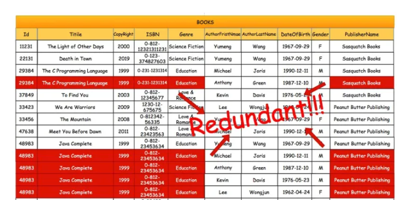

# 数据系统基础

> 概念解析: 数仓 & 数据湖 & 湖仓一体

## 术语表

### 事实

事实是数据仓库中的信息单元, 也是多维空间中的一个单元, 受分析单元的限制.

事实存储于一张表中, 或者多维数据库的一个单元.

每个事实包括关于事实的基本信息, 并且与维度相关. 在某些情况下, 当所有必要信息都存储在维度中时, 单纯的事实出现就是对于数据仓库足够的信息.

### 维度

维度是用来反映业务的一类属性, 这类属性的集合构成一个维度. 例如, 某个地理维度可能包括国家, 地区, 省以及城市的级别.

一个时间的维度可能包括年,季, 月, 周, 日的级别

### 级别

维度层级结构的一个元素. 级别描述了数据的层次结构, 从数据的最高级别(汇总程度最大)知道最低(最详细)级别. 级别经存在维度内, 级别基于维度表中的列或者维度中的成员数据.

### 数据清洗

对数据仓库系统无用的或者不符合数据格式规范的数据就是脏数据. 数据清洗即清除脏数据的过程.

### 切片

一种用来在数据仓库中将一个维度中的分析空间限制为数据子集的技术

### 切块

一种用来在数据仓库中将多个维度中的分析空间限制为数据子集的技术

### 粒度

粒度将直接决定所构建仓库系统能够提供决策支持的细节级别. 粒度越高表示仓库中的数据越粗, 反之, 较细. 例如，时间维度，时间可以分成年、季、月、周、日等。数据仓库模型中所存储的数据的粒度将对信息系统的多方面产生影响。事实表中以各种维度的什么层次作为最细粒度，将决定存储的数据能否满足信息分析的功能需求，而粒度的层次划分、以及聚合表中粒度的选择将直接影响查询的响应时间。

### 度量

度量是业务流程上的一个数值. 比如: `销量`, `价格`, `成本`等.

事实表中的度量可分为三类: `完全可加`, `半可加`, `不可加`.

- 完全可加: 度量最灵活, 最有用, 可以进行任意维度的汇总.
- 半可加: 可以对某些维度汇总, 但是不能对所有维度汇总, 比如差额, 它除了时间维度外, 可以扩所有维度进行加法操作.
- 完全不可加: 比如比率. 对于这些度量, 尽可能存储非可加度量的完全可加分量, 并在计算出最终的非可加事实, 将这些分量汇总到最终的结果集中.

### 度量值

在多维数据集中, 度量值是一组值, 这些值基于多维数据集的事实数据表中的一列, 而且通常为数字.

此外, 度量值是所分析的多维数据集的中心值. 即, 度量值是最终用户浏览多维数据集时重点查看的数字数据.

### 口径

口径就是取数的逻辑, 比如, 要取10岁以下的儿童中男孩的平均身高, 这就是统计的口径.

### 指标

指标是口径的衡量值, 也就是最后的结果. 比如: 最近7天的订单量, 一个促销活动的购买转化率等.

一个指标具体到计算实施, 主要有几个部分:

`指标加工逻辑`，比如`count` ,`sum`, `avg`

`维度`, 比如按部门, 地域进行指标统计, 对应sql中的group by.

`业务限定/修饰词`, 比如以不同的支付渠道来算对应的指标, 微信支付的订单退款率, 支付宝支付的订单亏款绿. 对应sql中的where.

除此之外, 指标本身可以衍生, 派生出更多的指标, 基于这些点, 可以将指标进行分类:

- 原子指标: 指基本的业务事实, 没有业务限定, 没有维度. 比如订单表中的订单量, 订单总金额都算原子指标.
- 派生指标: 维度+修饰词+原子指标. 店铺近一天订单支付金额. 其中店铺是维度, 一天是一个时间类型的修饰词, 支付金额是一个原子指标. 
- 衍生指标: 比如一个促销活动的转换率. 因为需要促销投放人数指标和促销订单数指标进行计算得出.

### 标签

标签是人为设定的, 根据业务场景需求的, 对目标对象运用一定的算法得到的高度精炼的特征标识. 

标签是认为再加工后的结果, 比如: 网红, 白富美.

### 自然键

有现实中已经存在的属性组件的键, 它在业务概念中的唯一的, 并具有一定的业务含义, 比如商品ID, 员工ID

以数仓角度看, 来自业务系统的标识符就是自然键, 比如业务库中员工的编号.

### 持久键

保持永久性不会发生变化. 优势也被叫做超自然持久键. 比如身份证号属于持久键.

### 代理键

不具有业务含义的键. 代理键有许多其他的称呼: 无意义键, 整数键, 非自然键, 人工键, 合成键等.

### 退化维度

退化维度, 就是那些看起来像是事实表的一个维度关键字, 但实际上没有对应的维度表, 就是维度属性存储到事实表中, 这种存储到事实表中的维度列被称为退化维度.

与其他存储在维表中的维度一样, 退化维度也可以用来进行事实表的过滤查询, 实现聚合操作等.

怎么定义退化维度呢? 比如说订单id, 这种量级很大的维度

## 数据仓库

数据仓库(Data Warehouse)是一种数据集合, 用于支持管理角色和信息的全局共享, 为企业所有级别的决策制定过程, 提供所有类型数据支持的战列集合.

出于分析性报告和决策支持目的而创建. 为需要业务职能的企业, 提供指导业务流程的改进/监控时间/成本/质量以及控制

业务累计的大量资料, 通过数仓理论所特有的资料存储架构, 系统化的进行分析整理, 比如: 联机分析处理(OLAP), 数据挖掘(Data Mining), 进而支持决策支持系统, 构建商业智能(BI)

### 特点

####  面向主题(Subject Oriented)

- 指用户使用数仓进行决策时关心的重点方面,比如: 收入, 客户, 销售渠道. 面相主题, 就是值数仓内的信息是按主题进行组织的, 而不是按照业务功能进行组织的.

#### 集成(Integrated)

- 指数据仓库中的信息不是从各个业务系统重简单抽象出来的, 而是经过一系列加工, 整理和汇总的过程, 因此数仓中的信息是关于整个企业的一致的全局信息.
  
- 这是数据仓库建设中最关键和复杂的一步 需要:
    - 统一解决源数据中所有矛盾的地方: 字段的同名异义、异名同义、单位不统一、字长不一致等
    - 进行数据综合和计算. 数据仓库中的数据综合工作可以从元数据库抽取数据时生成, 也可以进入数仓以后综合生成.
    - 大部分情况下, 数仓的建立是由大数据部门负责构建, 而别的分析业务部门无权直接使用线上的table

#### 相对稳定(Non-Volatile)

数据仓库的的数据主要供业务决策分析使用, 所涉及的数据操作主要是数据查询, 一般情况下不进行数据修改.

这里的数据不可更新一般是正对应用来说的, 也就是数仓用户在进行分析和处理的时候是不进行数据更新操作的. 

#### 反映历史变化(Time Variant)

仓库内的数据并不只是反映当前的状态, 而是记录了从过去某个时间到当前各个阶段的信息.

数据仓库反映的是一段相当长的时间内历史数据的内容, 是不同时间的数据库快照的集合, 以及基于这些快照进行统计, 重组导出的数据, 不是联机处理的数据.

一旦数据仓库存放的数据超过数仓存储期限就会被从当前的数仓中删除.

### 数据仓库的架构

数据仓库标准上可以分为4层:

- ODS(临时存储层): Operational Data Store, 将来自不同数据源的数据通过ETL过程汇聚整合成面向主题的, 集成的, 企业全局的, 一致的数据集合. 是数据粒度最细的. ODS的表通常包含两类: 1. 用于存储当前需要加载的数据. 2. 用于存储处理完后的历史数据. 历史数据一般保存3-6个月.
- PDW(数据仓库层): Data Warehouse, PDW层的数据应该一致, 准确, 干净. 即对源系统数据进行清洗(去除杂质), 这层的数据一般遵循数据库的第三范式, 其数据力度通常和ODS相同. 再PDW层会保存BI系统中所有的历史数据.
- DM(数据集市): Data Mart, 数据集市层, 这层数据主要面向主题组织, 通常是星形或者雪花结构的数据. 从数据粒度说, 这层是轻度汇总的数据.
- APP(应用层): Application层, 完全为了满足具体的分析需求而构建的数据, 也是星形或者雪花结构的数据. 从数据的广度来说不一定会覆盖所有业务数据, 而是DM层数据的一个真子集.

各个系统的元数据通过`ETL`同步到操作性数仓ODS, 对ODS进行面向主题域的建模, 形成DW.

DM是针对某一个业务领域建立模型, 而具体的用户则主要关注DM生成的报表.

## 数据湖

数据湖(Data Lake)是一个存储企业的各种各样原始数据的大型仓库, 其中的数据可供存取, 处理, 分析以及传输.

数据湖是以其自然格式存储的数据的系统或者存储库, 通常是对象blob或者文件.

数据湖通常是企业所有数据的单一存储, 包括源系统数据的原始副本, 以及用于报告, 可视化分析, 机器学习等任务的转换数据.

数据湖可以包括来自关系型数据库的结构化数据, 半结构化数据(csv, 日志, XML, JSON), 非结构化数据(邮件, 文档, PDF)和二进制数据(图像, 视音频)

Hadoop是比较常见的数据湖技术.

### 特点

- 高保真: 原始数据完整
- 灵活性: 根据需求对原始数据进行加工
- 可管理: 管理数据源, 数据连接, 数据格式, 数据模式, 数据权限等
- 可追溯: 需要对数据的全生命周期进行管理, 包括数据的定义, 接入, 存储, 分析, 应用的全过程. 对其中任一数据可追溯, 能清楚的重现数据完整的产生过程和流动过程

### 湖仓一体

湖仓一体(Data Lakehouse), 旨在为企业提供一个统一的,可共享的数据底座, 避免传统的数据湖, 数据仓库之间的数据移动, 将原始数据, 加工清洗数据, 模型化数据一起存储在湖仓中.

- 即面向业务实现高并发, 精准化, 高性能的历史数据, 实时数据的查询服务, 又能承载分析报表, 批处理, 数据挖掘等分析业务.

#### 特点

1. 统一的数据管理: 保存两类数据: 原始数据 & 处理后的数据. 数据湖中的数据会不断的积累, 演化, 所以要具备数据&权限管理的能力
2. 多模态的存储引擎: 湖仓一体本身内置多模态的存储引擎, 支持可插拔的存储框架
3. 丰富的计算引擎: 提供批处理, 流式处理, 交互式分析到机器学习的各种计算引擎.
4. 数据全生命周期的管理: 同上

## 不同技术的对比

### 数据湖与数据仓库

数据仓库和数据湖是大数据架构的两种设计趋向. 根本分析是在对包括存储系统, 权限, 建模要求等方面的把控.

数据湖是通过开放底层文件的存储能力, 给数据入湖带来最大的灵活性. 进入数据湖的数据可以是结构化的, 也可以是半结构化的.

数据仓库则更加关注数据的使用效率, 大规模下的数据管理, 安全, 合规这样的企业级需求. 数据通过统一的服务接口入仓, 数据通常预先定义schema. 用户通过数据服务接口或者计算引擎访问分布式存储系统中的文件. 

### 数据库与数据仓库

数据库的特点是:

- 相对复杂的表格结构, 存储结构紧致, 冗余数据少
- 读写都有优化
- 相对简单的读写查询, 单次作用于相对的少量数据

数据仓库的特点是: 

- 相对简单的表格结构, 存储结构松散, 冗余数据多
- 一般只有读优化
- 相对复杂的read query, 单次作用域相对大量的数据

#### 存储空间的对比

数据库的表格在转换到数仓表格一般是将多张表格数据整合到一张宽表中, 这个过程即`denormalization`(反规范化).

所以从存储空间角度来说, 相较于数据库紧密的存储结构, 数仓会存在大量冗余和重复的数据.

#### 读写优化对比

- 基本读操作

这里有两个查询:

1. 查询一本书的所有信息
2. 查询某个作者的所有作品信息

在数据库中, 我们需要利用表之间的关联才能找到所有的数据, 在效率上会更低一些.

在数仓中, 因为这些关联关系转化成重复素具聚合在同一张表中, 查询效率就会相对较高.

- 大数据读操作

当数据量非常大的时候, 特定条件下数据仓库的读优化就会开始碾压数据库.

大部分的数据库都是单实例的, 而数仓则一般是多实例的分布式系统, 在分配存储节点的时候根据主键(PrimaryKey)或者分区键(PartitionKey)来分配的,查询的时候可以根据查询的值来搜索对应节点的位置, 同时还能进行大量的并行查询.

不过也不是所有读操作都是数仓有优势, 比如:

1. 在对小量数据进行读取操作的时候, 由于数仓要找节点的地址等预运算, 整体效率上反而不如数据库.
2. 读入读取操作的目标不是主键或者分区键, 那么数仓的查询要进行全表扫描, 效率上就不一定更高.

- 写操作对比

大部分情况下, 数仓不会进行精确的写操作, 因为冗余行太多, 即便是改一个小的字段, 也会修改大量的行数据. 而对于数据库则相反. 

此外, 数仓的写操作是整段刷新或者写入. 一般来说, 我们会通过分区键设置成数据创建/更新的时间, 然后记录一段时间内的历史数据. 这对于数据分析以及数据决策都有比较好的意义.

### OLTP 与 OLA P的对比

数据库与数据仓库的对比实际上也是 OLTP 和 OLAP 的对比.

- 操作型处理: 叫**联机事务处理**, OLTP(On-Line Transaction Processing), 面相交易的处理系统, 是针对具体业务的处理系统, 针对具体业务在数据库联机的日常操作, 通常对少数记录进行查询和修改. 用户更加惯性操作的响应时间, 数据的安全性, 完整性和并发支持的用户数量. 传统的数据库系统是数据管理的主要手段, 主要用于操作.
- 分析型处理: 叫**联机分析处理**, OLAP(On-Line Analytical Processing), 一般针对某些主题的历史数据进行分析, 支持管理决策, ETL.

## 数仓的场景

一个抽象的软件架构, 就是用户通过API和数据库交互

直接在数据库上进行数据分析或者数据监控, 就会遇到几个问题:

- 数据分析通常涉及大量数据查询, 可能会占用太多CPI从而影响软件基础功能
- 数据库的表结构通常比较复杂, 需要数据分析人员对于DB有比较深入的了解
- 数据库在进行大量数据查询的时候效率比较低
- 开放数据库权限(即便只是读权限), 也会存在一定的安全隐患

所以, 我们可以通过脚本每个一段时间把数据库中的所有数据`Denormalize`到数据仓库中, 在数仓中进行数据分析.

- 独立不影响业务, 表结构简单, 读数据快, 相对安全

不过这里还有个小问题, 如果很多不同的组需要共享这个DataWareHouse, 那么他们的脚本可能会互相影响. 

一般我们引入数据目录(`Data Catalog`)来解决这个问题:

通过数据目录存储元数据, 然后发布出来, 让不同组的数仓都可以同步这个数据. 

这样每个不同组的数仓都拿到了同样的`Denormalized`数据, 但是都相互独立开了.

:::note

数据目录是一种元数据管理工具，旨在帮助组织查找和管理存储在其ERP、人力资源、财务和电子商务系统以及其他来源（如社交媒体源）中的大量数据（包括表、文件和数据库）。

:::  

## 元数据

当需要了解某地企业及其提供的服务时, 我们可能就需要电话荒野. 元数据就类似于这样的电话黄页.

### 定义

数据仓库的元数据是关于数据仓库中数据的数据, 其作用类似数据库管理系统的数据字典, 或者简单理解为一本书的目录, 保存了逻辑数据结构, 文件, 地址和索引等信息. 

广义的来说, 在数据仓库中, 元数据描述了数据仓库内数据的结构和建立方法的数据.

元数据是数据仓库管理系统的重要组成, 元数据管理器是企业级数据仓库中的关键组件, 贯穿了数据仓库构建的整个过程, 直接影响着数据仓库的构建, 使用和维护.

元数据可以分成: 

- 技术元数据: 为开发和管理人员使用, 描述与数仓开发, 管理, 维护相关的数据
- 业务元数据: 从业务角度描述数据, 包括商务属于, 数仓中有哪些数据, 数据的位置和数据的可用性等. 用于帮助业务人员更好的理解数据是否可用以及如何使用.

源数据不仅定义数据仓库中数据的模式, 来源, 抽取和转换规则, 而且是整个数据仓库系统运行的基础.

### 存储方式

- 以数据集为基础, 每一个数据集有对应的元数据文件, 每一个元数据文件包含对应数据集的元数据呢绒.
  - 优点: 调用数据时相应的元数据也会作为一个独立的文件被传输, 相对数据库有较强的独立性, 在对元数据检索的时候可以把元数据文件调到其他数据库中进行操作
  - 缺点: 在规模巨大的数据库中会有大量的元数据文件
- 以数据库为基础, 即**元数据库**. 其中元数据文件由若干项组成, 每一项表示元数据的一个要素.
  - 优点: 管理方便, 添加或者删除数据集, 是主流的元数据管理方式

元数据库最好选用主流的关系数据库管理系统. 

### 作用

1. 描述那些数据在数仓中
2. 定义数据进入数仓的方式
3. 记录业务时间发生和髓质进行的数据抽取工作的时间安排
4. 记录了并检测系统数据一致性的要求和执行情况
5. 评估数据质量

## 星形模型和雪花模型

在多维分析的商业只能解决方案中, 根据事实表和维度表的关系, 可以将常见的模型分为**星型模型**和**雪花模型**.

在设计逻辑性数据的模型的时候, 就应考虑数据是按星型模型还是雪花模型进行组织.

### 星型模型

当所有维度表都直接连接到事实表上, 整个图看起来就像星星一样, 所以叫星型模型.

- 星型模型是非正规话的结构
- 不存在渐变维度, 数据有一定的冗余

### 雪花模型

当有一个或者多个维表没有直接连接到事实表上, 而是通过其他维表连接, 那么就称雪花模型.

雪花模型是对星形模型的扩展, 它对星形模型的维表进一步进行层次化.

原有的维表被扩展为小的事实表, 形成一些局部的层次区域.

### 星型模型和雪花模型对比

- 数据优化: 雪花模型使用规范化数据, 冗余少, 数据量少. 星型模型使用的是反规范化数据, 维度直接指的是事实表, 业务层级不会通过维度之间的参照完整性来部署.
- 业务模型: 在雪花模型中, 数据模型的业务层级是由一个不同纬度表主键-外键的关系来代表的. 而在星型模型中, 所有必要的维度表在事实表中都只拥有外键
- 性能: 第三个区别在于性能不同. 雪花模型在维度表, 事实表之间的连接衡多, 因此性能会比较低. 星型模型连接少, 性能高.
- ETL: 雪花模型加载数据集市, 因此ETL操作在设计上更加复杂, 而且由于附属模型的限制, 不能并行化. 星形模型加载维度表, 不需要在维度之间添加附属模型, ETL相对简单, 可以实现高度的并行化

## 参考

- [数据库 与 数据仓库的本质区别是什么？](https://www.zhihu.com/question/20623931/answer/750367153)
- [关于数仓基础知识的超全概括](https://mp.weixin.qq.com/s/fN1sZbIV_1SdV4hmTzqqsg)