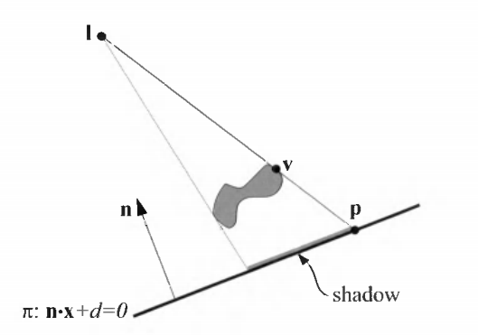
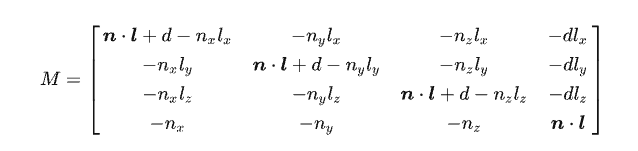
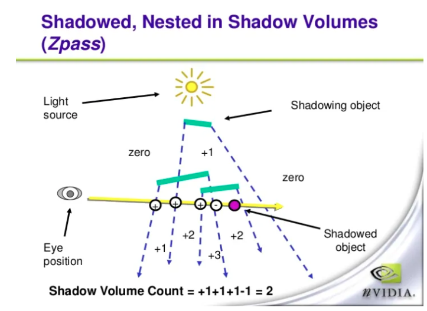

# 阴影

## 平面阴影 Planner Shadow

为了投射模型上每个三角形的阴影, 我们只需要在顶点着色器中把三角形的每个顶点从原来的额位置变化到指定平面上即可.

假设模型任一顶点的位置是`v`, 光源位置是`l`, 投影位置是`p`, 那么`l`, `v`, `p` 三点共线, 根据直线方程:

$$
p = l + t * (v-l)
$$

同时且满足:

$$
n * p + d = 0
$$

即可求出`p`的位置, 在实际计算时, 我们会借助一个平面投影矩阵来具体的计算:

这个矩阵在局部坐标到世界坐标的变换之后执行.

但是平面投影会有两个问题:

1. `z-fighting`, 投影在指定平面上, 最后得出的投影点会因为精度问题与投影平面本身有穿插现象. 有两个方法来处理:
   1. 先绘制平面, 再关闭深度测试和写入进行平面阴影的绘制, 最后再打开深度的测试和写入进行模型的正常绘制
   2. 在平面投影矩阵中, 稍微减小(或增大, 取决于法线的方向)d的值,让实际的投影平面位于模型平面的上方
2. 第二个问题是半透明叠加. 在绘制阴影的时候, 为了模拟全局光照, 通常不会把阴影绘制为纯黑, 而是一个半透明的黑色. 当三角面被压平在投影平面上是, 会产生重叠. 这时候开启半透明混合会出现错误的半透明效果.

平面投影绘制性能高, 不存在阴影走样的问题.

缺点是: 影子只能投射在平面上, 对于曲面上的投影无能为力, 其次, 如果光源恰好位于被投影物体和平面之间, 理论上是不产生投影的, 但实际上会投射出错误的阴影.

此外, 平面投影无法模拟软阴影.

## 阴影体 Shadow Volume

这是个比较古老的技术, 目前鲜有使用了.

