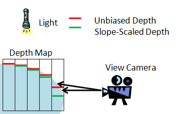
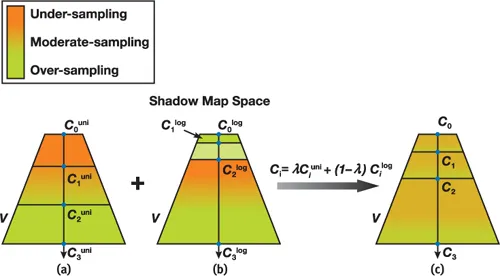
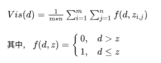
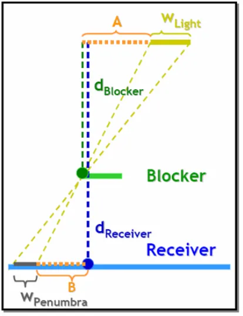

# 阴影

## 平面阴影 Planner Shadow

为了投射模型上每个三角形的阴影, 我们只需要在顶点着色器中把三角形的每个顶点从原来的额位置变化到指定平面上即可.

假设模型任一顶点的位置是`v`, 光源位置是`l`, 投影位置是`p`, 那么`l`, `v`, `p` 三点共线, 根据直线方程:

$$
p = l + t * (v-l)
$$

同时且满足:

$$
n * p + d = 0
$$

即可求出`p`的位置, 在实际计算时, 我们会借助一个平面投影矩阵来具体的计算:

这个矩阵在局部坐标到世界坐标的变换之后执行.

但是平面投影会有两个问题:

1. `z-fighting`, 投影在指定平面上, 最后得出的投影点会因为精度问题与投影平面本身有穿插现象. 有两个方法来处理:
   1. 先绘制平面, 再关闭深度测试和写入进行平面阴影的绘制, 最后再打开深度的测试和写入进行模型的正常绘制
   2. 在平面投影矩阵中, 稍微减小(或增大, 取决于法线的方向)d的值,让实际的投影平面位于模型平面的上方
2. 第二个问题是半透明叠加. 在绘制阴影的时候, 为了模拟全局光照, 通常不会把阴影绘制为纯黑, 而是一个半透明的黑色. 当三角面被压平在投影平面上是, 会产生重叠. 这时候开启半透明混合会出现错误的半透明效果.

平面投影绘制性能高, 不存在阴影走样的问题.

缺点是: 影子只能投射在平面上, 对于曲面上的投影无能为力, 其次, 如果光源恰好位于被投影物体和平面之间, 理论上是不产生投影的, 但实际上会投射出错误的阴影.

此外, 平面投影无法模拟软阴影.

## 阴影体 Shadow Volume

这是个比较古老的技术, 目前鲜有使用了.

1. 从光源位置出发, 针对阴影遮挡提的每个三角面生成一系列半开的棱台, 这些棱台被称之为阴影体
2. 所有位于阴影体内部的点都会被遮挡而看不见光源, 也就是绘制阴影的位置.

:::info 如何判断一个点是否位于阴影体中?

1. 假设我们从摄像机向屏幕上任一点发射一条线段, 当线段和阴影体正面相交时, 则表示它进入了一个阴影体, 当线段和阴影体背面相交时, 则表示它离开了一个阴影体
2. 每进入一个阴影体, 就让交点数+1, 反之离开一个阴影体, 就让交点数-1
3. 最终交点数为0, 则表示当前点位于阴影体之外, 大于0则表示点位于阴影体之内.
:::

这么计算的有一个假设&前提, 即: **摄像机本身是位于阴影体外的**.

不过实际情况往往并非如此, 于是John Carmack在原始算法的基础上提出了`ZFail`算法.

- 线段发射的起点位于距离相机无限远的地方, 
- 每次遇到阴影体背面就+1, 遇到正面-1, 其余设定不变

Shadow Volume能够生成精确的硬阴影, 但是很难是先软阴影效果, 此外场景多次绘制加上阴影体的生成和绘制, 使得算法对于场景的几何复杂度非常的敏感.

## Shadow Map

ShadowMap是目前主流的阴影生成算法, 其算法直观, 并且能够充分的利用现代硬件的光栅化能力.

算法思路很简单: 对于指定光源来说, 场景中某个点是否被照亮, 取决于从光源的视角看时, 这个点是否是可见的.

算法可以成分4步:

1. 从光源的视角出发绘制整个场景, 生成深度图
2. 从摄像机视角出发, 重新绘制场景, 并根据光源投影矩阵的逆矩阵, 将世界坐标空间变换为光源的投影空间, 找出对应投影空间的uv坐标以及投影空间内的深度d
3. 利用光源投影空间的uv坐标采样Shadow Map, 得到深度z
4. 比较d和z, 如果d>z, 则当前位置被遮挡, 处于阴影内部, 反之则未被遮挡.

:::info Slope Scale Depth Bias
由于在比较d和z的时候会产生精度误差, 产生`Shadow Acne`, 一般我们会在比较前给d加上一个固定的偏移, 但是如果偏移设置过大又会产生`Peter-Panning`, 一个自适应的方案是:
**基于斜率去计算当前深度要加的偏移(Slope Scale Depth Bias)**

:::

由于相机和光源视角不同, 从光源视角光栅化后的每个像素投影到屏幕空间后, 对应的区域大小也不相同, 所以往往会出现距离相机较近位置的shadow map精度不够, 而距离相机较远位置的shadow map精度又太高了, 导致阴影边缘的锯齿问题.

一个思路是将视椎沿着Z轴切分, 每段单独计算出一个光源坐标空间内的紧凑AABB, 然后基于这个AABB生成多张的Shadow Map, 也就是所谓的级联式阴影(Cascaded Shadow Map).

在进行深度查询的时候, 首先要根据当前像素在相机空间中的z值确定其位于哪个分段中, 然后找到对应分段的ShadowMap和投影矩阵.

划分位置通常基于指数划分或者均匀划分, 较远的shadow map可以提前计算好或者每个几帧更新一次, 提高渲染的效率.

提高Shadow Map像素利用率的另一个方案是获取更加紧凑的视椎包围盒. 由于相机在场景中始终处于变换的状态, 因此整个屏幕空间中可见的像素的包围盒也在变化, 且这个包围盒往往要比相机默认的视椎体紧凑许多, 假设我们能够通过场景的ZBuffer来统计这个包围盒, 再结合CSM去做场景划分, 就可以最大限度的避免Shadow Map中像素的浪费, 这就是Sample Distribute Shadow Map.

### 阴影的锯齿

锯齿的产生还有另外一个原因: 坐标变化是连续的, 但是光栅化后的像素是离散的, 我们无法保证从屏幕空间的像素映射到光源空间时, 能够找到一个位置完全匹配的像素. 这意味着当计算一个屏幕空间的像素是否处于阴影中时, 需要考虑它投影到Shadow Map位置附近的多个像素, 并且进行一定的运算, 以PCF, 百分比渐进滤波算法为例:

- 这个算法最终计算的阴影还是会一块一块的, 因为他的mn取值都还比较规则. 我们可以采用一些随机的样本位置来改善PCF的效果, 比如Poisson Disk.

### 软阴影

通过控制采样范围就可以改变阴影的模糊半径, 从而模拟出软阴影的效果, 这就是PCSS(Percentage-Closer Soft Shadows)算法的思路.

首先在2D坐标系下分析这个问题, 我们假设光源长度为 $w_{Light}$ , 半影区的长度为$w_{Penumbra}$, 遮挡物距离光源$d_{Blocker}$, 距离被遮挡物 $d_{Receiver}$, 光源, 遮挡物, 被遮挡物三者并行, 则容易得出:

$$
w_{Penumbra} = \frac{(d_{Receiver} - d_{Blocker})*w_{Light}}{d_{Blocker}}
$$

PCF的问题在于: 它需要大量的采样. 一个3x3的Kernel需要9次采样, 而且随着半径的增大, 这个采样次数会迅速增加.

那么可以将一个2D滤波拆分成两个独立的1D滤波才利用硬件的双线性采样来减少采样次数吗?

思路是对的, 但是我们需要设计出一个连续的可见性判断函数, 比如**VSM(Variance Shadow Map)**和**ESM(Exponential Shadow Map)**.

还有结合了两个的**EVSM(Exponential Variance Shadow Maps)**, 或者类似的方案**CSM(Convolution Shadow Maps)**

## 参考链接

- [游戏中的阴影（一）：基础](https://zhuanlan.zhihu.com/p/27572129)