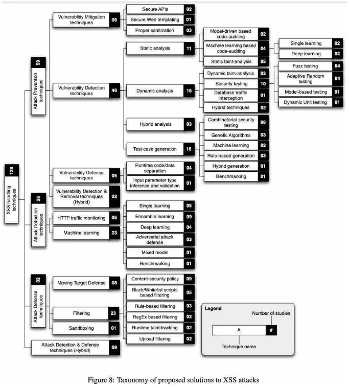

# 安全-常见攻击形式


## XSS

跨网站指令码(Cross-site scripting, 简称XSS, 使用CSS会混淆), XSS攻击通常指的是利用网页开发留下的漏洞, 通过巧妙的注入恶意指令代码到网页, 使用户加载并执行攻击者恶意制造的网页程序. 这些恶意网页程序通常是JavaSCript, 但实际上也可以包括Java, VBScript, ActiveX, Flash或者是普通的HTML. 攻击成功后, 攻击者可能得到包括不限于更高的权限, 私密网页内容, 会话和cookie等各种内容. 


### 1. 反射型XSS(RXSS)

> 当做HTTP请求的一部分提供的恶意数据在未经过适当清理的情况下成为服务器响应的一部分时, 就会发生RXSS攻击. 

- RXSS的典型目标是具有搜索功能的Web应用程序, 其中嵌入的恶意数据成为搜索结果或者错误消息的一部分

#### 攻击步骤

1. 攻击者构造出特殊的URL, 其中包含恶意代码
2. 用户打开带有恶意代码的URL时, 网站服务端将恶意代码从URL中取出, 拼接在html中返回给浏览器
3. 用户浏览器接收到响应后解析执行, 混在其中的恶意代码也被执行了
4. 恶意代码窃取用户的数据并发送到攻击者的网站, 或者冒充用户的行为, 调用目标网站接口执行攻击者指定的操作


### 2. 存储型XSS(SXSS)

> 当以输入形式提供的恶意数据未经清理就存储在服务器应用程序时, 就是SXSS攻击. 

- SXSS攻击的典型目标是在线社交网络应用程序和论坛, 恶意数据可以在其中发布,存储在数据库中, 从而感染访问它们的每个用户.
- SXSS攻击也称为持久性XSS

#### 攻击步骤

1. 攻击者将恶意代码提交到目标网站的数据库中
2. 用户打开目标网站时, 网站服务端将恶意代码从数据库中取出, 拼接在html中返回给浏览器
3. 用户浏览器接收到响应后解析执行, 混在其中的恶意代码也被执行了
4. 恶意代码窃取用户的数据并发送到攻击者的网站, 或者冒充用户的行为, 调用目标网站接口执行攻击者指定的操作

### 3. DOM型(DXSS)

> 客户端脚本处理逻辑导致的安全问题, 

- DXSS攻击是渲染时攻击
- 与RXSS和SXSS相反, DXSS攻击中使用的恶意数据用于动态更改浏览器在渲染阶段生成的DOM树

#### 攻击步骤

1. 攻击者构造出特殊的URL, 其中包含恶意代码
2. 用户打开带有恶意代码的URL
3. 用户浏览器接收到响应后解析执行, 前端js取出url中的恶意代码并且执行
4. 恶意代码窃取用户数据并发送到攻击者的网站, 或者冒充用户的行为, 调用目标网站接收执行攻击者指定的操作

### 4. JavaScript Mimicry XSS (JSM-SXX)

> 攻击者不是注入恶意脚本, 而是利用Web应用程序中已经使用的脚本来发起JSM-XSS攻击

- JSM-XSS很难呗检测并且很容易通过基于白名单的过滤器

### 5. XSS蠕虫(WXSS)

> WXSS是具有自我复制能力的XSS攻击

- RXSS和SXS攻击呗谷类为WXSS, WXSS攻击更加危险, 因为它们在Web应用程序用户之间传播, 并随着时间的推移逐渐感染其他用户
- 这类共计的典型目标就是在线社交网络应用程序


### 基于第三方的XSS攻击

1. 通过脚本小工具重用代码(CR-XSS): 触发CR-XSS攻击基本上需要了解目标应用程序使用的库或者框架中包含的脚本.
  - 成功的CR-XSS攻击是通过注入带有伪装负载(即不可执行的)HTML代码来实现, 这些负载匹配DOM元素并激发脚本小工具的执行

2. 通用XSS(UXSS): UXSS是由于浏览器本身或者其扩展没有对URL进行适当的清理而引起的, 入侵者可以利用浏览器或者浏览器扩展中的漏洞, 通过诱使用户单击一个链接, 该链接会加法访问者浏览器中安装的插件的执行, 该插件会触发连接中包含的恶意脚本的执行.

### 基于协作的XSS攻击

1. Mutation XSS (MXSS): MXSS攻击主要利用Web应用程序中使用的innerHTML属性将格式化的HTML字符串转换为有效的DOM元素的能力引起的.

2. Cross-API Scripting(XAS): XAS是 一种XSS攻击, 针对为社交网络等第三方开发者提供的Restful API的Web应用.
  - 攻击者在他们自己的应用程序配置文件中注入恶意脚本, 第三番应用程序的用户就比较容易收到XAS攻击. 恶意数据通过使用API从Web应用程序检索数据传输到受害则的浏览器.
  - XAS攻击的根本原因是缺乏对数据的适当清理
    - Web应用本身允许攻击者注入恶意数据
    - 第三方Web应用在没有适当的情况下接受恶意API的响应

3. Content-Sniffing XSS (CS-XSS): 由于浏览器对文件内容类型的错误解析而引起的XSS攻击.
  - 恶意数据作为单独的meticulous文件的一部分被提供给易受共计的Web应用程序, 这些文件对每个易受共计的浏览器中加载它们的用户都是有害的. 浏览器会将他们视为HTML文件, 在受害者浏览器执行注入脚本的位置展示.


### XSS的预防, 检测, 防御



#### XSS漏洞缓解技术

- 使用安全API: 浏览器通常带有内置API, 可以以高级的方式执行复杂的操作.
- 使用安全的Web模板
- 使用适当的消毒程序, 在所有敏感注入点消毒, 比如WebSSARI, DOMPurify.

#### XSS漏洞检测技术

1. 静态分析: 静态分析方法和工具专注于探索Web应用程序源码, 而不是执行它们, 以此发现安全漏洞. 三种主要的静态分析方法:
   1. 基于模型驱动
   2. 基于机器学习的代码审查
   3. 静态污点分析
2. 动态分析: 动态分析方法和工具旨在发现Web应用程序运行时的缺陷. 通过想服务器动态发送请求来检测基于HTTP响应的XSS漏洞的存在. 几种主要的动态分析方法:
   1. 动态污点分析
   2. 安全测试(模糊测试, 自适应随机测试, 预计模型的测试, 动态单元测试)
   3. 数据库流量拦截
   4. 混合动态测试
3. 测试用例生成: 基于静态分析的方法, 以及所有基于动态分析的方法都需要输入数据的集合来执行它们的评估过程. 这个集合包括各种不同且具有代表性的输入测试. 为了系统的生成输入测试, 探索了几种技术:
   1. 组合安全测试
   2. 遗传算法(GA)
   3. 机器学习
   4. 基于规则生成
   5. 基于混合的测试用例生成
   6. 基准测试
4. 混合分析: 混合分析包括结合或者交替使用静态和动态分析. 出了检测所有数据流路径, 还旨在降低误报率.

#### XSS漏洞防御技术

- 运行时数据代码分离
- 输入参数类型推断和验证

#### XSS漏洞检测与修复技术

- 静态污点分析从生成的Web应用程序页面的控制流图中识别输入和可能易受攻击的输出节点
- 模式匹配用于识别每个节点的HTML上下文, 惊醒适当的转移
- 一串算法用于从XSS攻击向量的初始种群生成不同的测试用例
- HTMLPurifier用于检测在易受攻击路径出清理用户数据

#### XSS攻击检测技术

运行时检测是构成防御网络中对于新的和未知的共计的最后一道防线.

- HTTP流量监控
- 机器学习

#### XSS攻击防御技术

- 过滤防御: 
  - 基于黑名单和白名单的过滤, 识别良性和恶意脚本
  - 基于正则表达式的过滤
  - 基于规则的过滤
  - 内容安全策略(CSP)
  - 上传过滤
- 移动目标防御(MTD): 旨在通过不断改变正在运行的应用程序的配置和参数来降低攻击的成功率
- 沙盒防御: 一种隔离技术, 完全控制正在运行的应用程序并防止传播可疑操作

### XSS防御实操


XSS攻击的两个要素:

- 攻击者提交恶意代码
- 浏览器执行恶意代码

针对第一个个攻击要素, 常见的方式是进行如下的转义: 

```js
function escape(str) {
    str = str.replace(/&/g, '&amp;');
    str = str.replace(/</g, '&lt;');
    str = str.replace(/>/g, '&gt;');
    str = str.replace(/"/g, '&quto;');
    str = str.replace(/'/g, '&#39;');
    str = str.replace(/`/g, '&#96;');
    str = str.replace(/\//g, '&#x2F;');
    return str;
}
```

对于富文本来说,可以采用白名单过滤的方式:

```js
var xss = require('xss');
var html = xss('<h1 id="title">XSS Demo</h1><script>alert("xss");</script>');
// -> <h1>XSS Demo</h1>&lt;script&gt;alert("xss");&lt;/script&gt;
console.log(html);
```

以上实例使用了`js-xss`来实现, 可以看到在输出中保留了`h1`标签, 过滤了`script`标签.

我们在用户输入的过程中, 过滤掉用户输入的恶劣代码, 然后提交给后端, 但是如果攻击者绕开前端请求, 直接构造请求就不能防御了

而如果在后端写入数据库前, 对输入进行过滤, 那这个内容可能在不同的地方有不同的显示.

比如, 正常用户输入了`5 < 7`字符串, 在写入前转译了, 变为`5 &lt; 7`.

在客户端中, 一旦经过了`escapeHTML()`, 就会变成乱码.

在前端中, 不同的位置所需要的编码也不同:

- 当`5 < 7`作为HTML凭借页面的是偶, 可以正常的显示
- 但是如果`5 < 7`作为ajax返回的话, 就不能用于vue等模板的展示, 也不能用于内容长度的计算, 标题, alert等.

过滤不一定是可靠的.

下面就要通过防止浏览器执行恶意代码:

在使用内容输入方法的时候要特别小心: `.innerHTML`、`.outerHTML`、`document.write()`, 不要把不可行的数据作为html插入的页面上, 尽量使用`.textContent`, `setAttribute`等.

如果使用`vue/react`可以不使用`v-html/dangerouslySetInnerHTML`, 在前端`render`阶段避免`innerHTML`, `outerHTML`的XSS隐患.

DOM 中的内联事件监听器，如 `location、onclick、onerror、onload、onmouseover` 等，`<a> `标签的 href 属性，`JavaScript` 的 `eval()`、`setTimeout()`、`setInterval()` 等，都能把字符串作为代码运行。如果不可信的数据拼接到字符串中传递给这些 API，很容易产生安全隐患，请务必避免.

```html
<!-- 链接内包含恶意代码 -->
< a href=" ">1</ a>

<script>
// setTimeout()/setInterval() 中调用恶意代码
setTimeout("UNTRUSTED")
setInterval("UNTRUSTED")

// location 调用恶意代码
location.href = 'UNTRUSTED'

// eval() 中调用恶意代码
eval("UNTRUSTED")html
</script>
```

比较靠谱的策略就是CSP, 这部分可以参考[Web 安全策略]('/性能与安全/8. Web 安全策略.html')中关于CSP的相关介绍.

## CSRF

跨站请求伪造(Cross-sit request forgery), 也被称为 one-click attack 或者 session riding, 通常缩写为 CSRF/XSRF, 是一种挟制用户在当前已经登录的 Web 应用程序上执行非本意的操作的攻击方式, 与 XSS 相比, XSS 利用的是用户对指定网站的信任, CSRF利用的是网站对用户网页浏览器的信任.

简单的说, CSRF 就是利用用户的登录状态发起恶意请求.

### 如何攻击

一个典型的CSRF攻击如下:

- 受害者登录`a.com`, 并且保留了登录凭证(Cookie)
- 攻击者引诱受害者访问`b.com`
- `b.com`向`a.com`发送了一个请求: `a.com/act=xx`. 浏览器会默认携带`a.com`的`cookie`
- `a.com`接受到请求之后, 对请求进行验证, 并确认是受害者的凭证, 误以为是受害者自己发送的请求
- `a.com`以受害者的名义执行了`act=xx`
- 攻击完成, 攻击者在受害者不不知情的情况下, 冒充受害者, 让`a.com`执行了自己定义的操作.

假设网站中有一个通过 Get 请求提交用户评论的接口，那么攻击者就可以在钓鱼网站中加入一个图片，图片的地址就是评论接口,

```html

```

如果是 POST 接口, 则需要表单来提交接口:

```html
<form action="http://www.domain.com/xxx" id="CSRF" method="post">
    <input name="comment" value="attack" type="hidden" />
</form>
```

访问这个页面中, 表单就会自动提交, 相当于模拟用户完成了一次POST操作.

### 如何防御

CSRF的特点在于:

- 攻击一般发起在第三方网站, 而不是被攻击的网站. 被攻击的网站无法防止攻击发火说呢过
- 攻击利用受害者在被攻击网站的登录凭证, 冒充受害者他提交操作; 而不是直接窃取数据
- 整个过程攻击者并不能获取受害者的登录凭证, 仅仅是"冒用"
- 跨站请求可以用各种方式, 包括图片的URL, 超链接, CORS, Form提交等. 部分请求方式可以直接嵌入在第三方的论坛, 文章, 难以追踪.

防范 CSRF 可以遵循以下规则:

- 阻止不明外域的访问
  - 同源检测
  - samesite cookie
- 提交时要求附加本域才能获取的信息
  - CSRF Token
  - 双重cookie验证

#### SameSite

可以对 Cookie 设置 SameSite 属性, 该属性设置 Cookie 不随着跨域请求发送, 该属性可以很大程度减少 CSRF 的攻击, 但是该属性目前并不是所有浏览器都兼容.

#### 验证 Referer

对于需要防范 CSRF 的请求, 我们可以通过验证 Referer 来判断该请求是否为第三方网站发起的.

#### Token

服务器下发 Token, 每次请求都要携带 Token.

流程如下:

- 用户代开页面的时候, 服务器需要给这个用户生成一个token
- 对于get请求, token将附在请求地址之后. 对于POST请求来说, 可以附在form的最后

```html
<input type=”hidden” name=”csrftoken” value=”tokenvalue”/>
```

- 当用户从客户端得到了Token, 再次提交给服务器的时候, 服务器需要判断token的有效性.


## SQL 注入

`Sql` 注入攻击，是通过将恶意的 `Sql` 查询或添加语句插入到应用的输入参数中，再在后台 `Sql` 服务器上解析执行进行的攻击.

流程大致如下:

- 找出SQL漏洞的注入点
- 判断数据库的类型以及版本
- 猜解用户名和密码
- 利用工具查找web后台管理入口
- 入侵和破坏

预防的方式如下:

- 严格检查输入变量的类型和格式
- 过滤和转译特殊字符
- 对访问数据库的`web`应用程序采用`web`应用防火墙

## 参考链接

-   [前端进阶之道-XSS](https://yuchengkai.cn/docs/frontend/safety.html#xss)
-   [百度百科: XSS](https://baike.baidu.com/item/XSS%E6%94%BB%E5%87%BB/954065)
-   [百度百科: 跨站请求伪造](https://baike.baidu.com/item/%E8%B7%A8%E7%AB%99%E8%AF%B7%E6%B1%82%E4%BC%AA%E9%80%A0/13777878?fromtitle=CSRF&fromid=2735433)
-   [web常见的攻击方式有哪些？如何防御？](https://github.com/febobo/web-interview/issues/92)
-   [【第2876期】XSS 攻击22年：全面调查及系统综述](https://mp.weixin.qq.com/s/Qwh6zBPMRVzGN-7NDN1IpQ)


